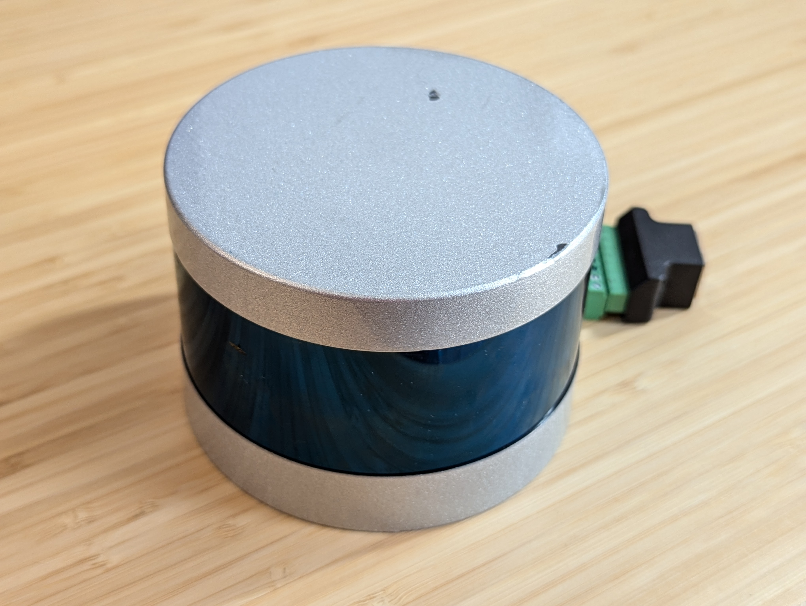
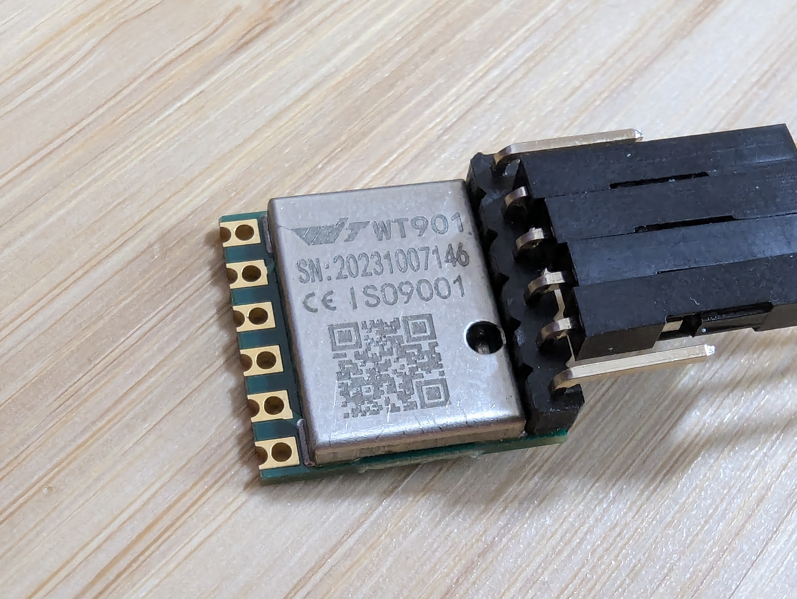
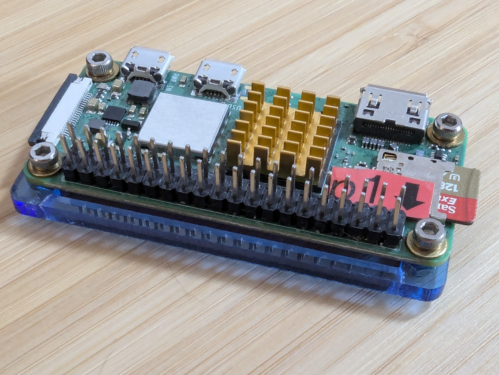
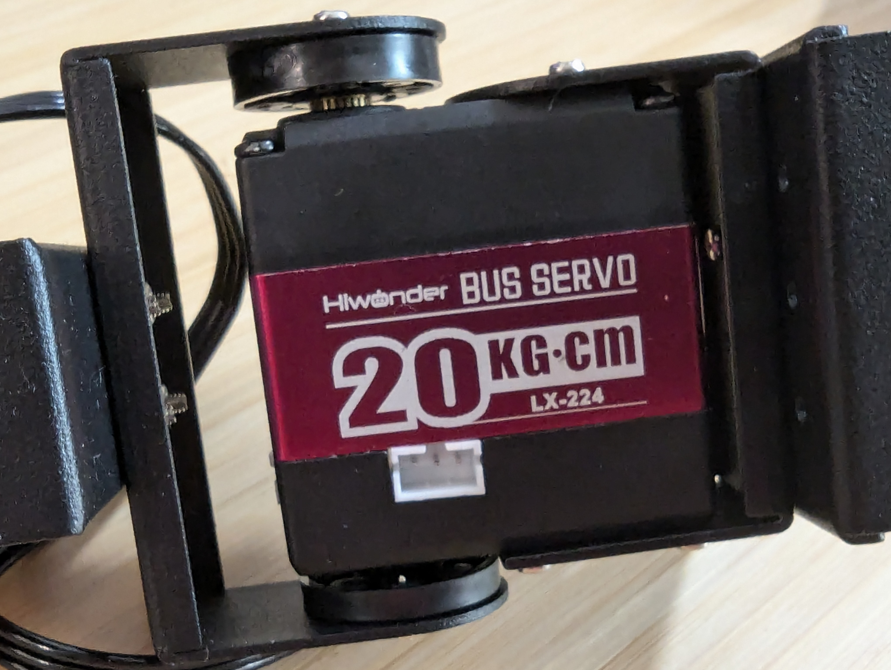

#
# Copper

[](https://github.com/gbin/copper-project/actions/workflows/general.yml)


[](https://opensource.org/licenses/Apache-2.0)
[](https://app.gitter.im/#/room/#copper:gitter.im)


Copper is a user-friendly robotics framework designed for creating fast and reliable robots. Copper is to robots what a game engine is to games.

* Easy: Copper offers a high-level configuration system and a natural Rust-first API.

* Fast: Copper uses Rust's zero-cost abstractions and a data-oriented approach to achieve sub-microsecond latency on commodity hardware, avoiding heap allocation during execution.

* Reliable: Copper leverages Rust's ownership, type system, and concurrency model to minimize bugs and ensure thread safety.

* Product Oriented: Copper aims to avoid late-stage infra integration issues by generating a very predictable runtime.

> [!NOTE]
> Copper is still in **early development / alpha stage**, and the APIs are subject to change. We are looking for contributors to help us build the best robotics framework possible. If you are interested, please join us on [Gitter](https://gitter.im/copper-project/copper-rs) or open an issue.

### Technical Overview

Copper is a data-oriented runtime with these key components:

* **Task Graph**: Described in [RON](https://github.com/ron-rs/ron), this configures the system's topology, specifying which tasks communicate and setting types for nodes and messages.

* **Runtime Generator**: This component decides on an execution plan based on the graph's metadata. It preallocates a "Copper List" to maximize sequential memory access during execution.

* **Zero-Copy Data Logging**: Records all messages between tasks without copying data, ensuring efficient logging.

* **Fast Structured Logging**: Interns and indexes logging strings at compile time, avoiding runtime string construction and ensuring high-speed textual logging.

### What features are already implemented?

1. **Basic task lifecycle interface**: Should be relatively stable for you to start contributing new algorithms, sensors, and actuators.
2. **Runtime generation**: Works but is very simple; this is just a BFS type of execution.
3. **Log reader & structured log reader**: Can export data, currently in Rust debug format.
4. **Simple/minimal drivers included**: These are more to show you how to implement your own:

   **Sensors**:
    1. Lidar: [Velodyne/Ouster VLP16](drivers/cu_vlp16) / crate name: cu_vlp16
       
    2. IMU: [WitMotion WT901](drivers/cu_wt901) / crate name: cu_wt901
       

   **Actuators**:
    1. GPIO: [Raspberry Pi](drivers/cu_rp_gpio) / crate name: cu_rp_gpio
       
    2. Servo: [Lewansoul Servo Bus (LX-16A, etc.)](drivers/cu_lewansoul) / crate name: cu_lewansoul
       

### What features are missing? What do we plan to implement next?

A lot! If any of these items pique your interest and you would like to contribute, feel free to reach out!

Here are some of the features we plan to implement next (in ~order of priority):

- [ ] **Deterministic log replay**: As the runtime is generated in a deterministic fashion, we need to add hooks to inject messages into an existing runtime.
- [ ] **Parallel Copper Lists**: Today Copper is monothreaded; this should enable concurrent Copper Lists to be executed at the same time with no contention.
- [ ] **Bunching**: as various sensors can vary a lot in output frequencies, we need to be able to bunch messages together with a dropping/algorithmic policy (mean max etc...). Today this can be achieved on the user side but it is painful.
- [ ] **Monitoring**: We need a parallel system that can listen to monitoring messages and act accordingly.
- [ ] **Distributed Copper**: Currently, we can only create one process. We need proper RPC filtering copper lists per subsystem.
- [ ] **ROS interfacing**: Build a pair of sink and source to connect to existing ROS systems, helping users migrate their infra bit by bit.
- [ ] **Modular Configuration**: As robots built with Copper gain complexity, users will need to build "variations" of their robots without duplicating their entire RON file.
- [ ] **"PGO"-like scheduling**: Pass previous log runs to the runtime generator to allow it to make better scheduling decisions.

So we are only at the beginning, but so much cool stuff is coming up!
 
### Kickstarting a copper project for the impatients

You can generate a project from a template present in the repo.
It will ask you the name you want to pick interactively.

```bash
cargo install cargo-generate
git clone https://github.com/copper-project/copper-rs
cd copper-rs/templates
cargo cunew [path_where_you_want_your_project_created]
    🤷   Project Name:
```

Check out [copper-templates](templates/README.md) for more info.

### How a Copper application looks like, some concepts and insights about how it can be that fast.

Here is a simple example of a task graph in RON:

```RON
(
    tasks: [
        (
            id: "src",                   // this is a friendly name
            type: "FlippingSource",      // This is a Rust struct name for this task see main below
        ),
        (
            id: "gpio",                  // another task, another name
            type: "cu_rp_gpio::RPGpio",  // This is the Rust struct name from another crate
            config: {                    // You can attach config elements to your task
                "pin": 4,
            },
        ),
    ],
     cnx: [
        // Here we simply connect the tasks telling to the framework what type of messages we want to use. 
        (src: "src",  dst: "gpio",   msg: "cu_rp_gpio::RPGpioMsg"),
    ],    
```

Then, on your main.rs:

```rust,ignore

// Your application will be a struct that will hold the runtime, loggers etc.
// This proc macro is where all the runtime generation happens. You can see the code generated by the macro at
// compile time.
#[copper_runtime(config = "copperconfig.ron")]  // this is the ron config we just created.
struct MyApplication {}

// Here we define our own Copper Task
// It will be a source flipping a boolean
pub struct FlippingSource {
    state: bool,
}

// You need to provide at least "new". But you have other hooks in to the Lifecycle you can leverage 
// to maximize your opportunity to not use resources outside of the critical execution path: for example start, stop, 
// pre_process, post_process etc...
impl CuTaskLifecycle for FlippingSource {
    fn new(_config: Option<&copper::config::NodeInstanceConfig>) -> CuResult<Self>
    where
        Self: Sized,
    {
        Ok(Self { state: true })
    }
}

// We implement the CuSrcTask trait for our task as it is a source / driver (with no internal input from Copper itself).
impl CuSrcTask for FlippingSource {
    type Output = RPGpioMsg;

    // Process is called by the runtime at each cycle. It will give:
    // 1. the reference to a monotonic clock
    // 2. a mutable reference to the output message (so no need to allocate of copy anything)
    // 3. a CuResult to handle errors
    fn process(&mut self, clock: &RobotClock, output: &mut CuMsg<Self::Output>) -> CuResult<()> {
        self.state = !self.state;   // Flip our internal state and send the message in our output.
        output.payload = RPGpioMsg {
            on: self.state,
            creation: clock.now().into(),
        };
        Ok(())
    }
}


fn main() {

    // Copper uses a special log format called "unified logger" that is optimized for writing. It stores the messages between tasks 
    // but also the structured logs and telemetry.
    // A log reader can be generated at the same time as the application to convert this format for post processing.
  
    let logger_path = "/tmp/mylogfile.copper";
    
    // This basic setup is a shortcut to get you running. If needed you can check out the content of it and customize it. 
    let copper_ctx =
        basic_copper_setup(&PathBuf::from(logger_path), true).expect("Failed to setup logger.");
        
    // This is the struct logging implementation tailored for Copper.
    // It will store the string away from the application in an index format at compile time.
    // and will store the parameter as an actual field.
    // You can even name those: debug!("This string will not be constructed at runtime at all: my_parameter: {} <- but this will be logged as 1 byte.", my_parameter = 42);  
    debug!("Logger created at {}.", logger_path); 
    
    // A high precision monotonic clock is provided. It can be mocked for testing. 
    // Cloning the clock is cheap and gives you the exact same clock.
    let clock = copper_ctx.clock;  
    
    debug!("Creating application... ");
    let mut application =
        MyApplication::new(clock.clone(), copper_ctx.unified_logger.clone())
            .expect("Failed to create runtime.");
    debug!("Running... starting clock: {}.", clock.now());  // The clock will be displayed with units etc. 
    application.run().expect("Failed to run application.");
    debug!("End of program: {}.", clock.now());
}

```

But this is a very minimal example for a task, please see [lifecycle](doc/lifecycle.md) for complete explanation of a task lifecycle.

## Deployment of the application

Check out the [deployment](doc/deploy.md) page for more information.


## How is it better or different from ROS?

### Performance

In the example directory, we have 2 equivalent applications. One written in C++ for ROS and a port in Rust with Copper.
```bash
examples/cu_caterpillar
examples/ros_caterpillar
```
You can them out either just logging on a desktop or with GPIOs on a RPi and you should see a couple order of magnitude difference in performance.

Copper has been design for performance first. Unlike a game engine we use a data oriented approach to minimize latency and maximize throughput.

### Safety

As Copper is written in Rust, it is memory safe and thread safe by design. It is also designed to be easy to use and to avoid common pitfalls.

As we progress on this project we plan on implementing more and more early warning to help you avoid "the death by a thousand cuts" that can happen in a complex system.
