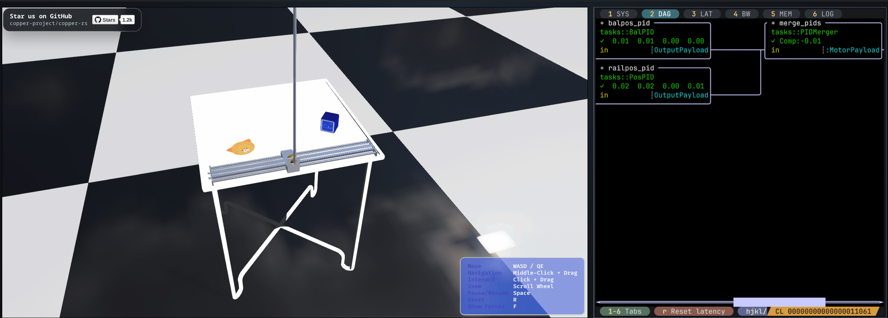
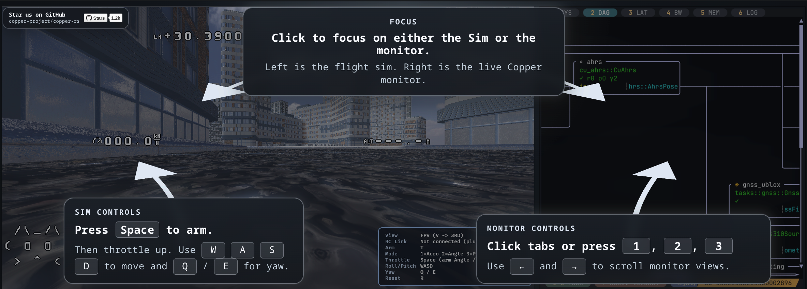

<h1 style="color: #b87333;"> &nbsp;&nbsp;&nbsp;&nbsp; Copper Runtime & SDK</h1>

[](https://github.com/copper-project/copper-rs/actions/workflows/general.yml)


[](https://crates.io/crates/cu29)
[](https://deps.rs/repo/github/copper-project/copper-rs)
[](https://discord.gg/VkCG7Sb9Kw)
[](https://copper-project.github.io/copper-rs-book/)
[](https://copper-project.github.io/copper-rs)

### Why Copper

<p><strong style="color: #b87333;">Rust-first</strong> – ergonomic & safe</p>
<p><strong style="color: #b87333;">Sub-microsecond latency</strong> – zero-alloc, data-oriented runtime</p>
<p><strong style="color: #b87333;">Deterministic replay</strong> – every run, bit-for-bit identical</p>
<p><strong style="color: #b87333;">Interoperable with ROS2</strong> – bridges via Zenoh opening the path for a progressive migration.</p>
<p><strong style="color: #b87333;">Runs anywhere</strong> – from Linux servers, workstations, SBC to bare-metal MPUs</p>
<p><strong style="color: #b87333;">Built to ship</strong> – one stack from simulation to production</p>

Already showing up in: ✈️ Flying | 🚗 Driving | 🌊 Swimming | 🚀 Spacefaring | 🤖 Humanoids

### Try Copper In One Click In Your Browser

No setup required. Open one of the live demos in your browser: the simulator runs on the left and the live Copper monitor runs on the right.

These are not mockups: BalanceBot is the exact same application that runs on a Raspberry Pi physical robot, and Flight Controller is the same control stack we run on a microcontroller (STM32H7) on real drones. Copper lets that same graph be recompiled for embedded hardware, a local workstation, or the browser.

<table>
  <tr>
    <td width="50%" valign="top">
      <a href="https://cdn.copper-robotics.com/demo/balancebot/index.html">
        
      </a>
      <br />
      <strong><a href="https://cdn.copper-robotics.com/demo/balancebot/index.html">BalanceBot</a></strong>
      <br />
      Self-balancing robot sim with a live Copper DAG and latency monitor.
      <br />
      <a href="examples/cu_rp_balancebot">Source code</a>
    </td>
    <td width="50%" valign="top">
      <a href="https://cdn.copper-robotics.com/demo/flight-controller/index.html">
        
      </a>
      <br />
      <strong><a href="https://cdn.copper-robotics.com/demo/flight-controller/index.html">Flight Controller</a></strong>
      <br />
      Quadcopter flight sim with the same live Copper monitor.
      <br />
      <a href="examples/cu_flight_controller">Source code</a>
    </td>
  </tr>
</table>

Prefer a native app instead of the browser? Install the published demo crates from crates.io:

```bash
cargo install cu-rp-balancebot
balancebot-sim

cargo install cu-flight-controller
quad-sim
```

The source for the published demo crates above lives in `examples/`.
Cross-framework comparison benchmarks live in `benchmarks/`.

Want to see more Copper in action? Watch the [community showcase video](https://youtu.be/weV_JYaUsmo).

<p align="center">
  <a href="https://youtu.be/weV_JYaUsmo">
    
  </a>
</p>

## Get Started

- Requires Rust 1.95 or newer. The latest stable Rust toolchain is recommended.

### Zero To Your First Copper App in 30 Seconds

```bash
cargo install cargo-cunew
cargo cunew hello_copper
cd hello_copper
cargo run
```

`cargo cunew` is the primary Copper bootstrap path. It generates a minimal
source -> task -> sink application. `cargo run` starts the app, prints the
first messages (`Received message: 42`, then `Sink Received message: 43`), and
records to `logs/hello-copper.copper`; stop it with `Ctrl-C` when you've seen
enough. If you have `just` installed, the generated project also includes
helpers like `just log`, `just cl`, and `just resim`. To get situated, open
`copperconfig.ron`, `src/main.rs`, `src/tasks.rs`, and `justfile`.

- Start a new project from templates: [Project Templates](https://copper-project.github.io/copper-rs/Project-Templates)
- Browse the live component catalog: [Copper Component Catalog](https://cdn.copper-robotics.com/catalog/index.html)
  Community components are welcome there too; if you build a reusable Copper component, prefer publishing it as its own crate and adding it to the catalog.
- See a full task graph + runtime walkthrough: [Copper Application Overview](https://copper-project.github.io/copper-rs/Copper-Application-Overview)
- Build and deploy an application: [Build and Deploy a Copper Application](https://copper-project.github.io/copper-rs/Build-and-Deploy-a-Copper-Application)
- RON configuration reference: [Copper RON Configuration Reference](https://copper-project.github.io/copper-rs/Copper-RON-Configuration-Reference)

## Documentation

[Link to the full documentation](https://copper-project.github.io/copper-rs/)

- Runtime concepts and SDK features: [Copper Runtime Overview](https://copper-project.github.io/copper-rs/Copper-Runtime-Overview)
- Task lifecycle: [Task Lifecycle](https://copper-project.github.io/copper-rs/Task-Lifecycle)
- Modular configuration: [Modular Configuration](https://copper-project.github.io/copper-rs/Modular-Configuration)
- Task automation: [Task Automation with just](https://copper-project.github.io/copper-rs/Task-Automation-with-Just)
- Coverage report: [Coverage Report](https://copper-project.github.io/copper-rs/coverage/)
- Supported platforms: [Supported Platforms](https://copper-project.github.io/copper-rs/Supported-Platforms)
- Bare-metal development: [Baremetal Development](https://copper-project.github.io/copper-rs/Baremetal-Development)
- Component catalog: [Copper Component Catalog](https://cdn.copper-robotics.com/catalog/index.html)
- FAQ: [FAQ](https://copper-project.github.io/copper-rs/FAQ)
- Release notes: [Copper Release Notes](https://copper-project.github.io/copper-rs/Copper-Release-Notes)
- Roadmap: [Roadmap](https://copper-project.github.io/copper-rs/Roadmap)

## Python Support

Copper has two very different Python stories:

- Offline Python log analysis: use `cu29-export` and app-specific PyO3 modules in
  the application crates that expose them. This is a reasonable workflow because
  Python stays off the runtime hot path.
- Runtime Python task prototyping: use
  [components/tasks/cu_python_task](components/tasks/cu_python_task) and
  [examples/cu_python_task_demo](examples/cu_python_task_demo). This is for
  experimentation only and is strongly not recommended for production or realtime
  robots.

Putting Python inside a Copper task defeats the performance model Copper is built
for: it adds allocations, latency, jitter, and middleware overhead, and it ruins
the realtime characteristics of the stack. The intended use is to sketch one task
in Python, get the behavior right, then rewrite it in Rust.

## Citation

If you use Copper-rs in your research, please cite it as:

```bibtex
@misc{copperrs2026,
  author       = {Guillaume Binet and Copper Project contributors},
  title        = {Copper-rs: A deterministic runtime and SDK for robotics},
  year         = {2026},
  howpublished = {GitHub repository},
  url          = {https://github.com/copper-project/copper-rs},
  note         = {Version v1.0.0 or latest}
}
```

## Project

> [!NOTE]
> We are looking for contributors to help us build the best robotics framework possible. If you are interested, please
> join us on [Discord](https://discord.gg/VkCG7Sb9Kw) or open an issue.
