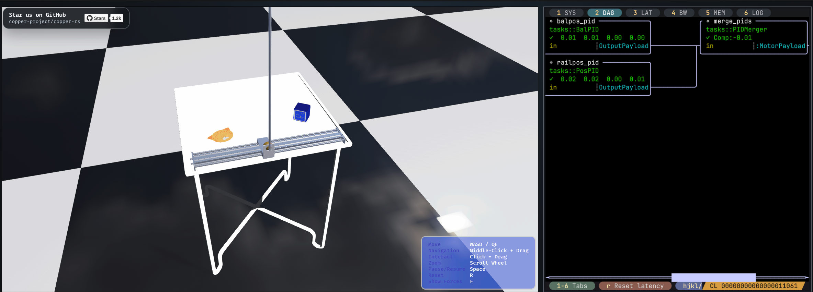
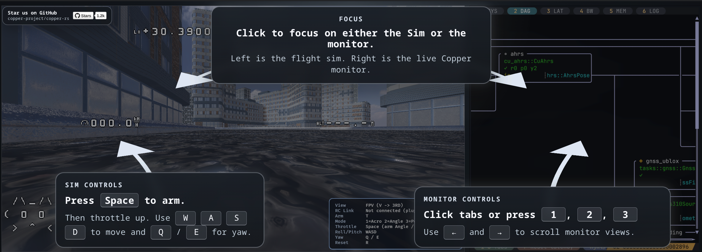
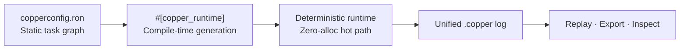

<h1 align="center">
  
  <br />
  Copper Runtime &amp; SDK
</h1>

<p align="center">
  A Rust runtime for building, running, recording, and deterministically replaying
  static robot task graphs—from Linux to bare metal.
</p>

<p align="center">
  <a href="https://github.com/copper-project/copper-rs/actions/workflows/general.yml"></a>
  <a href="https://crates.io/crates/cu29"></a>
  
  <a href="https://copper-project.github.io/copper-rs/"></a>
  <a href="https://discord.gg/VkCG7Sb9Kw"></a>
</p>

<p align="center">
  <strong><a href="https://cdn.copper-robotics.com/demo/balancebot/index.html">▶ Try Copper in your browser</a></strong>
  &nbsp;·&nbsp;
  <strong><a href="#build-your-first-copper-app">Build your first app</a></strong>
  &nbsp;·&nbsp;
  <strong><a href="https://copper-project.github.io/copper-rs-book/">Read the book</a></strong>
</p>

## Why Copper

| Built for robots | Built to ship |
| --- | --- |
| **Static by design** — task graphs are declared in RON and wired at compile time. | **Runs anywhere** — Linux, macOS, SBCs, and bare-metal microcontrollers. |
| **Realtime first** — zero-allocation, data-oriented execution on the hot path. | **Deterministic replay** — record a run, reproduce it, and inspect it offline. |
| **Rust-first** — ergonomic task APIs with compile-time guarantees. | **Interoperable** — connect to ROS 2 through Zenoh and migrate progressively. |

Already flying, driving, swimming, spacefaring, and powering humanoids.

## See It Run

These are the same Copper applications used on physical robots, recompiled for the
browser. The simulator runs beside a live view of the Copper task graph and latency.

<table>
  <tr>
    <td width="50%" valign="top">
      <a href="https://cdn.copper-robotics.com/demo/balancebot/index.html">
        
      </a>
      <br />
      <strong><a href="https://cdn.copper-robotics.com/demo/balancebot/index.html">BalanceBot</a></strong>
      <br />
      A self-balancing robot simulation using the application that runs on Raspberry Pi hardware.
      <br />
      <a href="examples/cu_rp_balancebot">Source code</a>
    </td>
    <td width="50%" valign="top">
      <a href="https://cdn.copper-robotics.com/demo/flight-controller/index.html">
        
      </a>
      <br />
      <strong><a href="https://cdn.copper-robotics.com/demo/flight-controller/index.html">Flight Controller</a></strong>
      <br />
      A quadcopter simulation using the control stack deployed on STM32H7 flight hardware.
      <br />
      <a href="examples/cu_flight_controller">Source code</a>
    </td>
  </tr>
</table>

Watch more robots built with Copper in the
[community showcase](https://youtu.be/weV_JYaUsmo), or explore the
[cross-framework benchmarks](benchmarks/).

## Build Your First Copper App

Install the latest stable Rust toolchain, then:

```bash
cargo install cargo-cunew
cargo cunew hello_copper
cd hello_copper
cargo run
```

In about 30 seconds, you have a typed `source → task → sink` graph that prints its
first messages and records `logs/hello-copper.copper`. Start with
`copperconfig.ron`, `src/main.rs`, and `src/tasks.rs`; the generated `justfile`
also provides helpers for logs, CopperLists, graph rendering, and replay.

## How Copper Fits Together


```mermaid
flowchart LR
    Config["copperconfig.ron<br/>Static task graph"]
    Generate["#[copper_runtime]<br/>Compile-time generation"]
    Runtime["Deterministic runtime<br/>Zero-alloc hot path"]
    Log["Unified .copper log"]
    Tools["Replay · Export · Inspect"]

    Config --> Generate --> Runtime --> Log --> Tools
```

The robot is a static thing: Copper turns its declared graph into a purpose-built
runtime, then records messages, timing, and state into one replayable log.

## Explore Copper

<table>
  <tr>
    <td><strong>Learn</strong></td>
    <td><a href="https://copper-project.github.io/copper-rs-book/">Book</a> · <a href="https://copper-project.github.io/copper-rs/Copper-Runtime-Overview">Runtime overview</a> · <a href="https://docs.rs/cu29">API docs</a></td>
  </tr>
  <tr>
    <td><strong>Build</strong></td>
    <td><a href="https://copper-project.github.io/copper-rs/Project-Templates">Project templates</a> · <a href="https://copper-project.github.io/copper-rs/Copper-RON-Configuration-Reference">RON reference</a> · <a href="https://cdn.copper-robotics.com/catalog/index.html">Component catalog</a></td>
  </tr>
  <tr>
    <td><strong>Go deeper</strong></td>
    <td><a href="examples/">Examples</a> · <a href="https://copper-project.github.io/copper-rs-book/logging-replay.html">Logging and replay</a> · <a href="https://copper-project.github.io/copper-rs/Python-Support">Python support</a></td>
  </tr>
  <tr>
    <td><strong>Project</strong></td>
    <td><a href="https://copper-project.github.io/copper-rs/Supported-Platforms">Supported platforms</a> · <a href="https://copper-project.github.io/copper-rs/Roadmap">Roadmap</a> · <a href="https://copper-project.github.io/copper-rs/Copper-Release-Notes">Release notes</a></td>
  </tr>
  <tr>
    <td><strong>Community</strong></td>
    <td><a href="CONTRIBUTING.md">Contributing</a> · <a href="https://github.com/copper-project/copper-rs/discussions">GitHub Discussions</a> · <a href="https://discord.gg/VkCG7Sb9Kw">Discord</a></td>
  </tr>
</table>
