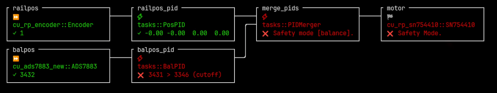

# ConsoleMon

</img>

Note: This is part of the Copper project. See the main project page for context.

The ConsoleMon is a simple monitor that display the current state of the robot to the console in an TUI.
It is useful for monitoring a robot quickly over ssh or in a terminal.

## Usage

Add it as a dependency in your `Cargo.toml`:

```tom
[dependencies]
cu-consolemon = "*"
```

And in you copperconfig.ron:

```ron
(
    tasks: [
        ( ...
        ),
     ],
    cnx: [
        ( ... ),
    ],
    
    monitor: (
        type: "cu_consolemon::CuConsoleMon", // <== Here
    )
)

```

The monitor has 3 screens:

- **SysInfo**: A quick sustem information screen (CPU, Memory, Distrib ...)
- **DAG**: A Directed Acyclic Graph of the tasks with their real time error status and short string info.
- **Latencies**: A list of the tasks with their real time latencies & assorted statistics (Jitter, Min, Max, Avg).


