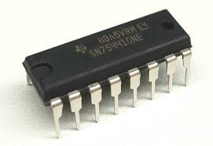
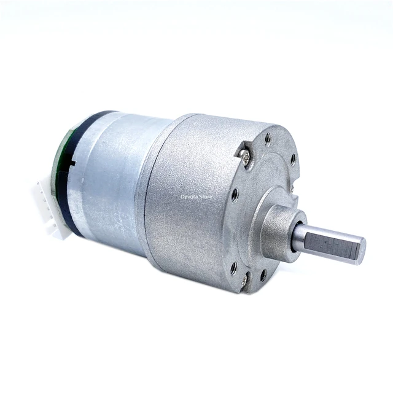
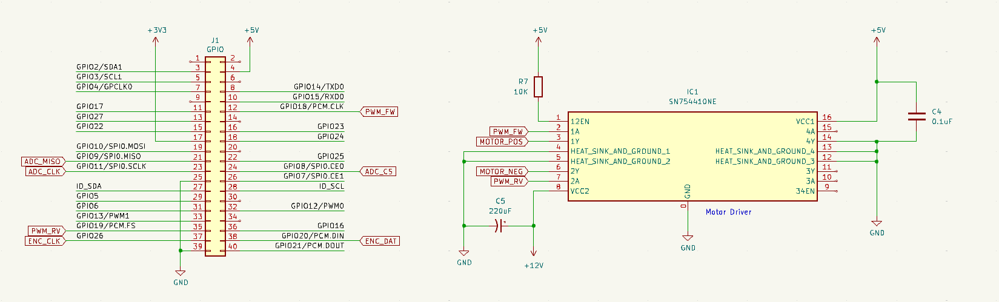

# Copper Driver for the TI SN754410 Quadruple Half-H Driver

See the crate [cu29](https://crates.io/crates/cu29) for more information about the Copper project.

## Overview

The SN754410 is a quadruple half-H driver that can be used to drive motors, solenoids, and other inductive loads.
It can drive up to 1A of current at 4.5V to 36V.
The driver is capable of driving two motors in both directions using the 2 PWMs generators from the Raspberry Pi.



## Compatibility

OS: Linux on Raspberry Pi.

hardware: [Texas Instrument SN754410](https://www.ti.com/lit/gpn/SN754410)

It can drive a DC motors like the MG513P2012:



## Wiring



## Usage

### Using this driver

Add the following to your `Cargo.toml`:

```toml
[dependencies]
cu-rp-sn754410 = "0.2.3"
```

In your Copper RON config file, add the following:

```ron
    tasks: [
        (
            id: "dst",
            type: "cu_rp_sn754410::SN754410",
        ),
    ]
```

There is no config for this driver.

When you connect this driver to the rest of the system you need to use the `cu_rp_sn754410::MotorMsg` message type.

```ron
    cnx: [
        (src: "src",  dst: "dst",   msg: "cu_rp_sn754410::MotorMsg"),
    ],

```

In this message the field current_power is the power that you want to apply to the motor.
It is a value between -1.0f32 and 1.0f32.
The negative values are for the reverse direction.


