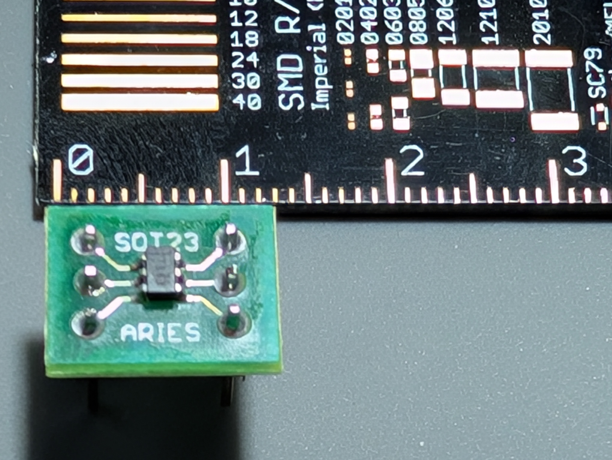

# Copper Driver for the ADS 7883 high speed SPI-based ADC

See the crate [cu29](https://crates.io/crates/cu29) for more information about the Copper project.

## Overview

The ADS7883 is a high-speed, 12-bit, sampling analog-to-digital converter (ADC) that operates
from a single power supply.
The ADS7883 is capable of converting an analog input signal of 2.7v to 5.5v max range to a 12-bit digital
output at a maximum throughput rate of 3MSPS.

The ADC is not only performant but also fairly compact:



## Compatibility

OS: Linux
This driver works on any Linux kernel with the spidev driver enabled.

hardware: [Texas Instrument ADS7883](https://www.ti.com/product/ADS7883)

## Usage

### Preflight checks

First check if a spi module is loaded on your system:

```bash
[gbin@copper7 ~]$ lsmod | grep -i spi                                                                                                                                                                                       
spidev                 12288  0                                                                                                                                                                                             
spi_bcm2835            16384  0 
```

This should give you a spi device:

```bash
[gbin@copper7 ~]$ ls /dev/spi*
/dev/spidev0.0  /dev/spidev0.1
``` 

With the ADS connected to the SPI bus, you can use a simple SPI test program to check if the values are read correctly:

```bash
[gbin@copper7 ~]$ git clone https://github.com/rm-hull/spidev-test
[gbin@copper7 ~]$ cd spidev-test
[gbin@copper7 ~]$ gcc spidev_test.c -o spidev_test
[gbin@copper7 ~]$ ./spidev_test  # defaults to /dev/spidev0.0
spi mode: 0x0
bits per word: 8
max speed: 500000 Hz (500 KHz)
RX | 0A 40 00 00 00 00 00 00 00 00 00 00 00 00 00 00 00 00 00 00 00 00 00 00 00 00 00 00 00 00 00 00  | .@..............................
[gbin@copper7 spidev-test]$ ./spidev_test
spi mode: 0x0
bits per word: 8
max speed: 500000 Hz (500 KHz)
RX | 0A 34 00 00 00 00 00 00 00 00 00 00 00 00 00 00 00 00 00 00 00 00 00 00 00 00 00 00 00 00 00 00  | .4..............................
```

The first couple bytes should vary with the input voltage on the ADC.

### Using this driver

Add the following to your `Cargo.toml`:

```toml
[dependencies]
cu-ads7883 = "0.2.3"
```

In your Copper RON config file, add the following:

```ron
    tasks: [
        (
            id: "src",
            type: "cu_ads7883::ADS7883",
        ),
    ]
```

With no config will take the `/dev/spidev0.0` device and the default SPI speed of 48MHz (maxing it out at 3MSPS).

If you need to override the device or clock speed, you can do so with the following config:

```ron
    tasks: [
        (
            id: "src",
            type: "cu_ads7883::ADS7883",
            config: {
                spi_dev: "/dev/spidev0.1",
                max_speed_hz: 1000000,  // 1MHz
            },
        ),
    ]
```

When you connect this driver to the rest of the system you need to use the `cu_ads7883::ADSReadingMsg` message type.

```ron
    cnx: [
        (src: "src",  dst: "dst",   msg: "cu_ads7883::ADSReadingMsg"),
    ],

```

In this message you will get a 16bit value that represents the ADC reading and its time of validity.

```rust
#[derive(Debug, Clone, Copy, Default, Encode, Decode, PartialEq, Serialize, Deserialize)]
pub struct ADCReadingMsg<T>
where
    T: Into<u128> + Copy, // Trick to say all unsigned integers.
{
    pub analog_value: T,
    pub tov: CuTime,
}

/// This is the type of message that the ADS7883 driver will send.
pub type ADSReadingMsg = ADCReadingMsg<u16>;
```


