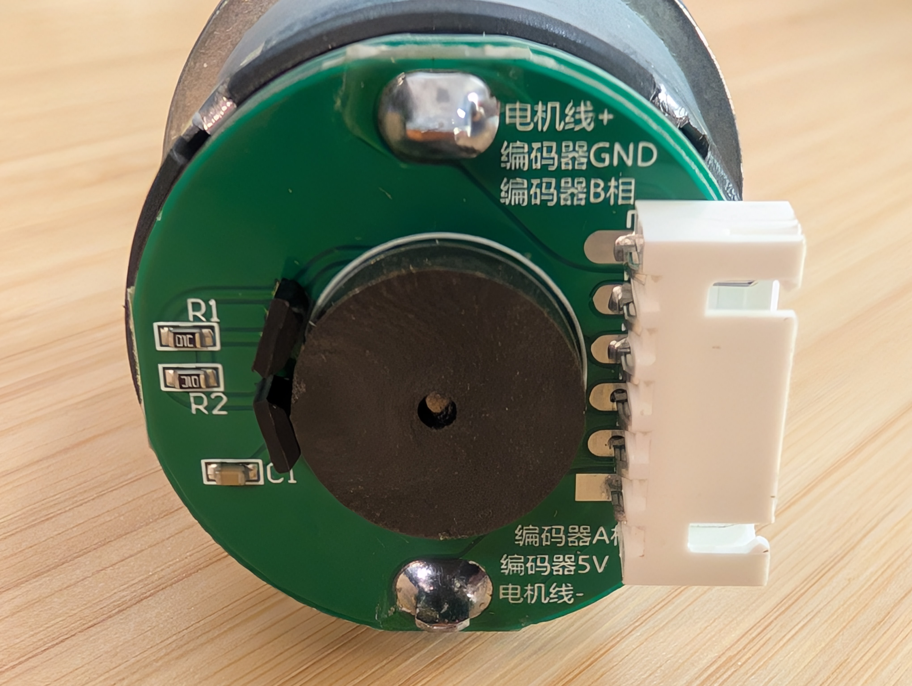

# Raspberry Pi based encoder driver for Copper

This driver is for the Raspberry Pi based encoder driver for Copper.

## Compatibility

Any encoder with a base clock + a direction trigger.

## Usage

Add the driver like any other source in Copper:

```ron
    tasks: [
        (
            id: "src",
            type: "cu_rp_encoder::Encoder",
            params: {
                pin_clt: 17,
                pin_dat: 18,
            },
        ),
    ]
```

The `pin_clt` is the pin for the clock signal and the `pin_dat` is the pin for the direction signal.

When you connect this driver to the rest of the system you need to use the `cu_rp_encoder::EncoderMsg` message type.

```ron
    cnx: [
        (src: "src",  dst: "dst",   msg: "cu_rp_encoder::EncoderMsg"),
    ],
```

It has been tested with a Hall effect encoder like this one:


