# Baremetal Development with Copper

Copper can also be deployed on baremetal ie. `no-std` on an MCU.

The main advantage is that algorithms can be written to be usable on both normal (on an OS) and baremetal.
The underlying logging format is also the same so you can extract the logs, replay in simulation what happened on the
device, and debug with the comfort of a full local environment development and debugger.

## Getting Started

### Hardware (reference platform)

We chose a beefed-up RP2350B-based board as a reference platform.
It is very well-documented, relatively cheap, and a lot of peripherals and accessories are available.

Overview:

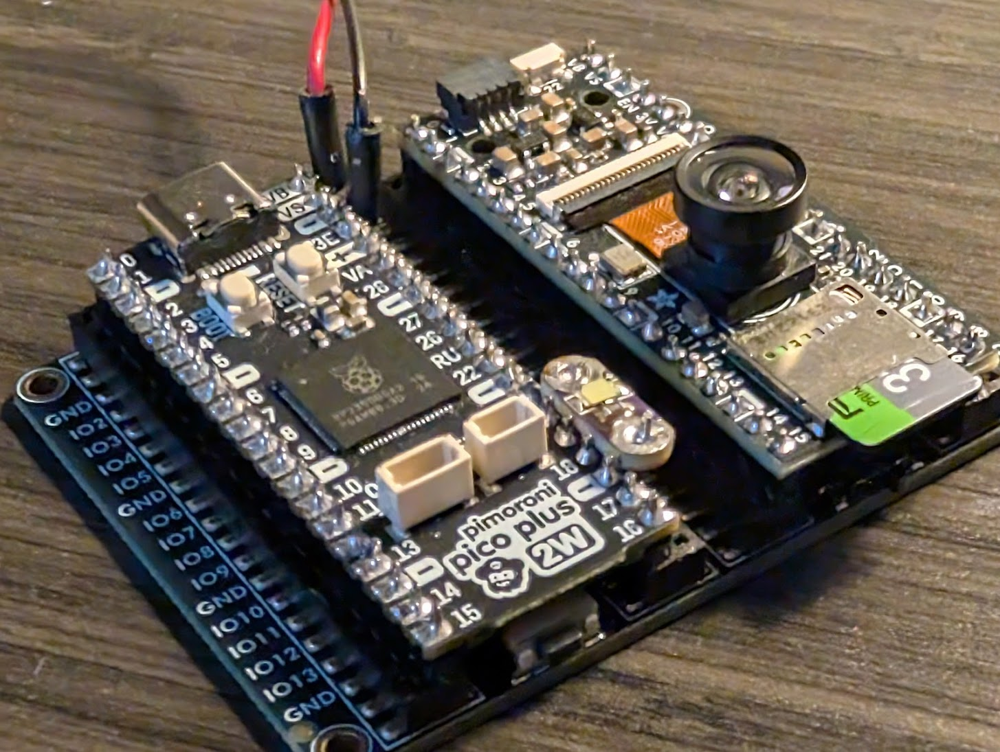

Note: we are not affiliated with any of those vendors or HW manufacturers. We just like them.

> If you want to receive the **whole kit ready to be deployed with Copper**: all soldered with the debug probe,
a debug cable and tested. We can send you one: Ping us directly at info@copper-robotics.com.

#### Base board

It is a `Pimoroni Pico plus 2W`.

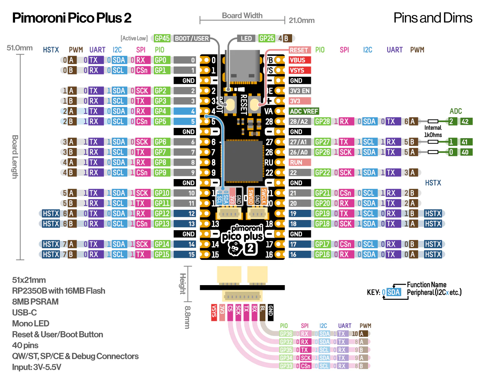

Out of the box it has:
- Powered by RP2350B (Dual Arm Cortex M33 running at up to 150MHz with 520KB of SRAM)
- 16MB of QSPI flash supporting XiP
- 8MB of PSRAM
- USB-C connector for power, programming, and data transfer
- Qw/ST (Qwiic/STEMMA QT) compatible I2C connector
- 3 pin debug connector (JST-SH)
- Reset and BOOT buttons (the BOOT button can also be used as a user button)
- User LED indicator (addressable through the wifi chip though)
- On-board 3V3 regulator (max regulator current output 600mA)
- Input voltage range 3V - 5.5V

You can buy it here:
https://www.adafruit.com/product/6243

From the UK here:
https://shop.pimoroni.com/products/pimoroni-pico-plus-2-w?variant=42182811942995

If you don't care about the Wi-Fi, you can opt for a simple plus 2: https://shop.pimoroni.com/products/pimoroni-pico-plus-2?variant=42092668289107

#### Extension boards to get a sdcard slot (to be able to log with Copper).

Adafruit PiCowBell Camera Breakout (Here the 160 deg wide lens version):
https://www.adafruit.com/product/5947

If you don't care about a camera: Adafruit PiCowbell Adalogger for Pico - MicroSD, RTC & STEMMA QT
https://www.adafruit.com/product/5703a

Or a simple, more compact alternative a break-out board just for the SD Card:

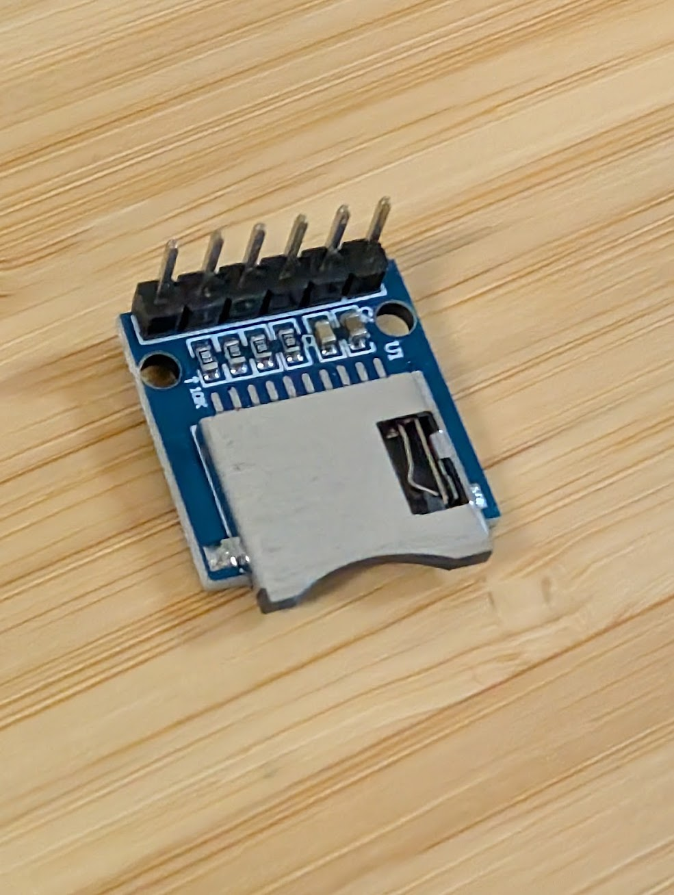

#### Adafruit Proto Doubler (optional)

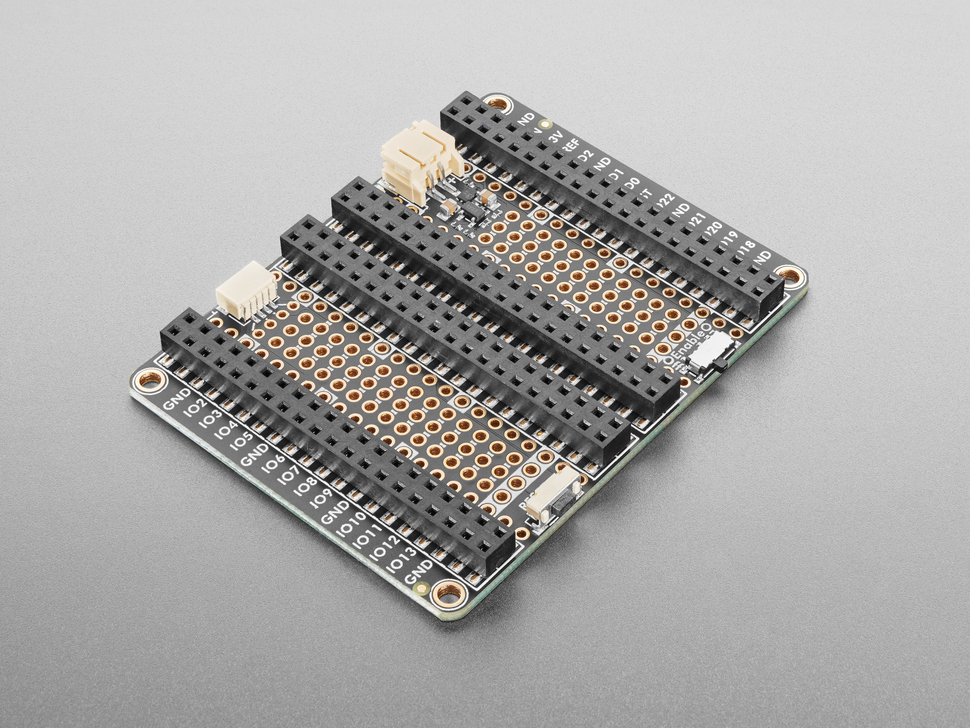

This is a very nice addition for a bench setup. It allows you to connect the extension boards side by side with an extra
row of pins you can use directly and some prototyping space underneath.

https://www.adafruit.com/product/5906

#### Debug Probe HW

It is highly recommended to use a debug probe: you'll be able to see the Copper structured logs in real-time,
deploy from `cargo run` without having to reset the probe, set breakpoints etc...

We recommend a CMSIS-DAP compliant debugger like the DAPLink-based ones: https://developer.arm.com/documentation/101451/0100/About-CMSIS-DAP because it works right out of the box with `probe-rs`, a Rust embedded probe tooling support.

We had success with this one: https://github.com/WeActStudio/WeActStudio.MiniDebugger

It is compact, with USB-C (most of the commercial probes are like tanks with USB-A), can provide a 5V power supply, and is straightforward to use.

> Be sure to buy the **DapLink Version** (not the ST-Link one).

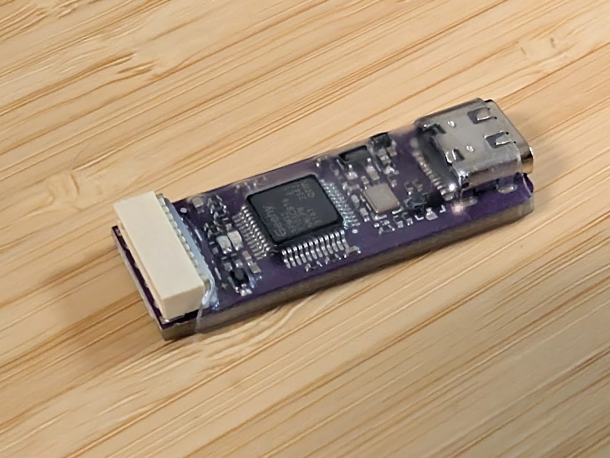

#### Debug probe cable and setup.

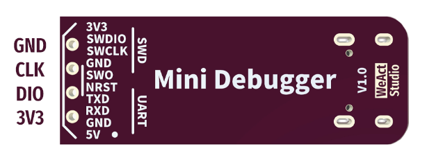

There are 2 connectors to connect:
 - power
 - debug

##### Power

This allows you to just have to plug in a single USB-C connector **on the probe side** and the board will power itself up.

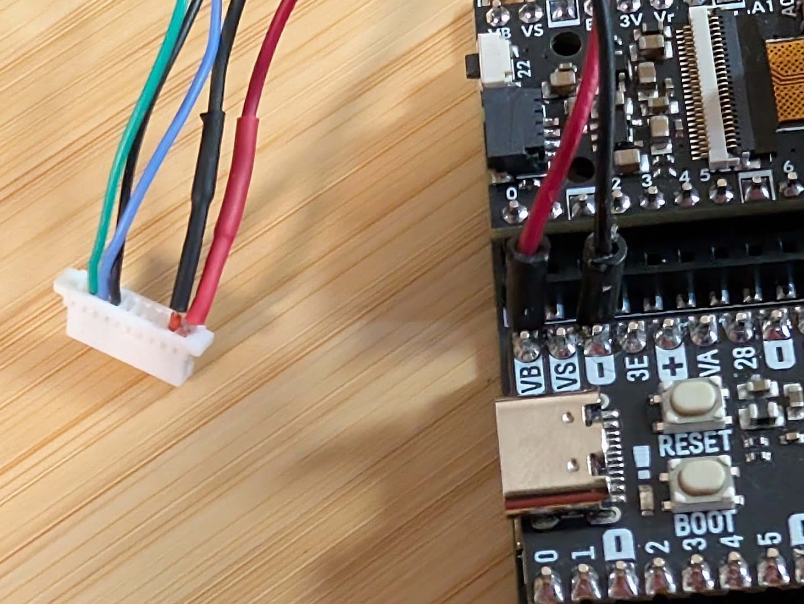

This is the 5V connection on the probe side (see the picture above).
You need to connect that to the VB (VBUS) pin on the board side. (NOT VS).

##### Debug

You now have to connect the SWDIO SWCLK and GND pins on the probe side to the SWDIO SWCLK and GND pins on the board side.
Ideally, you want to crimp a JST-SH connector to the probe wires to be able to plug it directly into the board.

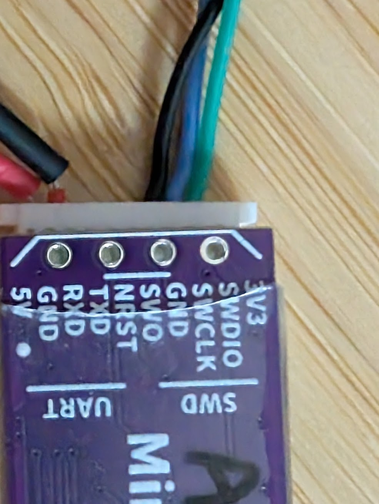
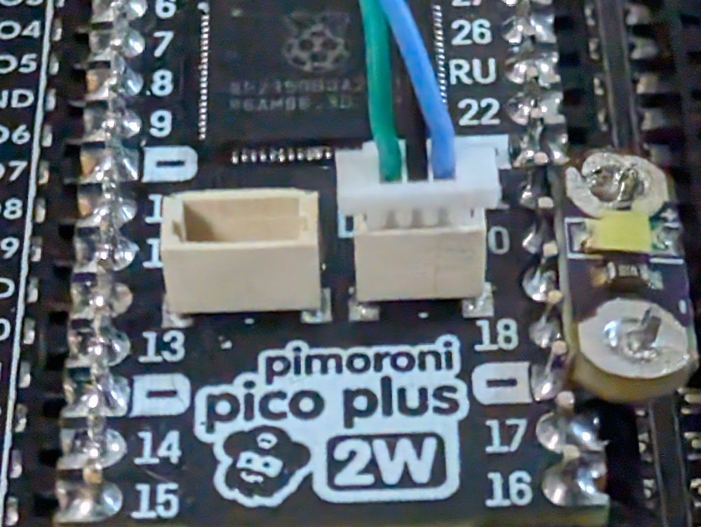

##### Extra LEDs (optional)

You can, for example, use some already made LED + resistor called lilypads: https://shop.pimoroni.com/en-us/products/lilypad-led-5pcs

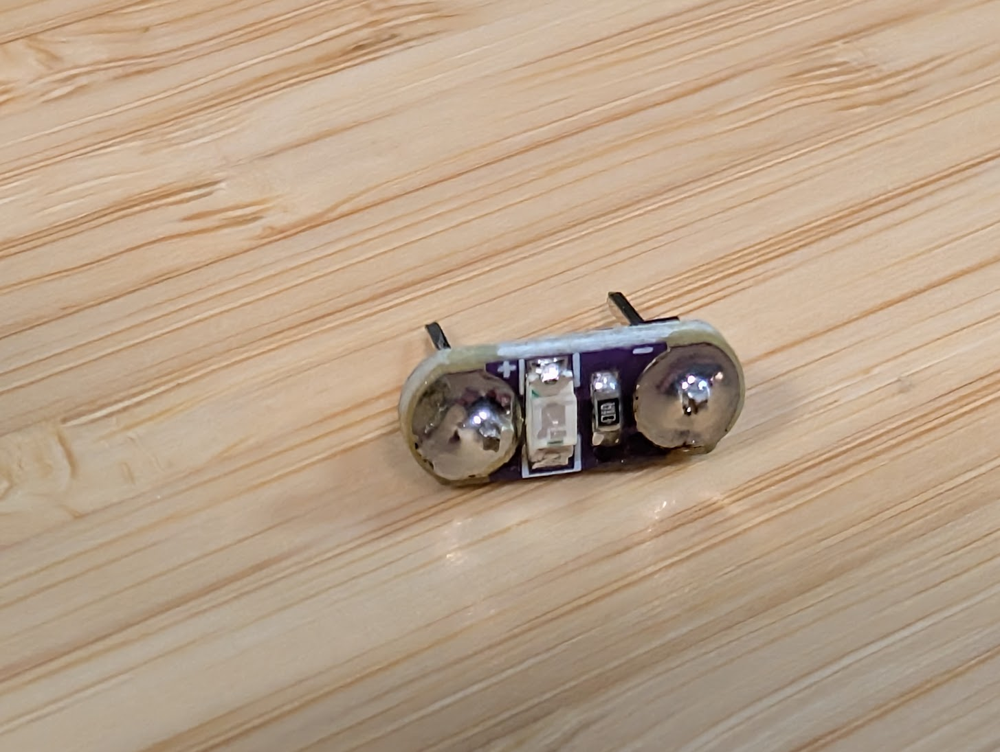

Here on plugged between pin 20 and GND. Ready to go for the rp2350 copper example.

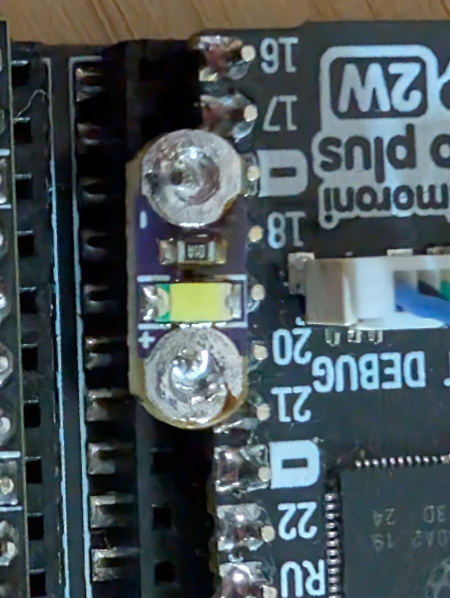

### Software

#### Quick sanity check

Plug in your debugger and run `dmesg`, check to see if the board is detected.

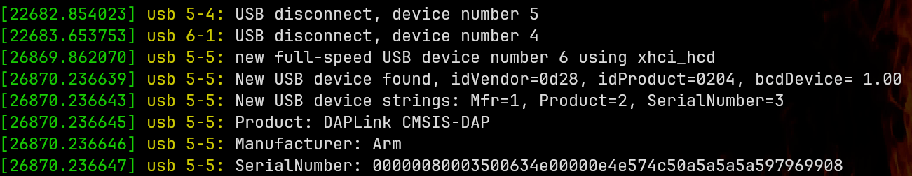

Install probe-rs: `cargo install probe-rs-tools --locked`

Now check with `probe-rs` to see if the probe can connect to the board.

First with a `probe-rs list` to see if the probe is detected and accessible.
Then with `probe-rs info --protocol swd` to dump the target debug information.

It should look like this:

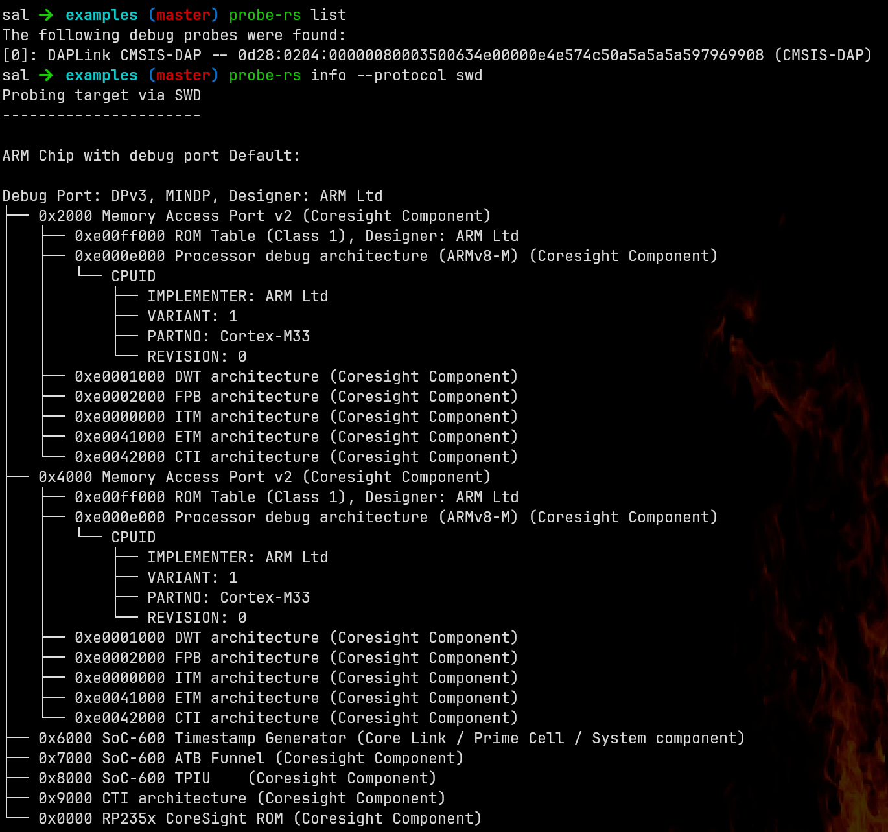

If not, check if your user has the right permissions to access the device. For example, you might want to add raw access to the USB devices with:

```
$ cat /etc/udev/rules.d/60-cmsis-dap.rules

# ARM mbed CMSIS-DAP (WeAct MiniDebugger DAPLink) VID:PID 0d28:0204
SUBSYSTEM=="usb", ATTR{idVendor}=="0d28", ATTR{idProduct}=="0204", MODE="0660", TAG+="uaccess"
SUBSYSTEM=="hidraw", ATTRS{idVendor}=="0d28", ATTRS{idProduct}=="0204", MODE="0660", TAG+="uaccess"
```

Also, double-check your cable.

#### Run the plain Copper example.

In `/examples/cu_rp2350_skeleton` you can find a fully working example that will just flip the GPIO 21 and log the result on the SD card.

First, plug an SD card on your computer and run the formatting script on it:
`support/mk_cu29_sdcard.sh <path to sdcard block device>`

You need `wipefs` and `sgdisk` installed for that (on Arch Linux, `sudo pacman -S util-linux gptfdisk`)

> TRIPLE-CHECK THAT PATH TO THE SD CARD BLOCK DEVICE IS CORRECT, it will wipe out any disk you point it to.

Here I monitor dmesg to see on which block device the SD card reader shows up and format it:

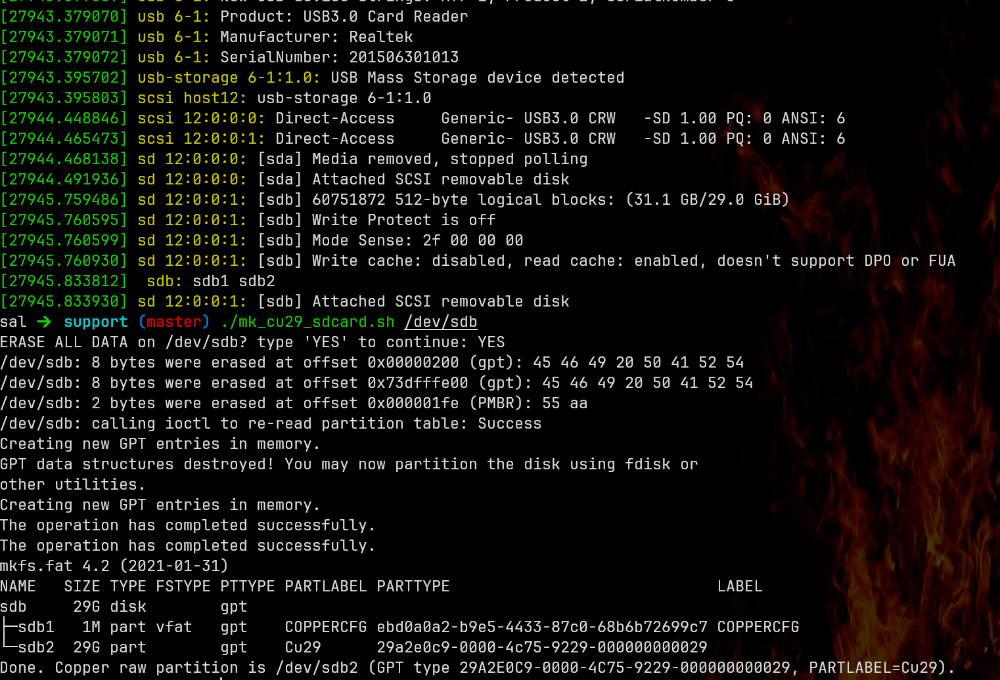

You can also run into user rights issues, this one you can sudo out of it `sudo support/mk_cu29_sdcard.sh <YOUR DEVICE>`

#### Run the Copper example with the debug probe.

go to `/examples/cu_rp2350_skeleton` and run `cargo run-arm`

You should see the Copper text logs streaming right through the debugger. With it finding the SD card and starting to log on it.
The LED on GPIO 21 should blink.

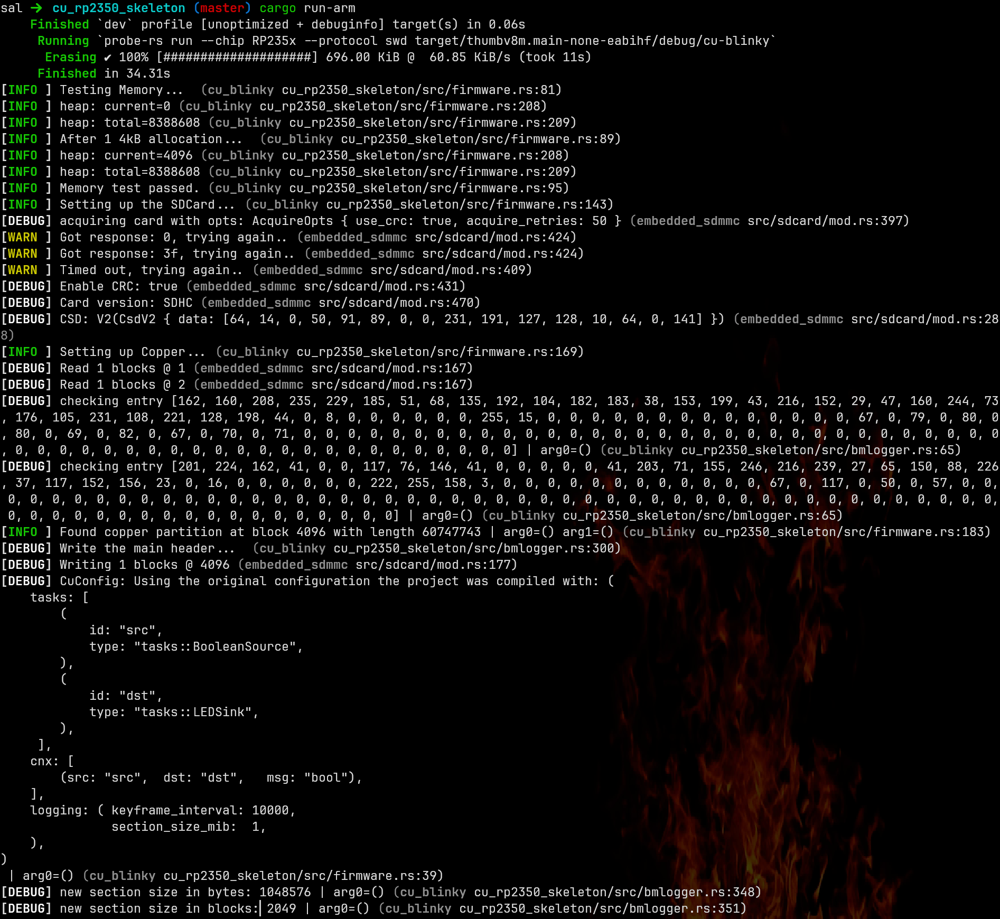

#### Extract the logs.

If you want to see the tasks data logs (copperlists), directly dump the partition to a file (basically recreating a slab):

```
$ # here substitute with your own device, probably the same as the one you formatted the sdcard with
$ pv /dev/sdb2 > logs/blinky_0.copper
```

Then you can dump the logs with exactly like a standard Copper log file, note we made also a shortcut for the log reader:
Note: no _0 suffix here, the log reader figures out the slab number automatically.

```
$ cargo run-logreader extract-copperlists logs/blinky.copper
```

#### Resim

If you check the src/tasks.rs file, you'll see that the tasks are just standard Copper tasks.
You can resimulate the log the same way as any other Copper programs (+/- managing the std/no-std variations), check the `examples` folder for resim examples.


#### Caveats

The logs don't get closed correctly, it should not prevent you from reading them but it is annoying. You can implement a button to drop the Copper instance and force the correct closure of the logs.
