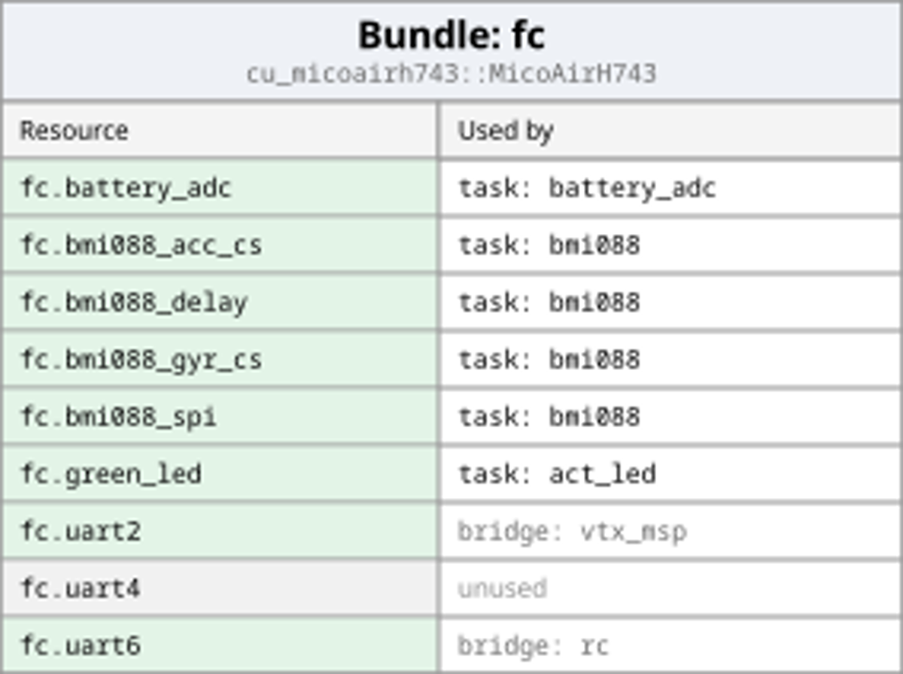
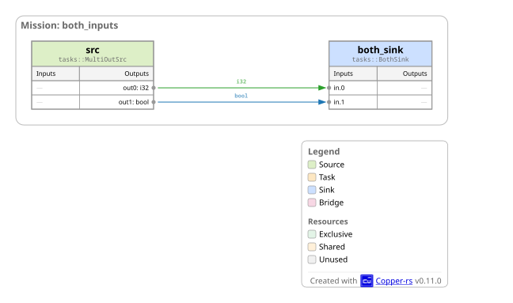
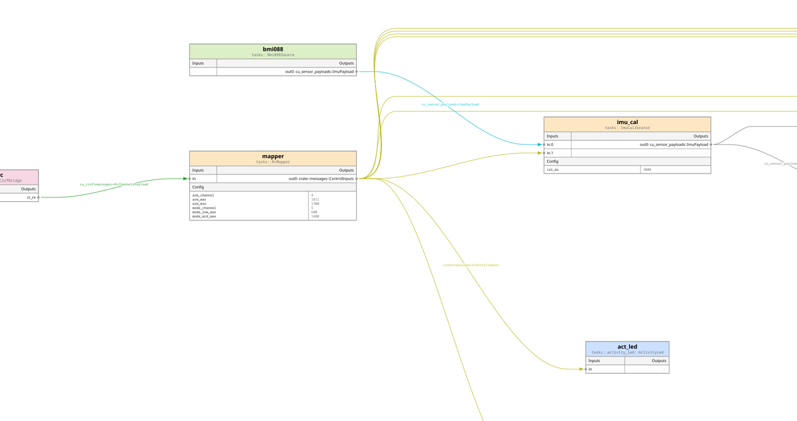
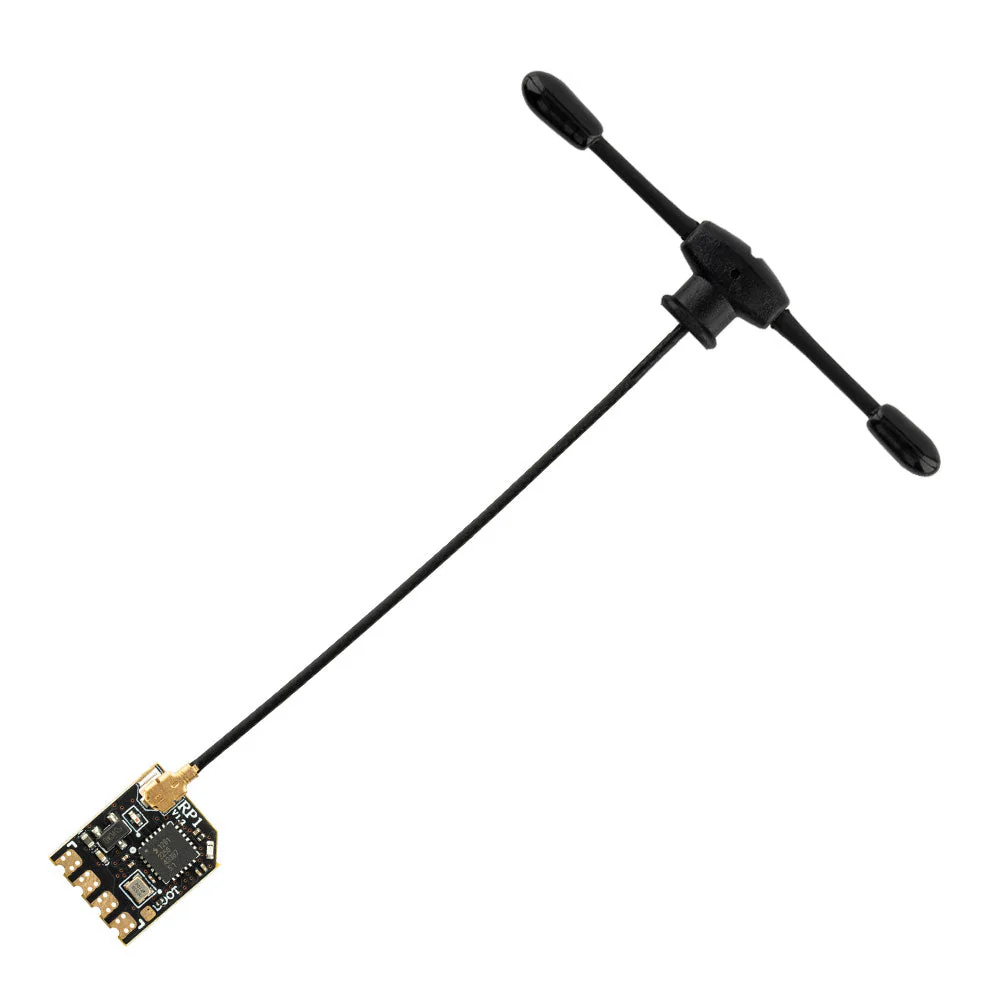

# v1.2.2 and v1.1.4 - 2026-10-02

Fix the background-task behavior to match the task specification: regular tasks configured with `background` now skip dispatch when the input payload is empty. Each completed background result is emitted once, including when collected on a tick with an empty input. Previously, empty inputs could launch background jobs and the last completed result could be emitted again on subsequent dispatches.

**Compatibility warning:** applications that rely on processing empty inputs or repeating the last completed result must opt into the old behavior. Add `background_process_empty: true` to each affected task in `copperconfig.ron`:

```ron
(
    id: "worker",
    type: "my_crate::Worker",
    background: true,
    background_process_empty: true,
)
```

Keep any existing background pool configuration; add the policy field alongside it. This option applies to regular background tasks. If constructing the wrapper directly, use `CuAsyncTask::<Task, Output, true>` to restore the old behavior. Omitting the option uses the corrected behavior.

# v1.2.1 - 2026-09-15

This patch release republishes the Copper 1.2 workspace with internal dependencies constrained to `~1.2.1`, keeping dependency resolution within the 1.2 release line and requiring the patched crate versions. Generated project manifests and tool-install recipes also use minor-line constraints.

## Fixes

- **CopperLists start with valid message storage.** Pool and asynchronous allocations initialize messages in place before borrowing or dropping them. This fixes invalid memory access when clearing tuple/vector payloads and preserves payload reuse without constructing a whole CopperList on the stack. ([#1396](https://github.com/copper-project/copper-rs/pull/1396))
- **The TUI handles graphs with more than 24 connection aliases.** Alias assignment and connection rendering support larger graphs without overflowing the fixed alias alphabet. ([#1393](https://github.com/copper-project/copper-rs/pull/1393))
- **Appending rejects recordings that were not cleanly closed.** The unified logger validates the existing recording before accepting an append, protecting prior log data. ([#1386](https://github.com/copper-project/copper-rs/pull/1386))

## Upgrading

Use `cu29 = "~1.2.1"` and the same requirement for other directly selected Copper crates. Update existing lockfiles with `cargo update` and confirm the resolved Copper crates remain on 1.2. A bare `"1.2"` requirement permits later 1.x releases; the tilde keeps the application on 1.2 patches.

# v1.2.0 - 2026-09-10

Copper 1.2 brings the robot's execution log to your ground station while it runs. Watch live telemetry, inspect the robot's own diagnostics, and keep a recording you can replay afterward—even over a link that drops packets. A live Copper twin can also run selected tasks on the ground, reconstructing results from the inputs you transmit.

This release also puts anytime computation to work on stereo vision, adds serial and HC-12 radio building blocks, and expands the messages you can exchange with ROS 2.

## Watch your robot live—and replay the same run later

**Log streaming makes remote recording part of the Copper application.** Configure a streaming destination alongside your onboard log. The receiver writes native `.copper` archives for your usual logreader and replay tools, preserving captured payloads and timestamps. Structured robot logs travel over the same link, so diagnostics appear alongside live outputs. Pausing the display leaves recording running. ([#1315](https://github.com/copper-project/copper-rs/pull/1315), [#1322](https://github.com/copper-project/copper-rs/pull/1322), [#1372](https://github.com/copper-project/copper-rs/pull/1372))

**The live twin trades ground-station computation for less radio traffic.** In the robot-arm demo, the robot sends shoulder and elbow angles; the ground station runs the same kinematics task to reconstruct the arm and fingertip trajectory. Generated twin builders connect reception, recording, and replay. Optional verification checks reconstructed results against the sender, and compile-time checks reject reconstruction when required inputs were not captured. ([#1330](https://github.com/copper-project/copper-rs/pull/1330), [#1337](https://github.com/copper-project/copper-rs/pull/1337), [#1379](https://github.com/copper-project/copper-rs/pull/1379))

Under the hood, sliding-window forward error correction supplies repair data for the continuous stream, while RaptorQ protects recovery objects such as task-state snapshots. Receivers can join late or resume at a later recovery point after an interruption. Buffer and bitrate budgets bound the stream; loss beyond the recovery window becomes an explicit gap. Optional receiver feedback adjusts the repair rate within configured limits. Framing, error correction, and transmission run on background workers. [Read how streaming works](https://github.com/copper-project/copper-rs/tree/93e215085697f714e07a15b05a0cebb22887679e/core/cu29_logstream).

**Try it:** in [`examples/cu_logstream_demo`](https://github.com/copper-project/copper-rs/tree/93e215085697f714e07a15b05a0cebb22887679e/examples/cu_logstream_demo), run `just telemetry` and `just sender` in separate terminals. Explore the live arm, robot logs, and link-health counters; the demo also includes loss and restart scenarios.

## Stereo depth that improves as more time becomes available

The new **`cu-anynet`** task turns a rectified stereo pair into a depth map in meters. It builds on the anytime task model introduced in 1.1: the first inference stage publishes an initial result, and two further stages refine it as the runtime grants more work. The Candle implementation supports CPU and optional CUDA execution. ([#1281](https://github.com/copper-project/copper-rs/pull/1281))

The [AnyNet demo](https://github.com/copper-project/copper-rs/tree/93e215085697f714e07a15b05a0cebb22887679e/examples/cu_anytime_anynet) shows each stage beside KITTI ground truth, measured error, latency, and a colored 3D reconstruction. Run `just` for synthetic input or `just kitti` for real stereo data; the latter downloads the dataset on first use. A background mode keeps the graph responsive while inference runs on a worker.


## Connect serial devices and radios through reusable resources

New nonblocking serial I/O, a buffered byte bridge, and serial LogStream framing provide building blocks for UART and radio links. **`cu-hc12`** configures an HC-12 radio at startup and exposes it as a serial resource, with channel selection in RON. The driver and serial adapters support `no_std`. [See the HC-12 wiring and examples](https://github.com/copper-project/copper-rs/tree/93e215085697f714e07a15b05a0cebb22887679e/components/res/cu_hc12).

Resources can now be composed from other resources: a radio can own its UART, control pin, and startup delay. Copper resolves those dependencies at construction and shows them in the generated DAG. ([#1343](https://github.com/copper-project/copper-rs/pull/1343), [#1344](https://github.com/copper-project/copper-rs/pull/1344))

The recovery engine is reusable too: **[`cu-fec`](https://github.com/copper-project/copper-rs/tree/93e215085697f714e07a15b05a0cebb22887679e/components/libs/cu_fec)** implements RFC 8681 sliding-window coding in a dependency-free, allocator-free `no_std` crate, usable outside Copper.

## More ROS 2 messages, with less conversion code

`cu-ros2-payloads` adds poses, transforms, odometry, paths, `CompressedImage`, `CameraInfo`, `JointState`, `BatteryState`, and TF messages. Adapters connect Copper's spatial payloads to ROS geometry messages, making existing robot visualization and navigation tooling easier to connect. ([#1365](https://github.com/copper-project/copper-rs/pull/1365), [#1366](https://github.com/copper-project/copper-rs/pull/1366), [#1371](https://github.com/copper-project/copper-rs/pull/1371))

## More control over execution and better tools for recordings

- **Catch lifecycle mistakes at compile time.** Typed application handles track initialized, running, stopped, and faulted states, guiding you through valid transitions. ([#1272](https://github.com/copper-project/copper-rs/pull/1272))
- **Choose task ordering at build time.** Pluggable execution planners support default ordering, pinned orders, and application-defined planners. Copper validates the result and bakes it into the generated runtime. ([#1277](https://github.com/copper-project/copper-rs/pull/1277))
- **Record less repeated metadata.** CopperLists compress timestamps and repeated metadata; `fsck` reports byte entropy to help assess recorded data. The unified logger can also append to a cleanly closed recording. ([#1303](https://github.com/copper-project/copper-rs/pull/1303), [#1304](https://github.com/copper-project/copper-rs/pull/1304), [#1375](https://github.com/copper-project/copper-rs/pull/1375))
- **Measure complete execution chains.** The [Autoware reference-system benchmark](https://github.com/copper-project/copper-rs/tree/93e215085697f714e07a15b05a0cebb22887679e/examples/cu_autoware) compares a synthetic callback workload with the LaME executor, reporting chain latency, deadline misses, CPU use, and memory. Run the included comparison on your own machine.

## Upgrading

Use receivers and logreaders built for the producing application version: CopperList encoding changes make that pairing important. For application startup, prefer `run_until_shutdown()` or typed `start()` / `stop()` transitions; the older manual lifecycle methods are deprecated. The [Caterpillar example](https://github.com/copper-project/copper-rs/tree/93e215085697f714e07a15b05a0cebb22887679e/examples/cu_caterpillar) shows the current pattern.

The v1.1.1 fixes are included, together with fixes for transform matrix layout, multi-output planning, and PNG stream reads. Thanks to everyone who contributed code, examples, testing, and fixes to this release.

# v1.1.3 - 2026-09-15

This patch release republishes the Copper 1.1 workspace with internal dependencies constrained to `~1.1.3`, keeping dependency resolution within the 1.1 release line and requiring the patched crate versions. Generated project manifests and tool-install recipes also use minor-line constraints. The workspace advances to 1.1.3 because `cu-png-codec` 1.1.2 was already released.

## Fixes

- **CopperLists start with valid message storage.** The backport initializes pool and asynchronous message storage in place, fixes invalid memory access when clearing tuple/vector payloads, and preserves payload reuse and the 1.1 recording format. ([#1396](https://github.com/copper-project/copper-rs/pull/1396))
- **The TUI handles graphs with more than 24 connection aliases.** The backport expands alias assignment and connection rendering for larger graphs. ([#1393](https://github.com/copper-project/copper-rs/pull/1393))

## Upgrading

Use `cu29 = "~1.1.3"` and the same requirement for other directly selected Copper crates. Update existing lockfiles with `cargo update` and confirm the resolved Copper crates remain on 1.1. A bare `"1.1"` requirement permits 1.2 and later 1.x releases; the tilde keeps the application on 1.1 patches. These constraints apply to the republished crates; previously published versions retain their original dependency requirements.

# v1.1.1 - 2026-08-31

## High Level

Copper v1.1.1 is a focused correctness and compatibility release. It makes keyframes safe when background or parallel work is still in flight, restores direct unit payloads in builds without reflection, updates remote debugging for Zenoh 1.10 with observable log indexing, fixes the flight-controller replay targets, and keeps the workspace lint-clean on macOS. There are no intentional breaking Rust API changes.

## Fixes

- **Keyframes no longer abort applications with active background work.** The runtime can capture a keyframe without draining background or parallel workers. In-flight async tasks and sources record a consistent pre-run snapshot and replay the original dispatch from that state; component frames are length-delimited in generated execution order, and simulation restores regular and `run_in_sim` components while skipping substituted components. Keyframe capture remains allocation-free on the realtime path. ([#1284])
- **Direct unit payloads compile when reflection is disabled.** Generated output metadata no longer requires every payload to implement `TypePath` in non-reflect and embedded builds. Reflection-enabled builds retain canonical type-path metadata, while non-reflect builds use the Rust type name without adding a trait bound. ([#1289])
- **Remote debugging builds against Zenoh 1.10.** The workspace now selects the Zenoh 1.10 release line and handles its updated shared-memory provider initialization state. ([#1273])
- **Remote debug log indexing reports real progress.** `session.open` performs a fast header-only sizing pass and emits correlated health events with scanned bytes, total bytes, and indexed CopperLists. Clients can consume those events while awaiting the RPC response, allowing TimeTraveler to show a determinate progress bar for recordings of any size. Existing `UnifiedLogRead` implementors remain source-compatible. ([#1298])
- **Flight-controller replay debug targets match the logs they serve.** MCU replay now uses the default mission and the same mode-supervisor/autonomy graph as the simulator, fixing schema mismatches when opening fresh logs. The explicit `resim-mcu-debug` and `resim-compute-debug` recipes distinguish controller logs from compute logs, including recorded depth images. ([#1299])
- **macOS workspace linting handles Linux-only test imports.** Imports used only by Linux ROS 2 and MCAP tests are gated with their test code, preventing `-D warnings` from rejecting the workspace on macOS. ([#1271])

<!-- v1.1.1 links -->
[#1271]: https://github.com/copper-project/copper-rs/pull/1271
[#1273]: https://github.com/copper-project/copper-rs/pull/1273
[#1284]: https://github.com/copper-project/copper-rs/pull/1284
[#1289]: https://github.com/copper-project/copper-rs/pull/1289
[#1298]: https://github.com/copper-project/copper-rs/pull/1298
[#1299]: https://github.com/copper-project/copper-rs/pull/1299

# v1.1.0 - 2026-08-08

## High Level

Copper v1.1 adds a static, policy-driven model for computations that can improve their answer when more time is available. `CuAnytimeTask` splits work into a required `base()` result and bounded `refine()` quanta; the generated runtime places those quanta directly into the deterministic execution plan or runs a complete job on a named background pool. The first substantial component built on the model is an RRT* path planner with deterministic replay.

The release also makes more of a robot's build-time structure explicit: Cargo features can select RON graph fragments, RON can generate SI-typed and expression-backed Rust constants, and frame-typed transforms can be composed at compile time. New plan and log-statistics tooling then shows both the schedule Copper generated and the timing it observed on the robot.

## Anytime Computation And Planning

- **`CuAnytimeTask` makes bounded refinement part of the generated runtime.** An anytime task implements `base()` and `refine()` and reports whether its output improved, converged, or aborted. Its RON `anytime:` policy can bound work by refinement count, time, input age, quality target/floor, and stalled refinements. Foreground refinement quanta are expanded into the static execution plan, including `parallel-rt`; `max_refines` is therefore required for foreground placement. Status stamps remain inline and policies without time bounds avoid unnecessary clock reads on the realtime path. ([#1205], [#1216], [#1232])
- **Anytime jobs can run in a background pool.** Combining `anytime:` with `background: true` or a named pool runs one complete job per worker invocation, including its per-job lifecycle hooks, while forwarding the task's debug-state view. This is the placement for algorithms whose useful refinement window may exceed one CopperList period. ([#1248])
- **Anytime execution remains deterministic and inspectable.** Replay tests exercise base/refine execution from recorded CopperLists, and graph rendering marks anytime nodes distinctly. ([#1239], [#1240])
- **`cu-rrt-star` is the first reusable anytime planner component.** The dimension-generic RRT* core supports 2D and 3D points, fixed-capacity SoA storage, deterministic randomness through `CuRng`, unit-typed distances and quality, and a small remote-debug state. The shipped Copper task plans collision-free 2D paths, while `cu_anytime_rrt_star` demonstrates closed-loop navigation under quick and thorough refinement policies. ([#1247])

## Static Configuration And Robot Geometry

- **Cargo features can select complete RON graph fragments.** An include can use `when: Feature(...)` with `Not`, `All`, and `Any` predicates, and multi-Copper interconnects can use the same predicates. `cu29-build` centralizes build-script setup and forwards the active feature set so proc-macro code generation, runtime config reload, `rendercfg`, and multi-Copper validation all resolve the same static topology. Existing applications should call `cu29_build::setup()` once from `build.rs`. ([#1202], [#1203], [#1206], [#1235])
- **RON configuration can generate compile-time Rust constants.** Numeric constants can select storage, physical quantity, unit, and module; values are normalized into coherent SI quantities. Expression constants name an explicit Rust type and const expression, allowing generated values to call const constructors and compose other constants. Includes use the normal root-first precedence, and a runtime config that disagrees with a baked constant emits a warning instead of silently changing the compiled robot. ([#1258])
- **Static transforms can carry units and frame relationships at compile time.** `TypedTransform3D<T, Parent, Child>` has const constructors, frame-checked `then()` composition, and an `at()` conversion to the existing stamped runtime message. Mismatched frame chains fail to compile, and static robot geometry has no extra runtime storage cost. ([#1261])

## Execution Plans, Logs, And Remote Debugging

- **`just plan` renders the exact per-CopperList schedule.** The SVG shows serial and `parallel-rt` projections, resource constraints, and the base/refine phases of anytime nodes. The project templates expose the workflow without requiring users to assemble the underlying command line. ([#1242])
- **`just plan-log` overlays what happened on the generated plan.** `log-stats` now exports schedule traces, stage percentiles, residual time, and resource overlaps from the unified log. The planner can append proportional typical and slowest observed timelines, so users can compare intended ordering with measured task duration while keeping the log as the source of truth. Feature and mission selection are resolved consistently during export. ([#1245], [#1249], [#1250], [#1251])
- **Remote debug handles richer state without embedding large buffers in the value tree.** Schemas now describe maps and enum variants, while `CuHandle` contents travel as deferred attachments. Linux shared-memory limits are checked before serving, and a heartbeat lease permits one active replay controller at a time so concurrent inspectors cannot mutate the same replay timeline. ([#1224], [#1225], [#1229])

## Payloads, Resources, And Platforms

- **Spatial payloads now share a unit-typed vocabulary.** `Point2`/`Point3`, `BBox`, pixel aliases, and point-transform operations use `cu29-units`; fixed-capacity point SoAs provide bulk distance, interpolation, containment, and transform kernels in `no_std`. The generic SoA derive now supports generic structs and rejects decoding data whose recorded length exceeds the destination capacity. ([#1254], [#1256])
- **Depth maps have a first-class payload.** `CuDepthMap` carries typed length samples, bulk access, scale metadata, and integer encodings. The flight-controller compute graph uses encoded ZED depth maps rather than treating depth as an untyped image buffer. ([#1231], [#1244])
- **Randomized tasks can use a replay-friendly RNG resource.** `cu-rng` provides a seedable ChaCha8 stream through the normal resource-binding system on both `std` and `no_std`; the same seed produces the same stream across platforms. It is deterministic infrastructure, not a cryptographic RNG. ([#1181])
- **CUDA pools are available to application tasks.** The `cuda` feature publicly exposes `CuCudaPool` and its device slice wrapper, registers custom pools for monitoring, and adds a process-local `CuHandle::storage_id()` for verifying that a pooled allocation was forwarded without replacement. ([#1212])
- **Cortex-R targets have a native raw clock backend.** Bare-metal ARMv7-R can use the PMU cycle counter with software rollover extension instead of falling through to the Cortex-M DWT implementation. ([#1179])

## Reference Application And Compatibility Notes

- **The flight-controller example is now a multi-Copper MCU/compute application.** Feature-selected graph fragments compose the firmware, simulator, and end-to-end deployments from shared RON; the compute side adds ZED/VitFly autonomy, its own unified log and replay debugger, and a deterministic forest simulation. This is the main integration example for feature-composed graphs, typed subsystem interconnects, encoded depth, and separate replayable runtimes. ([#1184], [#1194], [#1197], [#1199], [#1200], [#1204], [#1228], [#1244])
- **Custom `CuArrayVec` element types now need `Clone`.** This bound supports reflected/debuggable fixed-capacity values; downstream generic wrappers around `CuArrayVec<T, N>` may need to add the same bound. ([#1224])
- **The fixes from v1.0.1 and v1.0.2 are included.** Those entries below cover simulation placeholders, resolved-config order, rate limiting, ROS 2 Humble/Jazzy image compatibility, transform accessors, dependency resolution, and release-tooling fixes without duplicating them here.

<!-- v1.1.0 links -->
[#1179]: https://github.com/copper-project/copper-rs/pull/1179
[#1181]: https://github.com/copper-project/copper-rs/pull/1181
[#1184]: https://github.com/copper-project/copper-rs/pull/1184
[#1194]: https://github.com/copper-project/copper-rs/pull/1194
[#1197]: https://github.com/copper-project/copper-rs/pull/1197
[#1199]: https://github.com/copper-project/copper-rs/pull/1199
[#1200]: https://github.com/copper-project/copper-rs/pull/1200
[#1202]: https://github.com/copper-project/copper-rs/pull/1202
[#1203]: https://github.com/copper-project/copper-rs/pull/1203
[#1204]: https://github.com/copper-project/copper-rs/pull/1204
[#1205]: https://github.com/copper-project/copper-rs/pull/1205
[#1206]: https://github.com/copper-project/copper-rs/pull/1206
[#1212]: https://github.com/copper-project/copper-rs/pull/1212
[#1216]: https://github.com/copper-project/copper-rs/pull/1216
[#1224]: https://github.com/copper-project/copper-rs/pull/1224
[#1225]: https://github.com/copper-project/copper-rs/pull/1225
[#1228]: https://github.com/copper-project/copper-rs/pull/1228
[#1229]: https://github.com/copper-project/copper-rs/pull/1229
[#1231]: https://github.com/copper-project/copper-rs/pull/1231
[#1232]: https://github.com/copper-project/copper-rs/pull/1232
[#1235]: https://github.com/copper-project/copper-rs/pull/1235
[#1239]: https://github.com/copper-project/copper-rs/pull/1239
[#1240]: https://github.com/copper-project/copper-rs/pull/1240
[#1242]: https://github.com/copper-project/copper-rs/pull/1242
[#1244]: https://github.com/copper-project/copper-rs/pull/1244
[#1245]: https://github.com/copper-project/copper-rs/pull/1245
[#1247]: https://github.com/copper-project/copper-rs/pull/1247
[#1248]: https://github.com/copper-project/copper-rs/pull/1248
[#1249]: https://github.com/copper-project/copper-rs/pull/1249
[#1250]: https://github.com/copper-project/copper-rs/pull/1250
[#1251]: https://github.com/copper-project/copper-rs/pull/1251
[#1254]: https://github.com/copper-project/copper-rs/pull/1254
[#1256]: https://github.com/copper-project/copper-rs/pull/1256
[#1258]: https://github.com/copper-project/copper-rs/pull/1258
[#1261]: https://github.com/copper-project/copper-rs/pull/1261

# v1.0.2 - 2026-08-07

## High Level

Copper v1.0.2 is a focused compatibility release that fixes backend-independent 3D transform accessors and adds the ROS 2 Jazzy image profile alongside the existing Humble support.

## Fixes

- **`Transform3D` accessors now agree across the `glam` and fallback backends.** Translation is read from the correct backend representation, and rotation is returned as a dimensionless row matrix instead of angle quantities. This corrects the column-major/row-major mismatch that could produce incorrect accessor results when `glam` was enabled. The `rotation()` return type changes from `[[Angle; 3]; 3]` to `[[f32; 3]; 3]` or `[[f64; 3]; 3]`, so callers that explicitly relied on the old angle-typed signature must update. ([#1259])
- **ROS 2 Jazzy images use the encodings supported by its released `cv_bridge`.** The new `jazzy` feature selects the legacy `yuv422_yuy2` and `yuv422` names for YUYV and UYVY images and rejects planar formats that Jazzy cannot consume. `humble` and `jazzy` are mutually exclusive; unlike Humble, Jazzy retains ROS type hashes. ([#1234])

<!-- v1.0.2 links -->
[#1234]: https://github.com/copper-project/copper-rs/pull/1234
[#1259]: https://github.com/copper-project/copper-rs/pull/1259

# v1.0.1 - 2026-07-22

## High Level

Copper v1.0.1 fixes simulation code generation, resolved configuration bundling, rate limiting, ROS 2 Humble image interoperability, ExpressLRS BLE channel mapping, RON formatting, dependency resolution, and Rust 1.97 lint compatibility.

## Fixes

- **Multi-output sources can be excluded cleanly in simulation.** Generated simulation placeholders now preserve the complete output tuple instead of selecting only one output type, allowing `run_in_sim: false` on multi-output sources. ([#1187])
- **ExpressLRS BLE arming follows current EdgeTX channel mappings.** The flight-controller simulator reads CH5 as the arm axis and CH6 as the flight-mode axis, while retaining the existing HID-button fallback. ([#1192])
- **RON formatting tolerates deleted tracked files.** Local formatting and CI skip `.ron` paths that Git still reports after the file has been removed. ([#1193])
- **Bundled runtime configuration preserves the resolved source order.** Include-expanded standalone and multi-Copper configurations are embedded without losing mission task order, keeping generated task configuration aligned with runtime code. ([#1196])
- **Fresh dependency resolution respects Copper's Rust 1.95 MSRV.** Cargo resolver 3 now prefers dependency releases compatible with the workspace `rust-version`. ([#1198])
- **`CuRateLimit` no longer drifts off phase.** The limiter preserves the requested output phase across mismatched input cadences, propagates input timestamps, rejects invalid rates, and re-anchors after replay or simulation time rewinds. ([#1201])
- **ROS 2 Humble image encoding is compatible with `cv_bridge`.** The Humble feature uses the legacy YUV422 encoding names, accepts common packed pixel aliases, and rejects planar formats Humble cannot consume before publishing them. ([#1218])
- **Release checks are stable on current toolchains.** Rust 1.97 Clippy findings are fixed and public API snapshots use a pinned nightly. ([#1182], [#1183])

<!-- v1.0.1 links -->
[#1182]: https://github.com/copper-project/copper-rs/pull/1182
[#1183]: https://github.com/copper-project/copper-rs/pull/1183
[#1187]: https://github.com/copper-project/copper-rs/pull/1187
[#1192]: https://github.com/copper-project/copper-rs/pull/1192
[#1193]: https://github.com/copper-project/copper-rs/pull/1193
[#1196]: https://github.com/copper-project/copper-rs/pull/1196
[#1198]: https://github.com/copper-project/copper-rs/pull/1198
[#1201]: https://github.com/copper-project/copper-rs/pull/1201
[#1218]: https://github.com/copper-project/copper-rs/pull/1218

# v1.0.0 - 2026-07-02

## High Level

Copper V1 is the point where the application-facing runtime contract becomes something users can build on without expecting churn every few weeks. Since `v1.0.0-rc2`, the work is less about adding another big graph abstraction and more about finishing the last user-facing edges before calling the surface stable: named execution pools, handle-aware logging, clearer resource ownership, typed debug state, structured log access from the debugger, memory-allocation monitoring, and a much stronger replay/keyframe story.

The theme is: V1 should feel static, inspectable, and replayable in the places robotics users actually care about. A control pipeline can declare which work is background, a camera pipeline can avoid logging frames nobody consumed, a debugger can inspect task state as typed data instead of opaque JSON, a CI job can fail if realtime lifecycle code allocates, and replay should preserve real task/controller state instead of replaying through conveniently empty defaults.

## Final V1 Surface Polish

- **Background work can now be assigned to named thread pools from RON**
  `runtime.thread_pools` can declare named pools with thread counts, optional CPU affinity, scheduling policy (`Fair`, `Nice`, `Fifo`, `RoundRobin`), and `on_error` behavior (`Warn` or `Strict`). A task can keep the old compact form, `background: true`, which uses the default `background` pool, or target a specific pool with `background: (pool: "vision")`. The reserved `rt` pool config drives `parallel-rt` stage-worker scheduling rather than background task dispatch.
  The user reason is control: real robots often need to keep the latency-sensitive runtime path separate from heavier background work such as vision, logging, planning, or slow adapters. This keeps that choice declarative and visible in the same static robot graph instead of hiding it in runtime thread setup code. ([#1134])

- **Handle-backed payload logging can now avoid writing payload bytes that nobody used**
  Node logging gained `handle_content: all|touched_only|none`. The default remains `all`, preserving existing behavior. `touched_only` writes the full handle payload only if a consumer marks the handle as touched, while `none` keeps only metadata. `CuHandle` now exposes `mark_touched`, `was_touched`, `with_touched_inner`, `payload_should_log`, `logging_mode`, and ownership helpers such as `strong_count` / `is_unique`; composite payloads can opt in with `HandleContentAware`.
  The user reason is log size and replay practicality for large shared payloads. Camera frames and shared-memory buffers can dominate a log even when downstream code only needed timing, status, or metadata for that tick. V1 now has a typed, explicit way to make that tradeoff without changing the message graph and without silently dropping bytes by default. ([#1122], [#1123])

- **Task debug state is now an explicit part of the task trait surface**
  `CuSrcTask`, `CuTask`, `CuSinkTask`, async task wrappers, and simulation placeholders now have default debug-state hooks: `register_debug_state_types`, `debug_state_type_path`, and `with_debug_state`. Most tasks get the old behavior automatically by exposing the task struct itself. Tasks with hardware handles, ignored fields, third-party internals, or a cleaner public view can now expose a purpose-built debug-state type instead. `CuAhrs`, for example, now exposes quaternion, Euler angles, gyro bias, sample period, and filter gains as a typed debug view. ([#1146])

- **Remote-debug schemas now describe scalar data precisely**
  Debug schema descriptors moved from a loose string `field_type` to `scalar_kind: Option<DebugScalarKind>`, covering concrete scalar kinds such as `f32`, `u64`, `bool`, and `String`, while preserving semantic tags such as time and duration.
  The user reason is tooling quality: a debugger can render sliders, numeric columns, charts, timestamps, and nullable fields from the schema instead of guessing from strings or from serialized values after the fact. This is a small API break for tooling that consumed `DebugFieldDescriptor::field_type`, but it is the right shape to lock before V1. ([#1146])

- **Structured logs can carry their runtime origin**
  The structured log macros still support context-free calls like `debug!("...")`, but they now also accept `debug!(ctx, "...")`, `info!(ctx, "...")`, `warning!(ctx, "...")`, `error!(ctx, "...")`, and `critical!(ctx, "...")`. When a `CuContext` is supplied, the log entry records the CopperList id, component id, and task index. The Python structured-log entry wrapper exposes those origin fields too. ([#1100])

- **Structured log formatting handles mixed positional and named arguments correctly**
  Inline captured arguments and mixed `{}` / `{name}` formatting are preserved in the structured log path and rebuilt text output. The user-facing result is that the structured log stays the source of truth; users do not need a separate ad hoc text log because a format string was too complex for reconstruction. ([#1102])

- **Resource bindings now distinguish owned, shared, and borrowed resources cleanly**
  `resources!` now treats `Shared<T>` as a cloned `Arc<T>` handle and `Borrowed<T>` as a direct borrow from the `ResourceManager`. That is a better fit for common robotics resources such as buses, global logs, shared board services, and adapters that must be held by several tasks for the life of the application. The macro also no longer depends on declaration order when owned and shared resources are mixed. ([#1107], [#1129])

- **Resource bundle slot names are now canonical instead of guessed from casing**
  `bundle_resources!` can declare explicit slot names, for example `I2c1 = "i2c1"`, and generated resource binding tables resolve config paths through `NamedResourceBundleDecl` rather than reconstructing Rust enum variants from strings.
  The user reason is boring but important: config names like `linux.i2c1` and board-specific names such as `bmi088_acc_cs` should round-trip exactly and should not depend on acronym casing rules inside the derive macro. ([#1112])

- **Safety check macros were trimmed before the V1 contract is frozen**
  `safety_check!` and `safety_check_eq!` now take stable IDs plus the condition/equality being checked; they no longer take a free-form description literal at each assertion site. The generated failure message names the safety check and requirement IDs.
  This is an rc2-to-v1 cleanup: the stable evidence contract should be the case/check/requirement IDs and the code being asserted, not duplicated prose embedded in every assertion macro call. Existing rc2 call sites with a description argument need to drop that argument. ([#1095])

## Replay, Debugging, And Observability

- **Remote debug can read structured logs directly, including replay-generated logs**
  The remote debug API now exposes `logs.strings` and `logs.list`. A debug client can page through structured log entries, get rendered messages, raw parameter values, numeric parameter projections, message template indexes, and the runtime origin captured by contextual log macros. Live log listeners are now chainable and scoped, so replay/navigation can capture the structured logs it generates without stealing console or monitor listeners. This makes logs part of the same inspectable replay session as timeline, schema, and task state. ([#1131], [#1169])

- **Remote-debug timeline and replay queries are faster and more page-friendly**
  Debug sessions now resolve CopperList and timestamp targets through indexed lookups, `timeline.list` can page over a target range with keyframe metadata, and `nav.replay` can replay batches with optional CopperList, payload, raw, replayed-output, and state snapshots. The user-facing result is better large-log tooling: inspectors can load timelines, scrub by time, and collect replay pages without driving the replay engine one request at a time. ([#1156], [#1160])

- **Heap allocations can be monitored per task and bridge lifecycle step**
  The new `cu_memmon` monitor uses the `cu29/memory_monitoring` counting allocator and derive-inserted lifecycle scopes to report allocation/deallocation deltas for task and bridge `start`, `preprocess`, `process`, `postprocess`, and `stop` paths, including `parallel-rt` execution. It reports per-call process peaks, lifetime balance/leaks, and can run in `realtime_strict` mode where allocations in realtime lifecycle steps become fatal monitor errors. Project templates and reference apps now include commented hooks for enabling it. ([#1135], [#1172])

- **State inspection no longer has to expose raw task internals**
  Debug sessions now use the task debug-state hooks when building stack schemas and when reading task state. That means a task can keep opaque or ignored runtime internals private while still exposing the values a user wants to inspect during replay. For users building tools, this also means `state.inspect`, `state.read`, and schema output line up with the task's declared debug view. ([#1146])

- **Replay and remote-debug keyframe behavior is stricter and less surprising**
  Remote debug now handles forward navigation across keyframes, keyframe restoration ordering, repeated replay from keyframe anchors, and replay output snapshots more reliably. Shared-memory transport settings were also tuned so local debug sessions do not over-lock memory for ordinary inspector traffic. ([#1149], [#1150], [#1151], [#1154])

- **More task, bridge, and component state is actually frozen and thawed**
  The flight-controller example and `cu_pid` now preserve controller state across freeze/thaw. The broader component pass also moved many sources, bridges, tasks, and examples away from empty `Freezable` defaults where state matters for replay. Async task wrappers preserve in-flight background work across keyframes, so capture can continue while workers are busy and replay remains deterministic.
  The user reason is replay correctness: keyframes are only useful if they restore the state that affects the next tick. A replay that restarts a PID integral, calibration state, bridge buffer, or background-task output is not a faithful replay. ([#1153], [#1155])

- **GStreamer-backed image payloads replay without live GStreamer**
  `CuGstBuffer` now has separate live and replay representations. Recorded buffers decode into replay bytes and can be read by downstream tasks without initializing GStreamer. This matters for camera pipelines where replay should work on an analysis machine that has the log but not the live camera source or GStreamer pipeline state. ([#1113])

## New Robotics Components And Examples

- **UWB ranging support with the RYUW122 module**
  Copper now includes `cu_ryuw122`, ranging payloads in `cu_sensor_payloads`, protocol parsing, and a probe example for two-device ranging. This adds a concrete low-cost UWB path for users building localization, proximity, or peer-distance experiments. ([#1121])

- **Range accumulation and triangulation tasks**
  New `cu_peer_range_accumulator` and `cu_peer_triangulation` tasks turn peer range observations into retained range state and triangulated positions, with an executable example showing the workflow end to end. The accumulator keeps a retention window so applications can evolve toward RSSI filtering or other freshness policies without changing the basic payload model. ([#1126])

- **Richer reference applications are available from the main checkout again**
  The V1 repo now includes the larger examples and benchmark-style reference applications users kept needing for orientation: the flight controller, RP balancebot, ELRS/BDShot demo, Feetech demo, GNSS u-blox demo, human-pose demo, and several comparison/throughput benchmarks. The important user-facing effect is discoverability: the core docs can point at realistic apps without making users chase a separate example repository first. ([#1144])

- **Safety monitor behavior now has safety-case coverage**
  `cu_safetymon` now carries safety-case checks for watchdog timing validation, configured fault codes, and turning runtime errors into shutdown decisions. For users adopting the safety-id workflow, monitor behavior is part of the generated safety evidence instead of being an untagged runtime component. ([#1130])

## Fixes Since rc2

- **Generated replay templates work with the current replay callback contract**
  `cargo-cunew` project and workspace templates now pass both the process clock and mock callback clock through replay/resim setup, so generated apps have a working one-shot replay and remote-debug starting point. ([#1099])

- **Resource macro ordering no longer leaks borrow-checker internals**
  A `resources!` declaration can put owned resources after shared resources without producing an avoidable borrow conflict in generated code. Users can order resource fields by readability instead of by macro implementation constraints. ([#1107])

- **Resource config names round-trip for acronym-heavy slots**
  Resource bindings such as `i2c1` now resolve through declared slot names. This fixes real board-resource names where Rust variant casing and config casing are intentionally different. ([#1112])

- **Structured log argument capture is correct for inline and mixed formatting**
  Structured logs now preserve inline captured arguments and rebuild messages with both named and positional placeholders. ([#1102])

- **TUI monitor host identity works on Windows**
  `cu_tuimon` now uses a portable hostname path for native host identity, fixing the monitor footer on Windows without changing the browser path. ([#1128])

- **Replay/debug no longer gets stuck around keyframe jumps**
  Remote-debug navigation now replays when crossing a keyframe, restores keyframes in the right sequence, and avoids the frozen second-replay behavior observed when jumping repeatedly from keyframe state. ([#1149], [#1151], [#1154])

- **Flight-controller and PID replay preserve controller state**
  PID integral/error/output state and flight-controller task state now survive freeze/thaw, and the wider component set now implements real freeze/thaw behavior where replay depends on it. That makes replay from keyframes meaningful for the reference controller and less likely to hide reset-to-default behavior in sources, bridges, and async wrappers. ([#1153], [#1155])

- **ROS2 bridge payloads use the expected CDR little-endian encoding**
  `cu_ros2_bridge` now serializes Copper payloads with CDR little-endian encapsulation, matching ROS2 wire expectations for scalar and sensor payloads. The fix is covered by an end-to-end ROS2 interoperability test so the bridge does not silently regress back to the wrong byte order. ([#1176])

- **Example and monitor compatibility was refreshed for the final branch**
  The release branch includes final workspace build fixes for component feature combinations and support-tool dependencies, the Bevy monitor/demo has been ported to Bevy 0.19, and the balancebot simulation registers the Bevy types it needs. These are not new runtime concepts, but they keep the reference apps usable as V1 examples. ([#1136], [#1143], [#1162])

<!-- v1.0.0 links -->
[#1095]: https://github.com/copper-project/copper-rs/pull/1095
[#1099]: https://github.com/copper-project/copper-rs/pull/1099
[#1100]: https://github.com/copper-project/copper-rs/pull/1100
[#1102]: https://github.com/copper-project/copper-rs/pull/1102
[#1107]: https://github.com/copper-project/copper-rs/pull/1107
[#1112]: https://github.com/copper-project/copper-rs/pull/1112
[#1113]: https://github.com/copper-project/copper-rs/pull/1113
[#1121]: https://github.com/copper-project/copper-rs/pull/1121
[#1122]: https://github.com/copper-project/copper-rs/pull/1122
[#1123]: https://github.com/copper-project/copper-rs/pull/1123
[#1126]: https://github.com/copper-project/copper-rs/pull/1126
[#1128]: https://github.com/copper-project/copper-rs/pull/1128
[#1129]: https://github.com/copper-project/copper-rs/pull/1129
[#1130]: https://github.com/copper-project/copper-rs/pull/1130
[#1131]: https://github.com/copper-project/copper-rs/pull/1131
[#1134]: https://github.com/copper-project/copper-rs/pull/1134
[#1135]: https://github.com/copper-project/copper-rs/pull/1135
[#1136]: https://github.com/copper-project/copper-rs/pull/1136
[#1143]: https://github.com/copper-project/copper-rs/pull/1143
[#1144]: https://github.com/copper-project/copper-rs/pull/1144
[#1146]: https://github.com/copper-project/copper-rs/pull/1146
[#1149]: https://github.com/copper-project/copper-rs/pull/1149
[#1150]: https://github.com/copper-project/copper-rs/pull/1150
[#1151]: https://github.com/copper-project/copper-rs/pull/1151
[#1153]: https://github.com/copper-project/copper-rs/pull/1153
[#1154]: https://github.com/copper-project/copper-rs/pull/1154
[#1155]: https://github.com/copper-project/copper-rs/pull/1155
[#1156]: https://github.com/copper-project/copper-rs/pull/1156
[#1160]: https://github.com/copper-project/copper-rs/pull/1160
[#1162]: https://github.com/copper-project/copper-rs/pull/1162
[#1169]: https://github.com/copper-project/copper-rs/pull/1169
[#1172]: https://github.com/copper-project/copper-rs/pull/1172
[#1176]: https://github.com/copper-project/copper-rs/pull/1176

# v1.0.0-rc2 - 2026-05-10

## High Level

Between `v1.0.0-rc1` on 2026-05-01 and `v1.0.0-rc2` on 2026-05-10, Copper did not add a new major runtime capability or open up a new configuration surface. This release is mostly about stabilizing the V1 contract: keeping the public API delta intentionally small, fixing places where the runtime contract was still looser than the implementation, and making one more part of the engineering process explicit and reviewable.

If `rc1` was the point where Copper declared its first V1 application-facing surface, `rc2` is the point where we start sanding down the edges on that surface instead of expanding it.

## API Changes Since rc1

The public API diff from `rc1` to `rc2` is intentionally small.

- **New safety-case authoring surface: `#[safety_case]`, `safety_check!`, and `safety_check_eq!`**
  Copper can now attach structured safety-case IDs and requirement checks directly to tests or helper functions, and export that metadata through the opt-in `safety-ids` flow. The rationale is static traceability: keep safety evidence close to the code and test that justifies it, instead of pushing that mapping into ad hoc external documents or runtime-only conventions. ([#1075])

- **`CuLogCodec` now exposes `source_payload_handle_bytes(&self, payload: &P) -> usize`**
  This is a low-level trait addition for custom logging codecs. Some codecs read from handle-backed payload storage directly rather than first copying into a temporary buffer, which is exactly the kind of zero-copy behavior Copper wants. The runtime and monitors still need accurate byte accounting in that case, so codecs must now report the source handle-backed residency explicitly. The rationale is correctness of observability without sacrificing the memory model. ([#1089])

- **`CuListsManager::create()` now requires `P: CuListZeroedInit`**
  This is the only signature tightening in the low-level CopperList allocation path. Copper reuses zeroed CopperList storage, and some payload tuples need explicit post-zero fixups before reuse is valid. `rc2` makes that requirement explicit in the type system instead of leaving it as an implementation detail. The rationale is to align the public contract with the actual runtime lifecycle guarantees and keep this class of bug from hiding behind "it happens to work" behavior. Most application authors using generated runtimes will not see this directly; it mainly affects crates that work with `CuListsManager` themselves. ([#1084])

There are no broad application-model changes in `rc2`: the `cu29::prelude`, `#[copper_runtime(...)]`, generated builders, task/bridge traits, and RON graph model introduced in `rc1` remain the same shape. That is the main point of this release.

## Stability And Correctness

- **CopperList lifecycle guarantees are now tested more directly**
  `rc2` adds much better coverage around CopperList initialization, reuse, ordering, monotonic IDs, and exhaustion behavior. That matters because these are not just internal queue details; they are part of the determinism and replay story Copper is claiming as part of V1. ([#1084])

- **A runtime lifetime bug was fixed before final V1 stabilization**
  The repro case from [#1085] uncovered a runtime lifetime issue that is now fixed in [#1090]. This is exactly the kind of correctness fix we want to land before calling the surface stable rather than after. ([#1090])

- **Monitoring and tooling got small but important hardening fixes**
  Byte accounting for typed codecs is now correct, `cu_consolemon` no longer installs a double panic handler, `cu_tuimon` fixes a graph height estimation bug, and the released-version behavior of `just rcfg` / `just dag` is cleaner. None of these are headline features, but they reduce avoidable friction in the host-side workflow around the now-stable runtime. ([#1070], [#1078], [#1088], [#1089])

<!-- v1.0.0-rc2 PR links -->
[#1070]: https://github.com/copper-project/copper-rs/pull/1070
[#1075]: https://github.com/copper-project/copper-rs/pull/1075
[#1078]: https://github.com/copper-project/copper-rs/pull/1078
[#1084]: https://github.com/copper-project/copper-rs/pull/1084
[#1085]: https://github.com/copper-project/copper-rs/issues/1085
[#1088]: https://github.com/copper-project/copper-rs/pull/1088
[#1089]: https://github.com/copper-project/copper-rs/pull/1089
[#1090]: https://github.com/copper-project/copper-rs/pull/1090

# v1.0.0-rc1 - 2026-05-01

## High Level

The `0.x` line is where Copper explored the runtime design space we did not want to lock down too early: deterministic replay, bridges, missions/subsystems, distributed replay, optional parallel execution, structured logging, and remote debugging. `v1.0.0-rc1` uses that experience to define the first stable application-facing contract and to begin specifying, more clearly, the responsibilities of Copper-the-compiler/codegen and Copper-the-runtime.

A second theme of the release is typed logging codecs. Copper can now choose a log compression strategy based on payload semantics instead of forcing every robotics workload through one generic representation. The first shipped examples are lossless image codecs, but the mechanism is meant for a wider class of robotics data such as floating-point matrices, skinny matrices, point clouds, and other structured payloads.

## Breaking API Changes

- **V1 compatibility guarantees now apply only to the documented stable surface**
  Copper now ships an explicit V1 API contract in `docs/v1-api-surface.md`, backed by checked-in public API snapshots under `api/v1/`. The canonical application surface is now the documented one: `cu29::prelude`, `#[copper_runtime(...)]`, generated builders, the config model, task/bridge authoring traits, and the replay/export/logging APIs listed there. Lower-level modules that stayed public for proc-macro, generated-code, or rustdoc reasons are now clearly labeled `experimental` or `internal`, so downstream crates should not assume every public path is part of the semver promise. ([#1048])

- **Bootstrap/template paths changed around `cargo-cunew`**
  Project scaffolding now centers on `cargo-cunew`, with templates living under `support/cargo_cunew/templates/` rather than the old top-level `templates/` layout. If you have internal docs or automation that referenced the old template paths directly, update them to the new tool/workflow. ([#1064])

- **The core repo surface is slimmer: visualization and heavy integrations moved out**
  `cu29_logviz` and the in-tree Rerun demo path were removed from the core repo, Zed support moved to `copper-project/zed`, and several heavy examples/benchmarks moved to satellite repositories. This reduces compile/CI weight for the core, but it also means path-based references into those old in-tree crates need to be updated. ([#1051], [#1053], [#1060])

## New Features

- **Typed log codecs: compression can now follow payload semantics**
  Copper can now bind logging codecs by task output type through RON config, so structured robotics data no longer needs a one-size-fits-all log encoding. The mechanism is general enough to support future workload-specific codecs for floating-point matrices, skinny matrices, point clouds, or other payload families where domain structure matters for compression. ([#1008])

- **First concrete codecs: lossless image compression with PNG and FFV1**
  The first shipped codecs are `cu_png_codec` and `cu_ffv1_codec`, demonstrated by `cu_image_codec_demo`. Together they show that Copper can compress image streams losslessly inside the unified logging pipeline while keeping codec selection declarative and type-aware. ([#1008], [#1009])

- **`CuImage` now has first-class multiplane image support**
  `CuImage` can now represent multiplane layouts directly, which is a much better fit for real camera/video formats and part of what makes the new lossless image codec path practical. It also lays groundwork for cleaner interop with ROS/media-oriented payloads. ([#1007])

- **Replay and remote-debug are becoming real tool interfaces**
  Copper now has a shared replay CLI contract, remote-debug autodiscovery, replayed CopperList snapshot access, and richer debug schema/field metadata. This makes replay/debug sessions easier to automate and a much better base for higher-level tooling. ([#1015], [#1016], [#1018], [#1019], [#1033])

- **New sensor support: SEN0682 / WY6005 ToF lidar**
  Added a Copper source for the DFRobot SEN0682 / Wanyee WY6005 ToF lidar, including probe/debug examples and host/embedded-oriented metadata for the component catalog. ([#1027])

## Config/API Updates

- **The V1 public contract is now checked and versioned**
  Added checked-in public API baselines under `api/v1/` and CI-aligned `just api-check` / `just api-update` workflows. This is the practical mechanism behind the new backward-compatibility promise: changes to the documented stable surface now have to be intentional and reviewable. ([#1048])

- **Task roles are now expressible directly in config**
  Tasks can explicitly declare `kind: source|task|sink` in RON. This removes ambiguity for graph shapes that used to rely on inference and is a key step toward a clearer contract between Copper-the-compiler/codegen and Copper-the-runtime. ([#1037])

- **Background execution now includes source tasks**
  Background work is no longer limited to regular tasks; input-free source tasks can now run as background producers as well. This broadens the runtime model without inventing a separate abstraction for "background sources". ([#1024])

- **Unified log files now carry a general format version**
  The unified log header now tags the overall log format version explicitly, which gives future tooling and compatibility work a firmer base. ([#1046])

## Enhancements

- **`cargo-cunew` becomes the preferred onboarding path**
  Copper now ships a dedicated `cargo-cunew` bootstrap tool for single-crate and workspace scaffolds, instead of expecting users to piece together `cargo-generate` flows manually. This makes the "start a Copper project" path much closer to the V1 UX we want to support long-term. ([#1064])

- **A live component catalog now exists**
  The repo now includes the metadata model and generator for a contributor-friendly Copper component catalog, making it easier to discover reusable components and publish ecosystem crates without forcing everything into the main workspace. ([#1022])

- **Platform support expectations are now explicit**
  The contributing docs now define support tiers and validation scope, making it much clearer what Copper treats as release-blocking host, `no_std`, and embedded surfaces. ([#1047])

- **Core compile weight was reduced by moving faster-moving tooling out**
  Rerun/logviz was removed from the core repo, benchmarks/heavy demos moved out, and Zed support was split into its own repo. This is partly cleanup, but also part of the V1 strategy: keep the compatibility surface smaller and let satellite tooling move faster. ([#1051], [#1053], [#1060])

## Bug Fixes

- **Replay correctness around keyframes and task state**
  Fixed replay restoration so keyframes and `cu_pid` state restore correctly, which is essential now that replay/debug is treated as a first-class workflow rather than just an example convenience. ([#1020])

- **Mission-generated input shapes are now stable**
  Fixed variable input-shape issues caused by missions so sinks/tasks see the union of possible inputs when missions diverge. This closes an important edge case in generated runtime behavior. ([#1039])

- **Runtime/logging robustness fixes**
  Fixed stack overflows in handle decode, accepted newer/non-exhaustive RON number variants, and filtered default bridge TX publication for null payloads unless explicitly requested. These are small individually, but they tighten several correctness edges in core runtime behavior. ([#993], [#995], [#1050])

## Dependency Updates

- Rust MSRV is now `1.95`, and the workspace/CI was updated accordingly. ([#1040], [#1045])
- General dependency cleanup continued across the slimmer V1 core, including `hashbrown` `0.17`, `jsonschema` `0.46`, `winit` `0.30.13`, and related maintenance bumps. ([#1031], [#1032], [#1055])

<!-- v1.0.0-rc1 PR links -->
[#993]: https://github.com/copper-project/copper-rs/pull/993
[#995]: https://github.com/copper-project/copper-rs/pull/995
[#1007]: https://github.com/copper-project/copper-rs/pull/1007
[#1008]: https://github.com/copper-project/copper-rs/pull/1008
[#1009]: https://github.com/copper-project/copper-rs/pull/1009
[#1015]: https://github.com/copper-project/copper-rs/pull/1015
[#1016]: https://github.com/copper-project/copper-rs/pull/1016
[#1018]: https://github.com/copper-project/copper-rs/pull/1018
[#1019]: https://github.com/copper-project/copper-rs/pull/1019
[#1020]: https://github.com/copper-project/copper-rs/pull/1020
[#1022]: https://github.com/copper-project/copper-rs/pull/1022
[#1024]: https://github.com/copper-project/copper-rs/pull/1024
[#1027]: https://github.com/copper-project/copper-rs/pull/1027
[#1031]: https://github.com/copper-project/copper-rs/pull/1031
[#1032]: https://github.com/copper-project/copper-rs/pull/1032
[#1033]: https://github.com/copper-project/copper-rs/pull/1033
[#1037]: https://github.com/copper-project/copper-rs/pull/1037
[#1039]: https://github.com/copper-project/copper-rs/pull/1039
[#1040]: https://github.com/copper-project/copper-rs/pull/1040
[#1045]: https://github.com/copper-project/copper-rs/pull/1045
[#1046]: https://github.com/copper-project/copper-rs/pull/1046
[#1047]: https://github.com/copper-project/copper-rs/pull/1047
[#1048]: https://github.com/copper-project/copper-rs/pull/1048
[#1050]: https://github.com/copper-project/copper-rs/pull/1050
[#1051]: https://github.com/copper-project/copper-rs/pull/1051
[#1053]: https://github.com/copper-project/copper-rs/pull/1053
[#1055]: https://github.com/copper-project/copper-rs/pull/1055
[#1060]: https://github.com/copper-project/copper-rs/pull/1060
[#1064]: https://github.com/copper-project/copper-rs/pull/1064

# v0.15.0 - 2026-03-31

## High Level

This release pushes Copper from "deterministic robot runtime" toward "deterministic distributed runtime". The big theme is distributed Copper: not only as a multi-subsystem configuration (sub components of one robot) but also we can now describe a whole swarm-style deployment by stamping out many robot instances with per-instance overrides, and replay the resulting distributed logs deterministically.

On the runtime side, CopperList I/O can now move off the main loop, an optional parallel execution path keeps multiple CopperLists in flight boosting the general throughput while preserving ordered commit/logging, and host-side cadence control got a tighter high-precision limiter if you need to controlled minimum tick generation.

## Breaking API Changes

- **`cu29-helpers` is retired; generated app builders are now the migration path**
  `cu29-helpers` now exists only as a compatibility stub that points downstream users to the generated builder API. If you previously relied on helper-based setup, migrate to the generated app builder and configure log path, clock, logger, config override, resources, and `instance_id` there. ([#975])
  New style:

  ```rust
  let mut app = MyApp::builder()
      .with_log_path(log_path, slab_size)?
      .build()?;
  ```

## New Features

- **Distributed Copper for multi-robot and swarm-style deployments**
  Copper now understands an explicit multi-Copper umbrella config with `subsystems`, `interconnects`, and optional per-instance overrides. Generated apps can target one subsystem with `#[copper_runtime(config = "multi_copper.ron", subsystem = "...")]`, and the builder can inject an `instance_id` so the same static subsystem graph can be reused across many robots. This is the main building block for fleet deployments where every robot keeps the same type-safe topology but carries its own calibration, identity, or mission parameters. ([#958], [#976])

- **Deterministic distributed replay**
  Replay is no longer only a single-process story. Copper can now discover distributed logs, validate them against a strict multi-Copper topology, reconstruct one replayable app per `(instance_id, subsystem_id)`, and replay the whole fleet in a stable causal order. This is the strongest new debugging capability in `v0.15`: if a multi-robot run failed in the field, Copper can now replay the interaction between all recorded subsystems instead of forcing you to debug them one at a time. ([#964])

- **Async CopperList logging and optional parallel runtime execution**
  `async-cl-io` offloads CopperList serialization/logging to a dedicated std thread, and `parallel-rt` adds an ordered stage pipeline that can keep multiple CopperLists in flight at once without giving up deterministic ordered commit/logging. The new `cu_async_cl_io_bench`, `cu_runtime_matrix`, and `cu_parallel_mandelbrot` examples exist specifically to make those runtime tradeoffs visible and testable. ([#940], [#942], [#945])

- **High-precision runtime rate limiter**
  `runtime.rate_target_hz` now has an optional `high-precision-limiter` mode that uses a hybrid sleep/spin loop for tighter host-side cadence. This is aimed at applications that want a bounded execution rate without the looser timing of a pure sleep-based limiter. ([#988])

## Config/API Updates

- **Per-instance config overlays make fleets practical to manage**
  A multi-Copper config can now declare an `instance_overrides_root`, letting each robot instance keep a small overlay file instead of copying and forking an entire subsystem graph. Example:

  ```ron
  (
      subsystems: [
          (
              id: "robot",
              config: "robot_base.ron",
          ),
      ],
      interconnects: [],
      instance_overrides_root: "instances",
  )
  ```

  Then `instances/17/robot.ron` can override only the fields that differ:

  ```ron
  (
      set: [
          (
              path: "tasks/reporter/config",
              value: {
                  "label": "robot-17",
                  "gyro_bias": [0.012, -0.004, 0.008],
              },
          ),
      ],
  )
  ```

  In practice, that means one static robot graph can be deployed as robot `17`, `42`, or `500` with different calibration or identity, while the generated code and topology stay identical. ([#976])

- **Subsystem-aware generated apps and builders**
  `#[copper_runtime(...)]` now accepts `subsystem = "..."` for multi-Copper configs, builders carry `instance_id`, and the generated runtime preserves subsystem identity in lifecycle/debug/replay metadata. That makes subsystem-specific logs, replay registration, and per-instance app construction type-safe instead of stringly runtime glue. ([#958], [#964], [#974])

- **`resources!` now supports explicit owned vs borrowed resource bindings**
  Resource wiring got clearer: the `resources!` macro can now express whether a task/bridge takes ownership of a resource or borrows it from the `ResourceManager`. This matters because multi-instance deployments and richer runtime generation make resource lifetime mistakes easier to make if ownership stays implicit. ([#963])

- **Builder-centric runtime construction is now the standard path**
  The runtime construction refactor consolidates generated application setup around the builder API, and the old direct `CuRuntime::new(...)` family is now clearly secondary/deprecated. This is the same migration path used to replace `cu29-helpers`. ([#974], [#975])

## Enhancements

- **Distributed graph tooling and examples got much stronger**
  `rendercfg` now understands subsystem rendering, `cu_zenoh_bridge_demo` gained multi-Copper validation/provenance helpers, and `cu_distributed_resim_demo` gives a concrete three-subsystem/two-instance replay example. Together these make the distributed story much easier to learn and validate locally. ([#958], [#964], [#972])

- **Unified log and runtime plumbing are more robust under load**
  Added an opt-in `mmap` fsync mode for unified logs, fixed flushing of closed sections behind an open prefix, and added better runtime stress coverage around async I/O, parallel CopperLists, and background work. This is mostly infrastructure, but it directly supports the new concurrency/distributed features above. ([#943], [#944], [#945])

- **Python task prototyping handles shared-memory payloads better**
  Python integration now has shared-memory-backed `CuHandle` support and Python-side bindings/bootstrap support for those buffers, which reduces extra copies for the subset of payloads already represented as shared-memory handles. That keeps the "prototype in Python, move to Rust later" workflow more practical for image-like payloads. ([#954])

## Bug Fixes

- **Config resolution and runtime statistics correctness**
  Fixed include-path resolution when configs include children via parent paths, corrected monitor bandwidth reporting, and fixed live-statistics overflow in the runtime. These are the kinds of bugs that become much more visible once you start wiring together larger distributed graphs. ([#946], [#953], [#968])

- **Determinism/stress test correctness**
  Fixed the deterministic stress test so it checks the right contract, which matters because `v0.15` leans much harder on concurrency and replay claims than earlier releases. ([#951])

- **Host/TUI build stability fixes**
  Fixed TUI feature breakage and removed a vestigial ALSA dependency from the Bevy/TUI path. ([#981], [#982])

## Dependency Updates

- `avian3d` 0.5.0 -> 0.6.1 ([#949])
- `soft-ratatui` 0.2 updates/backports ([#984])
- `embedded-io` bump and small embedded dependency cleanup ([#985], [#986])

<!-- v0.15.0 PR links -->
[#940]: https://github.com/copper-project/copper-rs/pull/940
[#942]: https://github.com/copper-project/copper-rs/pull/942
[#943]: https://github.com/copper-project/copper-rs/pull/943
[#944]: https://github.com/copper-project/copper-rs/pull/944
[#945]: https://github.com/copper-project/copper-rs/pull/945
[#946]: https://github.com/copper-project/copper-rs/pull/946
[#949]: https://github.com/copper-project/copper-rs/pull/949
[#951]: https://github.com/copper-project/copper-rs/pull/951
[#953]: https://github.com/copper-project/copper-rs/pull/953
[#954]: https://github.com/copper-project/copper-rs/pull/954
[#958]: https://github.com/copper-project/copper-rs/pull/958
[#963]: https://github.com/copper-project/copper-rs/pull/963
[#964]: https://github.com/copper-project/copper-rs/pull/964
[#968]: https://github.com/copper-project/copper-rs/pull/968
[#972]: https://github.com/copper-project/copper-rs/pull/972
[#974]: https://github.com/copper-project/copper-rs/pull/974
[#975]: https://github.com/copper-project/copper-rs/pull/975
[#976]: https://github.com/copper-project/copper-rs/pull/976
[#981]: https://github.com/copper-project/copper-rs/pull/981
[#982]: https://github.com/copper-project/copper-rs/pull/982
[#984]: https://github.com/copper-project/copper-rs/pull/984
[#985]: https://github.com/copper-project/copper-rs/pull/985
[#986]: https://github.com/copper-project/copper-rs/pull/986
[#988]: https://github.com/copper-project/copper-rs/pull/988

# v0.14.0 - 2026-03-19

## High Level

This release makes Copper much easier to explore and debug without relaxing its realtime design center. The headline feature is Python: Copper now has a Python task bridge for rapidly prototyping one task (and a smooth path towards a Rust migration).
Monitoring also gets a v1 redesign with multi-monitor composition and a dedicated safety monitor, while the web assembly (runtime in browser) demo path, ROS2 bridge support, and reference components all moved forward.

## Breaking API Changes

- **Task and bridge lifecycle callbacks now receive `&CuContext` instead of `&RobotClock`**
  Why: callbacks now get the runtime clock *and* execution metadata such as the current CopperList id and task identity. That context is also the common shape used by simulation, monitoring, and Python integration. Update lifecycle methods on `CuSrcTask`, `CuTask`, `CuSinkTask`, and `CuBridge`. ([#857])
  Before:

  ```rust
  fn process(&mut self, clock: &RobotClock, input: &Self::Input<'_>, output: &mut Self::Output<'_>) -> CuResult<()>
  ```

  After:

  ```rust
  fn process(&mut self, ctx: &CuContext, input: &Self::Input<'_>, output: &mut Self::Output<'_>) -> CuResult<()>
  ```

- **Custom monitor implementations must port to Monitoring v1**
  Why: the monitor API is now explicit and typed instead of being assembled through late setters. `CuMonitor::new` now receives `CuMonitoringMetadata` and `CuMonitoringRuntime`, `process_copperlist` receives a `CopperListView`, and `process_error` now uses `ComponentId` plus `CuComponentState`. Old `set_topology(...)` and `set_copperlist_info(...)` hooks are gone because that data is part of the construction metadata. This is what enables multi-monitor composition and the dedicated safety-monitor path. ([#860], [#868], [#877])
  Old signatures:

  ```rust
  fn new(config: &CuConfig, taskids: &'static [&'static str]) -> CuResult<Self>;
  fn process_copperlist(&self, msgs: &[&CuMsgMetadata]) -> CuResult<()>;
  fn process_error(&self, taskid: usize, step: CuTaskState, error: &CuError) -> Decision;
  ```

  New signatures:

  ```rust
  fn new(metadata: CuMonitoringMetadata, runtime: CuMonitoringRuntime) -> CuResult<Self>;
  fn process_copperlist(&self, ctx: &CuContext, view: CopperListView<'_>) -> CuResult<()>;
  fn process_error(&self, component_id: ComponentId, step: CuComponentState, error: &CuError) -> Decision;
  ```

- **If you build with `reflect`, payload types now need proper reflection metadata**
  Why: schema/debug/export/Python flows rely more directly on reflected payloads. Under the `reflect` feature, `CuMsgPayload` now requires `Reflect` and `TypePath`. In practice that usually means deriving `Reflect` on your message payloads and checking any wrappers/generic payload types still satisfy the bound. ([#893], [#894])

## New Features

- **Python support for tasks**
  Copper now ships `cu-python-task`, which lets one `CuTask` run in Python in either `process` or `embedded` mode. That path is explicitly for experimentation only: it is a good way to validate an algorithm quickly, but it is a bad fit for production because every call crosses the Rust/Python boundary, allocates, and copies data. The intended workflow is still: prototype one task in Python, then rewrite it in Rust. ([#895], [#896], [#931], [#935])

- **Monitoring v1: composable monitors plus a dedicated safety monitor**
  Copper's monitoring API is now strong enough to separate concerns cleanly. You can keep a focused safety policy, a UI monitor, and a lighter logging/debug monitor instead of merging all of that into one monitor implementation. A new `cu_safetymon` adds configurable decisions for lock failures, panics, and shutdown conditions. ([#860], [#868], [#877])

- **Webassembly as a new target! After CPUs, MCUS, now Copper can run directly in browsers! (mainly for live demos at the moment)**
  The shared `cu_tuimon` model and new `cu_bevymon` backend let Copper's live monitor run inside Bevy, and selected demos now run in the browser through wasm/Trunk. This matters because users can try a real Copper app, inspect the live monitor, and understand the task graph without needing hardware first. The BalanceBot and flight-controller demos are now much stronger showcase/reference apps for that flow. ([#901], [#902], [#905], [#906], [#919], [#920])

- **ROS2 bridge and integration surface expansion**
  `cu_ros2_bridge` is now bidirectional, adds liveliness tokens, and supports a `ring` queue mode for ROS2 payload paths. This makes it much easier to slot Copper into an existing ROS2 environment while keeping the bridge idiomatic on the Copper side. ([#834], [#899], [#914])

- **New components and reference integrations**
  Added `cu_dps310` (barometer/thermometer), `cu_ist8310` (magnetometer), and `cu_feetech` (Feetech servo bus for STS3215/SO101). GNSS is now wired through the flight-controller reference path as well, which makes the main example stack more representative of a real robot application. ([#844], [#845], [#846], [#882])

## Config/API Updates

- **Single-monitor configs use `monitor`, multi-monitor fan-out uses `monitors`**
  For one monitor, prefer:

  ```ron
  monitor: (type: "your_monitor::Type")
  ```

  For fan-out, use:

  ```ron
  monitors: [
      (type: "monitor_a::Type"),
      (type: "monitor_b::Type"),
  ]
  ```

  Config deserialization accepts both forms, so existing configurations continue to load. ([#868], [#877])

- **Bridges now support `run_in_sim`**
  Bridges can now opt in or out of running their real implementation in simulation mode, just like sources and sinks already could. The bridge default is `true` to preserve historical behavior. This is useful for middleware-style bridges that should stay live during simulation. ([#862])

- **Multi-output graphs can mark an output as intentionally not connected**
  Use `dst: "__nc__"` when a task or source exposes more outputs than a given mission wants to consume. That keeps the graph wiring explicit instead of forcing fake sinks or ad hoc workarounds, and Copper now supports partial wiring of multi-output sources directly. ([#883])

- **Tasks can now accept up to 12 inputs**
  The generic tuple support for task inputs was extended from 5 to 12, which removes a lot of unnecessary merger tasks in larger graphs. ([#880])

## Enhancements

- **Runtime/debug/export plumbing got deeper**
  Runtime lifecycle records are now a first-class log section and remote debug gained snapshot caching. Together with the new Python iterators, recorded runs are much more useful for debugging and offline inspection. ([#842], [#850], [#896])

- **`cu29-value` got broader data coverage**
  `cu29-value` now supports Python conversions and 128-bit integers, which matters for reflection, config-like value transport, and cross-language tooling. ([#929], [#935])

- **Reference demos are more coherent**
  The flight controller and BalanceBot examples now share the same optional Bevy monitor pattern, browser demo path, and much better overlays/UI. That makes them stronger examples for new users evaluating Copper. ([#863], [#865], [#871], [#919], [#920])

## Bug Fixes

- **Background task logging correctness**
  Fixed stale CopperList values leaking from previous iterations on background tasks. ([#934])

- **Simulation and timing stability**
  Fixed unstable sim timings and corrected downstream timing propagation on bridges. ([#847], [#926])

- **Mission/logreader correctness**
  Multi-mission `gen_cumsgs!` generation now includes all CopperList message types. ([#849])

- **ROS2 compatibility fixes**
  Fixed ROS2 Humble type-hash handling and Zenoh attachment formatting issues. ([#838], [#839])

## Dependency Updates

- `jsonschema` 0.42 -> 0.45 ([#837], [#878], [#916])
- `rerun` 0.30 ([#879])
- `gstreamer` 0.25 ([#856])
- `hf-hub` 0.5.0 ([#855])
- `uf-ahrs` 0.2.0 ([#915])

<!-- v0.14.0 PR links -->
[#834]: https://github.com/copper-project/copper-rs/pull/834
[#837]: https://github.com/copper-project/copper-rs/pull/837
[#838]: https://github.com/copper-project/copper-rs/pull/838
[#839]: https://github.com/copper-project/copper-rs/pull/839
[#842]: https://github.com/copper-project/copper-rs/pull/842
[#844]: https://github.com/copper-project/copper-rs/pull/844
[#845]: https://github.com/copper-project/copper-rs/pull/845
[#846]: https://github.com/copper-project/copper-rs/pull/846
[#847]: https://github.com/copper-project/copper-rs/pull/847
[#849]: https://github.com/copper-project/copper-rs/pull/849
[#850]: https://github.com/copper-project/copper-rs/pull/850
[#855]: https://github.com/copper-project/copper-rs/pull/855
[#856]: https://github.com/copper-project/copper-rs/pull/856
[#857]: https://github.com/copper-project/copper-rs/pull/857
[#860]: https://github.com/copper-project/copper-rs/pull/860
[#862]: https://github.com/copper-project/copper-rs/pull/862
[#863]: https://github.com/copper-project/copper-rs/pull/863
[#865]: https://github.com/copper-project/copper-rs/pull/865
[#868]: https://github.com/copper-project/copper-rs/pull/868
[#871]: https://github.com/copper-project/copper-rs/pull/871
[#877]: https://github.com/copper-project/copper-rs/pull/877
[#878]: https://github.com/copper-project/copper-rs/pull/878
[#879]: https://github.com/copper-project/copper-rs/pull/879
[#880]: https://github.com/copper-project/copper-rs/pull/880
[#882]: https://github.com/copper-project/copper-rs/pull/882
[#883]: https://github.com/copper-project/copper-rs/pull/883
[#893]: https://github.com/copper-project/copper-rs/pull/893
[#894]: https://github.com/copper-project/copper-rs/pull/894
[#895]: https://github.com/copper-project/copper-rs/pull/895
[#896]: https://github.com/copper-project/copper-rs/pull/896
[#899]: https://github.com/copper-project/copper-rs/pull/899
[#901]: https://github.com/copper-project/copper-rs/pull/901
[#902]: https://github.com/copper-project/copper-rs/pull/902
[#905]: https://github.com/copper-project/copper-rs/pull/905
[#906]: https://github.com/copper-project/copper-rs/pull/906
[#914]: https://github.com/copper-project/copper-rs/pull/914
[#915]: https://github.com/copper-project/copper-rs/pull/915
[#916]: https://github.com/copper-project/copper-rs/pull/916
[#919]: https://github.com/copper-project/copper-rs/pull/919
[#920]: https://github.com/copper-project/copper-rs/pull/920
[#926]: https://github.com/copper-project/copper-rs/pull/926
[#929]: https://github.com/copper-project/copper-rs/pull/929
[#931]: https://github.com/copper-project/copper-rs/pull/931
[#934]: https://github.com/copper-project/copper-rs/pull/934
[#935]: https://github.com/copper-project/copper-rs/pull/935

# v0.13.0 - 2026-02-13

## High Level

This release focuses on developer experience and runtime observability: Reflection/Schema support, remote and time-travel debugging APIs, richer MCAP exports, and a new Rerun-based visualization path. On the runtime side, Linux/std resource wiring is now centralized, the units stack is standardized through `cu29-units`, and simulation/determinism tooling has been strengthened.

## Breaking API Changes

- **Config getters now propagate conversion errors**
  `ComponentConfig::get<T>()` and `Node::get_param<T>()` now return `Result<Option<T>, ConfigError>` (instead of `Option<T>`), and `CuConfig::serialize_ron()` / `deserialize_ron()` now return `CuResult` instead of panicking. ([#682])
- **Reflection is now an explicit feature flag**
  If you relied on reflection being implicitly enabled, add the explicit feature in your crate configuration. ([#796])
- **Units migrated to `cu29-units`**
  Repository-wide refactor removes direct `uom` usage in favor of `cu29::units`; update imports and type paths accordingly. ([#815], [#824], [#827])

## New Features

- **Reflection/Schema + debugger APIs**
  Added Reflection & Schema support with debug-session integration, plus remote debug and time-travel debugger APIs. ([#793], [#798], [#744], [#792])
- **Richer log tooling and visualization**
  New `cu29-logviz` (Rerun-based visualization), logreader added to workspace templates, and MCAP export precision/progress improvements using exact reflected schemas. ([#768], [#771], [#661], [#688], [#797])
- **Centralized Linux/std resources**
  `cu-linux-resources` introduces centralized serial/I2C/GPIO resource management and migrates Linux/std components to consume shared resource bindings. ([#790])
- **GNSS payloads + u-blox reference implementation**
  Standardized GNSS payloads landed with a concrete u-blox reference path. ([#803])
- **Bridge and simulation capabilities**
  Added simulation callbacks for bridges, sim-mode bridge getters, and `cu_iceoryx2_bridge` to replace separate source/sink split in that stack. ([#722], [#788], [#709])
- **Config/runtime ergonomics**
  Structured `ComponentConfig` deserialization via `cu29-value` for safer typed config handling. ([#762])
- **Console monitoring upgrades**
  Added DAG log stats, DAG layout caching, bandwidth/disk stats, mouse + clipboard support, and headless-mode fallback logging. ([#691], [#699], [#667], [#672], [#723], [#741])

## Enhancements

- **Determinism and CI confidence**
  Added determinism record/resim CI coverage in `cu-caterpillar`, plus faster/cleaner embedded CI with cache improvements and expanded CodeQL coverage. ([#774], [#761], [#754], [#757])
- **Developer workflow**
  Switched from pre-commit to `prek` and improved project-level lint/check automation. ([#783], [#787], [#718])

## Bug Fixes

- **Determinism/runtime correctness**
  Fixed multiple determinism issues and a runtime iteration early-return bug. ([#727], [#789])
- **Resource and simulation fixes**
  Fixed shared-resource test bindings, Linux resource defaults, and follow-up breakages from the Linux resource migration. ([#752], [#809], [#801], [#802])
- **Monitoring and logging stability**
  Fixed monitoring indirection issues and made stderr capture failures non-fatal in console monitoring flows. ([#735], [#734], [#724])

## Dependency Updates

- `bevy` 0.18 ([#664])
- `rerun` 0.29 ([#770])
- `rp235x` 0.4 and `pio` 0.3 ([#782])
- `rand` 0.10 ([#794])
- `pyo3` 0.28 ([#777])
- `nix` 0.31 ([#714])
- `glam` 0.31 -> 0.32 updates across crates ([#713], [#813])
- `jsonschema` 0.41 ([#814])

<!-- v0.13.0 PR links -->
[#661]: https://github.com/copper-project/copper-rs/pull/661
[#664]: https://github.com/copper-project/copper-rs/pull/664
[#667]: https://github.com/copper-project/copper-rs/pull/667
[#672]: https://github.com/copper-project/copper-rs/pull/672
[#682]: https://github.com/copper-project/copper-rs/pull/682
[#688]: https://github.com/copper-project/copper-rs/pull/688
[#691]: https://github.com/copper-project/copper-rs/pull/691
[#699]: https://github.com/copper-project/copper-rs/pull/699
[#709]: https://github.com/copper-project/copper-rs/pull/709
[#713]: https://github.com/copper-project/copper-rs/pull/713
[#714]: https://github.com/copper-project/copper-rs/pull/714
[#718]: https://github.com/copper-project/copper-rs/pull/718
[#722]: https://github.com/copper-project/copper-rs/pull/722
[#723]: https://github.com/copper-project/copper-rs/pull/723
[#724]: https://github.com/copper-project/copper-rs/pull/724
[#727]: https://github.com/copper-project/copper-rs/pull/727
[#734]: https://github.com/copper-project/copper-rs/pull/734
[#735]: https://github.com/copper-project/copper-rs/pull/735
[#741]: https://github.com/copper-project/copper-rs/pull/741
[#744]: https://github.com/copper-project/copper-rs/pull/744
[#752]: https://github.com/copper-project/copper-rs/pull/752
[#754]: https://github.com/copper-project/copper-rs/pull/754
[#757]: https://github.com/copper-project/copper-rs/pull/757
[#761]: https://github.com/copper-project/copper-rs/pull/761
[#762]: https://github.com/copper-project/copper-rs/pull/762
[#768]: https://github.com/copper-project/copper-rs/pull/768
[#770]: https://github.com/copper-project/copper-rs/pull/770
[#771]: https://github.com/copper-project/copper-rs/pull/771
[#774]: https://github.com/copper-project/copper-rs/pull/774
[#777]: https://github.com/copper-project/copper-rs/pull/777
[#782]: https://github.com/copper-project/copper-rs/pull/782
[#783]: https://github.com/copper-project/copper-rs/pull/783
[#787]: https://github.com/copper-project/copper-rs/pull/787
[#788]: https://github.com/copper-project/copper-rs/pull/788
[#789]: https://github.com/copper-project/copper-rs/pull/789
[#790]: https://github.com/copper-project/copper-rs/pull/790
[#792]: https://github.com/copper-project/copper-rs/pull/792
[#793]: https://github.com/copper-project/copper-rs/pull/793
[#794]: https://github.com/copper-project/copper-rs/pull/794
[#796]: https://github.com/copper-project/copper-rs/pull/796
[#797]: https://github.com/copper-project/copper-rs/pull/797
[#798]: https://github.com/copper-project/copper-rs/pull/798
[#801]: https://github.com/copper-project/copper-rs/pull/801
[#802]: https://github.com/copper-project/copper-rs/pull/802
[#803]: https://github.com/copper-project/copper-rs/pull/803
[#809]: https://github.com/copper-project/copper-rs/pull/809
[#813]: https://github.com/copper-project/copper-rs/pull/813
[#814]: https://github.com/copper-project/copper-rs/pull/814
[#815]: https://github.com/copper-project/copper-rs/pull/815
[#824]: https://github.com/copper-project/copper-rs/pull/824
[#827]: https://github.com/copper-project/copper-rs/pull/827

# v0.12.0 - 2026-01-15

## High Level

Resources are now first-class in Copper: you can describe hardware endpoints and shared system services in config, then bind them to tasks/bridges without rewriting code. Multi-output tasks land, mission/DAG rendering is clearer, and the flight controller stack is now a solid base for autonomous flying machines on off-the-shelf hardware.

## Breaking API Changes

- **Resources are now explicit in task/bridge constructors**
  Why: resources are now configured in `copperconfig.ron` just like config, so ownership/sharing and board wiring live in the mission config instead of task code. This keeps tasks portable across missions/boards and makes resource lifetimes consistent.
  Before (v0.11: no resources parameter):

  ```rust
  impl CuTask for TelemetryTask {
      fn new(cfg: Option<&ComponentConfig>) -> CuResult<Self> {
          let port: String = cfg.and_then(|c| c.get("serial_port")).unwrap();
          let serial = SerialPort::open(port)?;
          Ok(Self { serial })
      }
  }
  ```

  After (v0.12: no resources needed, use `()` and ignore `_res`):

  ```rust
  impl CuTask for TelemetryTask {
      type Resources<'r> = ();

      fn new(cfg: Option<&ComponentConfig>, _res: ()) -> CuResult<Self> {
          let port: String = cfg.and_then(|c| c.get("serial_port")).unwrap();
          let serial = SerialPort::open(port)?;
          Ok(Self { serial })
      }
  }
  ```

  After (v0.12: with resources):

  ```rust
  pub struct TelemetryResources<'r> {
      pub serial: Owned<SerialPort>,
  }

  impl<'r> ResourceBindings<'r> for TelemetryResources<'r> {
      type Binding = TelemetryBinding;

      fn from_bindings(
          mgr: &'r mut ResourceManager,
          map: Option<&ResourceBindingMap<Self::Binding>>,
      ) -> CuResult<Self> {
          let map = map.expect("serial binding");
          let serial = mgr.take(map.get(TelemetryBinding::Serial).unwrap().typed())?;
          Ok(Self { serial })
      }
  }

  impl CuTask for TelemetryTask {
      type Resources<'r> = TelemetryResources<'r>;

      fn new(_cfg: Option<&ComponentConfig>, res: Self::Resources<'_>) -> CuResult<Self> {
          Ok(Self { serial: res.serial.0 })
      }
  }
  ```

- **Messages must implement `Deserialize`**
  Why: every Copper message now round-trips through serde so comm systems (Zenoh bridges, Copper-to-Copper, Copper-to-foreign) stay compatible across transports with the flexibility of serde. `CuMsgPayload` now requires `DeserializeOwned`. ([#648])

## New Features

- **Resources system (bundles + two-phase init + exports)**
  Define hardware endpoints and shared system services (serial ports, buses, thread pools, memory arenas, etc.) in `copperconfig.ron` and bind them by name to tasks/bridges. Think of it as a hardware abstraction/wiring layer: tasks ask for named resources and the config decides which board resource they get. Resource tables are now rendered in DAGs. ([#557], [#580], [#581], [#579], [#562], [#619], [#631])
  

- **Multi-output tasks**
  Tasks can emit multiple outputs natively, unlocking richer graph topologies. ([#635])
  

- **Mission/DAG rendering upgrades**
  Custom SVG renderer, clearer layout, legend/credit, and CuGraph helpers for repeated patterns. ([#588], [#642], [#589], [#611], [#556])
  Generate your own with: `cargo run -p cu29-runtime --bin cu29-rendercfg -- examples/<app>/copperconfig.ron --mission <id>` (writes `output.svg`, add `--open` to preview)
  

- **Logging additions**
  New textlogs support, a temporary EOF marker to recover logs cleanly after abrupt power loss (think yanking a drone battery), and FC log extraction helpers. ([#623], [#535], [#593])

## Flight Controller SDK (MVP+)

This is now a strong base for autonomous flying machines on off-the-shelf hardware, with Copper handling the control, logging, and radio/ESC plumbing.

- **STM32 baseline + DSHOT**
  STM32 reference stack with ELRS + storage, plus STM32 DSHOT support. ([#546], [#575], [#577])

- **Video + OSD + tuning**
  Video transmission support, battery voltage on OSD, and tuning/airmode improvements. ([#602], [#621], [#622], [#624], [#598])

- **Sensors and AHRS**
  BMI088 driver + logging, updated MPU9250 registry driver, generic IMU payload, and base AHRS task. MSP sensor decoding into the FC pipeline. ([#592], [#552], [#536], [#540], [#630])

- **Optical flow mission**
  The `flow` mission is the base FC graph plus the optical flow sensor and its logging, so you can toggle it without rewriting the baseline mission. ([#647])

## Enhancements

- **CuError cause chaining** for clearer error context. ([#608])
- **Default double-buffering for Copperlists**. ([#578])
- **Cu-bincode fork** to stabilize embedded serialization. ([#576])
- **Worktree and justfile polish** for dev workflows. ([#597], [#605], [#606], [#607])

## Bug Fixes

- Multi-input routing bug fixed. ([#604])
- Background task determinism restored. ([#533])
- Consolemon exit crash fixed. ([#555])
- `no_std` logmon compile fix. ([#550])
- Compile test now emits distinct errors per channel. ([#570])

## Dependency Updates

- `defmt` 1.0 ([#634])
- `buddy_system_allocator` 0.12 ([#636])
- `embedded-alloc` 0.7 ([#599])
- `linux-embedded-hal` 0.4 ([#539])
- `bevy` 0.17 ([#590])
- `iceoryx2` 0.8 ([#587])
- `rerun` 0.28 ([#574])
- `cached-path` 0.10 ([#573])
- `svg` 0.18 ([#601])
- `tui-widgets` 0.7 ([#600])

## Special thanks

- [Yang Zhou](https://github.com/makeecat) for release engineering work (CI refactors, parallelism, and caching) that kept the pace of this release.

<!-- v0.12.0 PR links -->
[#533]: https://github.com/copper-project/copper-rs/pull/533
[#535]: https://github.com/copper-project/copper-rs/pull/535
[#539]: https://github.com/copper-project/copper-rs/pull/539
[#546]: https://github.com/copper-project/copper-rs/pull/546
[#550]: https://github.com/copper-project/copper-rs/pull/550
[#552]: https://github.com/copper-project/copper-rs/pull/552
[#555]: https://github.com/copper-project/copper-rs/pull/555
[#556]: https://github.com/copper-project/copper-rs/pull/556
[#557]: https://github.com/copper-project/copper-rs/pull/557
[#562]: https://github.com/copper-project/copper-rs/pull/562
[#570]: https://github.com/copper-project/copper-rs/pull/570
[#573]: https://github.com/copper-project/copper-rs/pull/573
[#574]: https://github.com/copper-project/copper-rs/pull/574
[#575]: https://github.com/copper-project/copper-rs/pull/575
[#576]: https://github.com/copper-project/copper-rs/pull/576
[#577]: https://github.com/copper-project/copper-rs/pull/577
[#578]: https://github.com/copper-project/copper-rs/pull/578
[#579]: https://github.com/copper-project/copper-rs/pull/579
[#580]: https://github.com/copper-project/copper-rs/pull/580
[#581]: https://github.com/copper-project/copper-rs/pull/581
[#587]: https://github.com/copper-project/copper-rs/pull/587
[#588]: https://github.com/copper-project/copper-rs/pull/588
[#589]: https://github.com/copper-project/copper-rs/pull/589
[#590]: https://github.com/copper-project/copper-rs/pull/590
[#592]: https://github.com/copper-project/copper-rs/pull/592
[#593]: https://github.com/copper-project/copper-rs/pull/593
[#597]: https://github.com/copper-project/copper-rs/pull/597
[#598]: https://github.com/copper-project/copper-rs/pull/598
[#599]: https://github.com/copper-project/copper-rs/pull/599
[#600]: https://github.com/copper-project/copper-rs/pull/600
[#601]: https://github.com/copper-project/copper-rs/pull/601
[#602]: https://github.com/copper-project/copper-rs/pull/602
[#604]: https://github.com/copper-project/copper-rs/pull/604
[#605]: https://github.com/copper-project/copper-rs/pull/605
[#606]: https://github.com/copper-project/copper-rs/pull/606
[#607]: https://github.com/copper-project/copper-rs/pull/607
[#608]: https://github.com/copper-project/copper-rs/pull/608
[#611]: https://github.com/copper-project/copper-rs/pull/611
[#619]: https://github.com/copper-project/copper-rs/pull/619
[#621]: https://github.com/copper-project/copper-rs/pull/621
[#622]: https://github.com/copper-project/copper-rs/pull/622
[#623]: https://github.com/copper-project/copper-rs/pull/623
[#624]: https://github.com/copper-project/copper-rs/pull/624
[#630]: https://github.com/copper-project/copper-rs/pull/630
[#631]: https://github.com/copper-project/copper-rs/pull/631
[#634]: https://github.com/copper-project/copper-rs/pull/634
[#635]: https://github.com/copper-project/copper-rs/pull/635
[#636]: https://github.com/copper-project/copper-rs/pull/636
[#642]: https://github.com/copper-project/copper-rs/pull/642
[#647]: https://github.com/copper-project/copper-rs/pull/647
[#648]: https://github.com/copper-project/copper-rs/pull/648

---

# v0.11.0 - 2025-11-26

## High Level

In this release we are introducing a new type of tasks: Bridges to help users implement multi-channel transports (serial, CAN, ELRS radios, ESC buses…). Technically they are like a set of our existing sources and sinks bundled into one logical component, it makes it easier to manage state from external systems and Copper.

This release also delivers the minimum viable set of crates to build a Copper-native flight controller!

MSP messaging, PID control, ELRS/CRSF radio links, and bidirectional DSHOT ESCs all run in `no_std`.

Flight controllers are only the first vertical we are bootstrapping but we will rotate through specialties (driving, etc...) to continue to give some basic components to get you started quickly with Copper.

## New Features

- **CuBridge Runtime + docs**
  Bridge landed end-to-end: config parsing ([#490]), runtime scheduling ([#495]), and graph APIs ([#491], [#500]) now understand multi-channel transports with typed payloads and shared resources.
  The new [CuBridge Concept](CuBridge-Concept) page explains how to declare Tx/Rx channel sets, map them in missions, and extend bridge lifecycles. A `cu_bridge_test` example ([#509]) pairs with the monitoring tooling
  so you can dry-run bridges locally before flashing firmware.

- **Bridge-aware monitoring & graphing**
  `cu_consolemon` renders bridges directly in the TUI DAG ([#510], [#511]) and the live graph now matches the DOT export down to the shared transport connectors ([#512], [#513]).

  

  

## Flight Controller SDK (MVP / Prototype)

We are waiting for a couple of rp2350-based FC boards to test it in flight but if you are interested to start developing your own, it works very well on our devkit with the SDcard logging support etc.


- **MSP everywhere (`no_std` + bridge)**
  The MSP library/bridge combo is now fully `no_std` and built on top of the new `cu_embedded_registry`, so you can share UART handles between copper crates on MCUs (bda362600, [#516]). MSP (MultiWii Serial Protocol) remains the lingua franca for controllers such as INAV, Cleanflight, and Betaflight; the bridge exposes batch Tx/Rx channels so Copper tasks can stream RC data, sensor packets, or tuning commands without rewriting MSP plumbing.
- **PID controller in firmware**
  `cu_pid` drops its `std` dependency and uses only `alloc`, letting you tune and run PID loops directly on bare-metal targets ([#514]). Tasks that already use the PID helper on Linux now compile unchanged for firmware.
- **ELRS/CRSF bridge (`std` + `no_std`)**
  The radio link supports both environments, shares serial ports via the embedded registry, and routes telemetry back into Copper so you can log link quality or failsafe events alongside flight data ([#498], bda362600).
- **Bidirectional DSHOT (RP2350 only for now)**
  DSHOT is the digital ESC bus flight controllers use to send throttle commands and receive telemetry on the same wire; the RP2350 bridge drives ESCs with DSHOT800 timings, decodes the one-wire telemetry bursts, and exposes four static channels into the task graph ([#497]). MSP + PID + CRSF + DSHOT are the core building blocks for a Copper flight controller today, and extending the stack is just writing more Rust tasks/bridges.

## Remote Ops & Telemetry

- **ELRS/CRSF remote operation stack**
  `cu_crsf` gained the same `std`/`no_std` duality as the rest of the bridge family, so the exact radio link you use to operate a Copper robot over ExpressLRS works both on host testbeds and MCUs ([#498], bda362600).
  The bridge speaks CRSF for RC commands and streams link quality, battery, and failsafe telemetry down the same radio pipe, and the new `cu_elrs_bdshot_demo` shows it driving ESCs from a handheld radio out of the box.

  

- **Bidirectional DSHOT flight stack demo**
  `cu_bdshot` encapsulates the RP2350 PIO/DMA programming needed to control four bidirectional DSHOT ESCs and collect their telemetry ([#497]). Combined with the ELRS bridge you can run a remote pilot loop—commands in, ESC telemetry out—entirely in Copper.

  

## Bug Fixes

- The simulation generation was not able to generate a Sink proxy (replacing your actual task and callbacking the sim) if you were listening to 2 other tasks as input. This is fixed with ([#512]). Thank @matthewashton-k for your patience on this one.

## Enhancements

- We made some monitoring TUI visual improvements (more compact, nicer icons and merging connectors)


- **CuBridge UX polish**: optional routes on bridge channels ([#499]) and assorted QoL cleanups ([#500]) make mission authoring less verbose.
- **Vendored TUI nodes**: we now ship a patched `tui-nodes` copy tailored for bridge rendering inside `cu_consolemon`.
- **Weekly CI**: embedded-crate detection got smarter so ARM-only components stay exercised automatically ([#507]).
- **Dependency refresh**: `ron 0.12` ([#503]), `cudarc 0.18` ([#504]), and `rerun 0.27` ([#506]) keep the desktop toolchain current.
- **no more rkv**: After a discussion with Mozilla it was clear that they won't support the lmdb backend we used for storing our string indexes for our structured logging. We swapped the implementation to a very dumb lock + bincode dump. At some point we will improve that with a system similar to what defmt uses (that is scalable per compiled crate).
- **no more console corruption**: there was ways the system could quit from cu-consolemon without restoring properly the console, we fixed them ([#526]).
-

## Special thanks

- [Yang Zhou](https://github.com/makeecat) for making our Weekly CI keep up with this crazy pace of development!

<!-- v0.11.0 PR/issue links -->
[#490]: https://github.com/copper-project/copper-rs/pull/490
[#491]: https://github.com/copper-project/copper-rs/pull/491
[#495]: https://github.com/copper-project/copper-rs/pull/495
[#498]: https://github.com/copper-project/copper-rs/pull/498
[#499]: https://github.com/copper-project/copper-rs/pull/499
[#500]: https://github.com/copper-project/copper-rs/pull/500
[#503]: https://github.com/copper-project/copper-rs/pull/503
[#504]: https://github.com/copper-project/copper-rs/pull/504
[#506]: https://github.com/copper-project/copper-rs/pull/506
[#507]: https://github.com/copper-project/copper-rs/pull/507
[#509]: https://github.com/copper-project/copper-rs/pull/509
[#510]: https://github.com/copper-project/copper-rs/pull/510
[#511]: https://github.com/copper-project/copper-rs/pull/511
[#512]: https://github.com/copper-project/copper-rs/pull/512
[#513]: https://github.com/copper-project/copper-rs/pull/513
[#514]: https://github.com/copper-project/copper-rs/pull/514
[#516]: https://github.com/copper-project/copper-rs/pull/516
[#526]: https://github.com/copper-project/copper-rs/pull/526

---

# v0.10.0 - 2025-10-19

## High Level

Major milestone: **baremetal** support lands across the stack, SD/eMMC logging backends, CMSIS-DAP probe workflow. RP2350 is the reference platform; examples and scripts are included.

## New Features

- **Baremetal (no_std) end-to-end**
  Ported core crates and runtime to `no_std` and added embedded tests to CI ([#444], [#446], [#447], [#449], [#450], [#451], [#452], [#453], [#454], [#455], [#456], [#457], [#458], [#459], [#460], [#461], [#466], [#467], [#468])

- **RP2350 Reference Example**
  `examples/cu_rp2350_skeleton` a "blinky" example for Copper on its reference platform to get you started quickly. Pairs with docs and a formatting script for the Copper log partition on SDCards. ([#467], [#468])

- **RobotClock with Calibration (baremetal + host)**
  New calibrated clock that accepts an **external reference** (RTC/GPS/etc.) on embedded and desktop; raw counter access standardized. ([#478])

- **Logging straight to a filesystem partition: SD / eMMC logging backends**
  Embedded backends for unified logging ([#473], [#474])

- **CMSIS-DAP probe workflow + defmt bridge**
  Probe defaults, `cargo run` deploy loop via probe; bridged the Copper logging to `defmt` for MCU-friendly debugging. ([#470])

- **Host vs Firmware split**
  Cleaner tree and CI: host utilities (incl. `run-logreader`) live outside firmware paths. ([#476])

- **More tolerant log reader**
  No longer panics on unclosed logs; returns an error instead. ([#477])

## Enhancements

- **Stabilized std/no_std/sim combos** and removed legacy `host` feature in favor of explicit `std` flags where applicable. ([#462])
- **Config & runtime refactors** for embedded storage backends in `CuApplication`. ([#472])

<!-- v0.10.0 PR/issue links -->
[#444]: https://github.com/copper-project/copper-rs/pull/444
[#446]: https://github.com/copper-project/copper-rs/pull/446
[#447]: https://github.com/copper-project/copper-rs/pull/447
[#449]: https://github.com/copper-project/copper-rs/pull/449
[#450]: https://github.com/copper-project/copper-rs/pull/450
[#451]: https://github.com/copper-project/copper-rs/pull/451
[#452]: https://github.com/copper-project/copper-rs/pull/452
[#453]: https://github.com/copper-project/copper-rs/pull/453
[#454]: https://github.com/copper-project/copper-rs/pull/454
[#455]: https://github.com/copper-project/copper-rs/pull/455
[#456]: https://github.com/copper-project/copper-rs/pull/456
[#457]: https://github.com/copper-project/copper-rs/pull/457
[#458]: https://github.com/copper-project/copper-rs/pull/458
[#459]: https://github.com/copper-project/copper-rs/pull/459
[#460]: https://github.com/copper-project/copper-rs/pull/460
[#461]: https://github.com/copper-project/copper-rs/pull/461
[#462]: https://github.com/copper-project/copper-rs/pull/462
[#466]: https://github.com/copper-project/copper-rs/pull/466
[#467]: https://github.com/copper-project/copper-rs/pull/467
[#468]: https://github.com/copper-project/copper-rs/pull/468
[#470]: https://github.com/copper-project/copper-rs/pull/470
[#472]: https://github.com/copper-project/copper-rs/pull/472
[#473]: https://github.com/copper-project/copper-rs/pull/473
[#474]: https://github.com/copper-project/copper-rs/pull/474
[#476]: https://github.com/copper-project/copper-rs/pull/476
[#477]: https://github.com/copper-project/copper-rs/pull/477
[#478]: https://github.com/copper-project/copper-rs/pull/478

---

# v0.9.1 - 2025-09-12

## High Level

Point release improving simulation control, fixing task indexing bugs, and refreshing several dependencies for long-term maintenance.

## New Features

- **`run_in_sim` for Sources & Sinks** ([#431])
  Override Copper’s default sim stubbing for hardware endpoints. Useful when your sim must keep talking to external middleware (ROS bridge, Zenoh, etc.).

  ```ron
  (
      tasks: [
          (
              id: "ros_bridge",
              type: "tasks::RosBridgeSink",
              run_in_sim: true,  // real sink runs even in sim
          ),
      ]
  )
  ```

## Bug Fixes

- **Task output index calculation** fixed to select the correct output slot. ([#426])
- **Index into output arrays** now uses `node_id` rather than `output_position`. ([#430])
- **Threadpool use-after-move** resolved by cloning the pool correctly; improves stability for background tasks. ([#416])
- **cu-monitor empty status crash** removed legacy workaround that caused crashes. ([#415])
- **Crates.io metadata** corrected for publication. ([#414])
- **CI**: disabled Windows CUDA runner until upstream action is fixed. ([#424])

## Dependency Updates

- `ron` → **0.11.0** (API changes adapted). ([#427])
- `pyo3` → **0.26.0** (ported to new API). ([#429])
- `cached-path` → **0.9.0**. ([#428])
- `nalgebra` → **0.34.0**. ([#420])
- `cudarc` → **0.17.0**. ([#419])
- GitHub Actions: `Jimver/cuda-toolkit` **0.2.26 → 0.2.27**. ([#425])
- GitHub Actions: `actions/checkout` **v5**. ([#423])

<!-- v0.9.1 PR/issue links -->
[#414]: https://github.com/copper-project/copper-rs/pull/414
[#415]: https://github.com/copper-project/copper-rs/pull/415
[#416]: https://github.com/copper-project/copper-rs/pull/416
[#419]: https://github.com/copper-project/copper-rs/pull/419
[#420]: https://github.com/copper-project/copper-rs/pull/420
[#423]: https://github.com/copper-project/copper-rs/pull/423
[#424]: https://github.com/copper-project/copper-rs/pull/424
[#425]: https://github.com/copper-project/copper-rs/pull/425
[#426]: https://github.com/copper-project/copper-rs/pull/426
[#427]: https://github.com/copper-project/copper-rs/pull/427
[#428]: https://github.com/copper-project/copper-rs/pull/428
[#429]: https://github.com/copper-project/copper-rs/pull/429
[#430]: https://github.com/copper-project/copper-rs/pull/430
[#431]: https://github.com/copper-project/copper-rs/pull/431

---

# v0.9.0 - 2025-07-31

## High Level

This release is primarily driven by user requests. It introduces a full transform library (à la tf2 for ROS), new keyframes in the logs, background tasks, a log checker, and a set of runtime and logging tuning parameters to better adapt to constrained environments.

## API Change

The task API now uses finer-grained lifetimes for input and output types. This provides greater flexibility when testing tasks and was necessary to support the implementation of background tasks:

Old API:

```rust

impl<'cl> CuSrcTask<'cl> for FlippingSource {
    type Output = output_msg!('cl, RPGpioPayload);

    fn process(&mut self, clock: &RobotClock, output: Self::Output) -> CuResult<()> {
        self.state = !self.state;   // Flip our internal state and send the message in our output.
        output.set_payload(RPGpioPayload {
            on: self.state,
            creation: Some(clock.now()).into(),
            actuation: Some(clock.now()).into(),
        });
        Ok(())
    }
}

```

There are two changes required to port your tasks:

1. The lifetime has moved from `<'cl>` on the task struct to `<'m>` on the `Input` and `Output` types.
2. The `process` method now takes explicit references: `&` for input and `&mut` for output.

```rust

impl CuSrcTask for FlippingSource {
    type Output<'m> = output_msg!(RPGpioPayload);
    #          ^^^^

    fn process(&mut self, clock: &RobotClock, output: &mut Self::Output<'_>) -> CuResult<()> {
        #                                             ^^^^             ^^^^
        self.state = !self.state;   // Flip our internal state and send the message in our output.
        output.set_payload(RPGpioPayload {
            on: self.state,
            creation: Some(clock.now()).into(),
            actuation: Some(clock.now()).into(),
        });
        Ok(())
    }
}

```

## New Component: `cu_transform`

The `cu_transform` crate provides real-time spatial and velocity transformations for Copper, with support for hierarchical frames, interpolation, and zero-allocation caching.

Huge thank you to [@makeecat](https://github.com/makeecat) for this feature!

### Features

- Homogeneous matrix representation of 3D transforms
- Time-stamped pose updates and interpolated lookups
- Hierarchical transform tree with parent-child frames
- Velocity computation via transform differentiation
- Rigid-body velocity frame transformations
- High-performance caching for repeated transform/velocity queries
- Zero-allocation for real-time performance

### Example: Pose Lookup

```rust
    use cu_transform::{StampedTransform, TransformTree, Transform3D};
    use cu29::clock::CuDuration;

    let mut tree = TransformTree::<f32>::new();
    tree.add_transform(StampedTransform {
        transform: Transform3D::default(),
        stamp: CuDuration(1000),
        parent_frame: "world".try_into()?,
        child_frame: "robot".try_into()?,
    })?;

    let pose = tree.lookup_transform("world", "robot", CuDuration(1000))?;
```

### Example: Velocity Lookup

```rust
    use cu_transform::TransformTree;
    use cu29::clock::CuDuration;

    let velocity = tree.lookup_velocity("world", "robot", CuDuration(1500))?;
    let linear = velocity.linear_velocity();
    let angular = velocity.angular_velocity();
```

This component is ideal for real-time robotic applications needing fast, correct spatial and motion reasoning across dynamic coordinate frames.

## New Features

- **background tasks**: we now have a best effort asynchronous task type. Be careful to use memory handles if you feed them a large amount of data has the input and output need to be copied to allow the asynchronism to work.
How to use it? just add background: true to *any* CuTask (not Src nor Sink).

```RON
(
    tasks: [
        (
            id: "task1",
            type: "tasks::ExampleTask",
            background: true,  // that's it
        ),
    ]
```

The result will be set in a random future CopperList so for the downstream tasks keep a close eye on the `input.tov` field to know from where this message is coming from.

Note: We have not implemented the deterministic replay yet for those, but it will come in an upcoming release.

- **logreader fsck**: we now have a cool tool to not only check for the consistency of a Copper log and giving you some explanation of any corruption, it gives out some cool statistics about the logs:

```bash
pal ➜  cu_caterpillar (master) cargo run -r --bin cu-caterpillar-logreader logs/caterpillar.copper fsck

The log checked out OK.

          === Statistics ===
  Total time       -> 1.481 s
  Total used size  -> 14,120,984 bytes
  Logging rate     -> 9.09 MiB/s (effective)

  # of CL          -> 20,303
  CL rate          -> 13,708.96 Hz
  CL total size    -> 10,384,994 bytes

  # of Keyframes   -> 3
  KF rate          -> 2.03 Hz
  KF total size    -> 28 bytes

  # of SL entries  -> 162,433
  SL total size    -> 3,735,962 bytes

```

- Added a runtime rate target configuration ([#410]): Copper can be **too** fast, especially with the introduction of background tasks. We added a way to rate limit the CopperList creation, exactly like a frame rate limiter would work in games because probably your robot doesn't need 500KHz refresh rates normal use cases.

For example limit at 100Hz:

```RON
(
    runtime: (
        rate_target_hz: 100,
    ),
    tasks: [
```

- Adds a way to disable logging for some tasks. ([#407])

With the determinism built in Copper, you might not want to log everything. We added a way to disable the logging of any task output.
It will keep the metadata of the output though (Time of Validity, Status string ....)

```RON

    tasks: [
        (   // Normal
            id: "task0",
            type: "tasks::ExampleSrc",
        ),
        (
            id: "task1",
            type: "tasks::ExampleTask",
            logging: (
                enabled: false,  // HERE, no more logging for this one
            )

        ),
```

- **Keyframes** (#369): Now Copper is able to record "keyframe" ie. the serialized state of all the tasks during runtime, sim or resim. This will allow nifty debugger features.
- **force Serialize implementation on CuMsg**: This guarantees that the log reader can at least reexport the messages to all the SerDe backends.
- **cu-dorabench**: a new benchmark more geared toward bandwidth more than just latency.

## Enhancements

- **CuStampData**: a lot of robotics data needs to be timestamped and this is also true for the CuMsg between tasks. We have generalized this concept so you can use a contained with a time of validity and arbitrary metadata for your own internal use in your tasks and libraries.

```rust
// CuMsg is now defined as
type CuMsg<P> = CuStampData<P, CuMsgMetadata>;

// And now TOV (the time of validity for this temporal data) is directly accessible in the main object instead of the metadata
let mut m: CuMsg<u32> = CuMsg::new(12);
m.tov = CuDuration(1000).into();

// You can define temporal data types for yourself for example
type MyTemporalData = CuStampData<f64, ()>;

// And use them directly as a field in your tasks.
```

- **resim implemented for cu-caterpillar** ([#364]): added that to our venerable example to test out various logger features easily.
- **cargo cubuild** ([#365]): helps you debug when a change causes a code compilation error in the generated code. Just use that instead of `build` and it will insert the generated code at the macros spot and compile it.
- **CuCompactString**: Better log and debug output showing the string nicely.

## Bug fixes

- Unified Logger Poisoned lock ([#390]): We had a cascading error when the main thread would panic and drop the logger.
- Task DAG in the Monitoring UI is slow ([#391]): Thanks to Matthew Ashton-Knochel from working with tui-nodes folks to optimise the direct rendering mode of it.
- Restored the original log debug behavior ([#381]): if nothing is specified -> debug builds enable log-debug, -> release builds enable log-info.  if anything is specified, it will respect the user's choice.
- Unconditionally install ctrl-c handler ([#375]): instead of relying on user's code to handle that as it can cause easy log corruption.
- Fix CuCompactString initialization CuListsManager ([#409]): a zero init of the copper list created status strings that are all 24x `\\0`. This fixes it with a correct initialization that set them at length 0 instead. It was wasting a bunch of log space for no reason.

## Dependency updates

- socket2 -> 0.6.0
- cuda-toolkit -> 0.2.26
- gstreamer & gstreamer-app -> 0.24
- rerun -> 0.24
- glam -> 0.30.x
- thiserror -> 2.x

<!-- v0.9.0 PR/issue links -->
[#364]: https://github.com/copper-project/copper-rs/pull/364
[#365]: https://github.com/copper-project/copper-rs/pull/365
[#375]: https://github.com/copper-project/copper-rs/pull/375
[#381]: https://github.com/copper-project/copper-rs/pull/381
[#390]: https://github.com/copper-project/copper-rs/pull/390
[#391]: https://github.com/copper-project/copper-rs/pull/391
[#407]: https://github.com/copper-project/copper-rs/pull/407
[#409]: https://github.com/copper-project/copper-rs/pull/409
[#410]: https://github.com/copper-project/copper-rs/pull/410

---

# v0.8.0 - 2025-05-26

## High level

This release has been focused on Zenoh and ROS2 interoperability, modular configuration for larger robots with a new support for the notion of "mission" (aka mode like autonomy mode, datacollect mode etc..)

## New Features

- **Copper to ROS2 Integration**: We now support streaming Copper data directly to ROS2 (rwm_zenoh). This includes a working example bridging Copper tasks to ROS2 nodes and a translation layer for Copper message representations.
  See PR [#348](https://github.com/copper-project/copper-rs/pull/348).

- **Zenoh Sink**: Added a `zenoh_sink` component to forward Copper messages to any other Zenoh participant with the serialization of your choice.
  Thanks to [@kamibo](https://github.com/kamibo) ([#316](https://github.com/copper-project/copper-rs/pull/316)).

- **Missions System**: You can now define and generate missions from RON, with automatic default fallback. Missions are properly serialized, structured, and support reuse through includes.
  ([#337](https://github.com/copper-project/copper-rs/pull/337), [#294](https://github.com/copper-project/copper-rs/pull/294))

- **Modular Configuration System**: Copper now supports reusable and parameterized config files. This feature introduces relative/absolute file includes, parameter substitution using `{{param}}` syntax, and well-defined merging rules. You can now split large config files into logical components and reuse templates with different parameters.
  Example templates are included under the `modular_config_example` directory.
  Thanks to [@makeecat](https://github.com/makeecat) ([#328](https://github.com/copper-project/copper-rs/pull/328))

- **Memory Pool Monitoring UI**: Copper's monitoring console `cu-consolemon` now includes a dedicated page to visualize memory pool usage in real time. It displays total preallocated memory, in-use buffers, memory handles in flight, and the allocation rate. This provides better observability into buffer-heavy pipelines using CopperLists and memory pools.
  Thanks to [@makeecat](https://github.com/makeecat) for implementing this! ([#190](https://github.com/copper-project/copper-rs/issues/190))

- **CuRateLimit Task**: A new `CuRateLimit` task lets you easily throttle any message flow without modifying the producing task.
  See [#343](https://github.com/copper-project/copper-rs/pull/343).

- **Copper Application Trait**: Introduced a trait to generalize Copper applications. Enables grouping and dynamic handling of mission-defined applications.
  ([#345](https://github.com/copper-project/copper-rs/pull/345))

- **Nix Setup**: Introduced Nix setup for Linux, supporting CUDA / non-CUDA environment. Thanks to [@makeecat](https://github.com/makeecat)! ([#332](https://github.com/copper-project/copper-rs/pull/332))

## Enhancements

- **Compile-time log-level macro**: Copper now supports compile-time log filtering for logs. This feature lets you fully disable logging macros at compile time by enabling only the relevant features in `Cargo.toml`. It introduces a `log-level` field in `CuLogEntry`, and updates serialization, formatting, and documentation accordingly. Thanks to [@makeecat](https://github.com/makeecat)! ([#318](https://github.com/copper-project/copper-rs/pull/318)) Example usage:

```toml
[dependencies]
cu29 = { version = "0.7.0", features = ["log-level-debug"] }
```

- **CuGraph Separation**: Graph-related functionality has been extracted into its own module to reduce coupling between configuration and execution layers.
  ([#334](https://github.com/copper-project/copper-rs/pull/334))

- **Bevy 0.16 Support**: Copper is now compatible with Bevy 0.16, including updated patches for asset loading and avian3d.
  Thanks to [@makeecat](https://github.com/makeecat) ([#303](https://github.com/copper-project/copper-rs/pull/303)).

- **Support for iceoryx2 v0.6.1**: Iceoryx2 backend updated and patched accordingly.
  ([#338](https://github.com/copper-project/copper-rs/pull/338))

- **Dockerization of ros-caterpillar**: `ros-caterpillar` has been fully containerized to deal with OS dependency hell. It is now portable and future-proof.
  ([#348](https://github.com/copper-project/copper-rs/pull/348))

## Dependency Bumps

- **`iceoryx2-bb-log`** bumped to 0.6.1 ([#340](https://github.com/copper-project/copper-rs/pull/340))
- **`uom`** bumped to 0.37.0 ([#339](https://github.com/copper-project/copper-rs/pull/339))
- **Other crates**: `cached-path`, `iyes_perf_ui`, `faer`, `ron`, `petgraph`, `nix`, etc. updated to support Bevy 0.16 and latest Rust editions.

<!-- v0.8.0 PR/issue links -->

---

# v0.7.0 - 2025-03-14

## High level

This release added a set of feature useful to develop autonomy algorithms on Drone (MSP).
We also have a solid set of quality of life improvements derived from real usage.

## Notable regression

- **bincode** after 4 years stuck at the 2.0.0-rc3 decided to release the 2.0.0 and it broke the API. This release updates all our API calls. The good news is that decoding in memory pools are now supported, it will be useful.

## New Features

- **gstreamer support**

You can define arbitrary gstreamer pipeline and hook it as an appsink to Copper are a SrcTask [#239]

This for example a source that will get the camera from your robot, stream it to a host on your network for live display but also convert it to GRAY8 and inject it to the Copper task graph.

```RON
        (
            id: "video",
            type: "cu_gstreamer::CuDefaultGStreamer",
            config: {
                "pipeline": "v4l2src device=/dev/video9 ! image/jpeg,width=1920,height=1080 ! tee name=t t. ! queue ! jpegdec ! videoconvert ! appsink name=copper t. ! queue ! jpegparse ! rtpjpegpay ! udpsink host=192.168.1.73 port=5000",
                "caps": "video/x-raw, format=GRAY8, width=1920, height=1080",
            },
        ),

```

- **Dynamic Threshold**. A quick 0 copy implementation using an integral image. [#244]


- **April Tag support**. It can give you the relative pose of tags from images. [#246]

```RON
        (
             id: "pos",
             type: "cu_apriltag::AprilTags",
             config: {
                 "tag_family": "tag16h5",
                 "tag_size": 0.14,
                 "fx": 1513.93,
                 "fy": 1513.93,
                 "cx": 946.84,
                 "cy": 557.819,
             },
        ),
```

- **MSP (MultiWii Serial Protocol)**

This is a communication protocol used on drones with INAV, cleanflight, betafligh [#248]


- Added 2 new robotics standard messages: **Transform3D and Pose** [#245]

They can be transformed back and forth with `into()` from [Faer](https://github.com/sarah-ek/faer) and [Nalgebra](https://github.com/dimforge/nalgebra) so you can integrate that to your robotics algorithms smoothly.

```Rust
       let pose = Transform3D {
            mat: [
                [1.0, 2.0, 3.0, 4.0],
                [5.0, 6.0, 7.0, 8.0],
                [9.0, 10.0, 11.0, 12.0],
                [13.0, 14.0, 15.0, 16.0],
            ],
        };
```

## Quality of life improvements

- The `Cu29` crate has a new global **debug_macro** feature to be able to see any generation (runtime, structured logging, SOAs etc...) [#247]
- **PyO3** (the python bindings for log reading) is now an optional feature [#240] Thanks Mike Kaliman!
- The Input order in the tuples of tasks receiving messages from more than one taask is now determined by their order of connection [#251] Thanks [@hscoelho](https://github.com/hscoelho)!
- Better feedback when a task sends an error to the runtime. Ie. now it actually triggers a debug! with the error description instead of just giving you the result of the monitoring behavior.
- **CuTime** now support Copy which makes clock forwarding more immediate.
- **Bevy perf-ui** is back (overlay for bevy) and can be used in your simulations (see cu-balancebot) [#263] Thanks [@AS1100K](https://github.com/AS1100K)!

And finally special thanks to [@makeecat](https://github.com/makeecat) for the ongoing help on the CI/CD that starts to be a complicated piece of machinery at this point.

<!-- v0.7.0 PR/issue links -->
[#239]: https://github.com/copper-project/copper-rs/pull/239
[#240]: https://github.com/copper-project/copper-rs/pull/240
[#244]: https://github.com/copper-project/copper-rs/pull/244
[#245]: https://github.com/copper-project/copper-rs/pull/245
[#246]: https://github.com/copper-project/copper-rs/pull/246
[#247]: https://github.com/copper-project/copper-rs/pull/247
[#248]: https://github.com/copper-project/copper-rs/pull/248
[#251]: https://github.com/copper-project/copper-rs/pull/251
[#263]: https://github.com/copper-project/copper-rs/pull/263

---

# v0.6.0 - 2025-01-20

## New Features

- **Images support**: We added the API to make a pool instance and bind is as a [u8] for an image buffer, see below about Memory Pools.

- **Video For Linux 2 support**: We built a V4L2 source so you can read images directly from you video system on Linux.
The component is named `cu_v4l` here are an example of parameters to can set in your RON file:

```RON
   config: {
      "device": 0,       // The /dev/video0 device
      "width": 3840,     // Width asked
      "height": 2160,    // Height asked
      "fps": 30,         // image rate
      "fourcc": "NV12",  // buffer format
      "buffers": 4,      // how many buffers you want to allocate
      "timeout_ms": 500, // time before giving up on trying to get a frame
  }
```

<https://github.com/user-attachments/assets/0858026d-bf92-418f-9525-3df5d5de9b70>

- **Computer Vision: Kornia API support**: Kornia is an awesome Computer Vision set of algorithms. The 2 projects cooperated to we can map Copper images to Kornia and Kornia can accept them with 0 copy! Check out the [Kornia-rs project](https://github.com/kornia/kornia-rs). Big thanks to the creator of this project [Edgar Riba](https://www.linkedin.com/in/edgarriba/overlay/about-this-profile/) for his support!


- **0-Copy Heterogeneous Memory Pools**: Said wut?

Before this release anything the tasks would touch (as input or output) would have been needed to be copied in the CopperList ie. the backing structure that makes Copper so fast and low latency with no synchronization etc.
Building a complex robot is the art of having not only low latency like this but also large throughput: this is the large throughput side of Copper for modern computer architectures!

You can create large memory buffers pools either in main host memory or on a "device" for example a GPU (this is what heterogeneous memory means) and Copper will give you memory handles that you can use to:

- pass the memory to another task
- pass the memory to the accelerator that can use it (for example CUDA kernels see below)
- pass the memory to a DMA backed driver (see the new V4L driver below)

For you developer, it means that you can safely stream multi-megabytes structures (Images, Matrices, PointClouds etc..) at no cost and you also buffer them in tasks if you need to keep them for a few cycle more (for temporal alignment for example).

- **New Basic Livox Lidar Tele15 Driver**:


Thanks to [@luc-k1](https://github.com/luc-k1) from Konboi One.

- **New Debug log pane in cu-consolemon**: Before that you had to choose between the cool TUI and the text log (that was hidden behind) but thanks to [@AS1100K](https://github.com/AS1100K) effort we now have a tab that can capture your debug logs! (it is only enabled if you want them as they are expensive to build and if the app is build in debug mode).


- **Pcap replay support**: for drivers reading data from the network, it is very common to build a test set from network capture. This is a little tool that help driver developer to inject those capture and build a small test data set to validate their driver.


- **Quicksort on PointCloud SOA ts**: Sorting by time of validity allows the points to get merged more efficiently.


2 lidar sources getting merged.

## Enhancements

- **Prelude**: we drastically simplified the imports for Copper, now you just need to do:

```rust
use cu29::prelude::*;
```

And you are good to go for starting Copper, creating tasks, etc...

- **More flexible project generation**: The template will ask you which version of Copper you want to generate your project for.


- **Log parameter in RON**: Added the section_size parameter in the RON file. It is useful to tune your logging throughput.

- **Builder pattern for the Copper Application**: we moved app init to the generated builder, for example:

```Rust
  let mut application = CaterpillarApplicationBuilder::new()
        .with_log_path("logs/my-app.copper", Some(10 * 1024 * 1024))?
        .build()
        .expect("Failed to create application.");
```

Thanks to [@hscoelho](https://github.com/hscoelho) for this one!

- **Log disable**: Now you can disable task logging completely (if you know you won't need the data). Thanks to [@AS1100K](https://github.com/AS1100K)!

- **Better feedback on configuration snafu**: We improved the clarity of the messages given to the user with a line number if possible in case of misconfiguration... Thanks again to [@AS1100K](https://github.com/AS1100K)!

- **Full dependency update**: Enjoy the latest Bevy, the latest Rerun, the latest everything thanks to [@makeecat](https://github.com/makeecat). This includes the new picker that has been integrated to Bevy.

- **Logger Parameters Consistency**: We now check if the various parameters of the unified logger makes sense ie. section not larger than slabs etc.. that avoids a lot of user confusion.

- Clippy escaped our CI/CD again but thanks to an heroic effort from [@makeecat](https://github.com/makeecat) we have a major improvement on our CI/CD to cross check all the platforms, features and configurations.

- -= op on CuTime, it is useful to compute quickly time offsets.

- **ScopedAllocCounter**: we improved their use by exposing a sane public API so you can check if you or one of your dependency is allocating in a given scope. Thanks to [Zac8668](https://github.com/Zac8668)

## Bug Fixes

- **X11 support for Bevy on Linux**: Apparently some people have not migrated to Wayland yet :P. Thanks [@Paulotten](https://github.com/paulotten)

- Missing ./logs would make cu-balancebot-sim crash: thanks [@vsenn](https://github.com/vsenn) for reporting this.

---

# v0.5.1 - 2024-12-05

### New Features

- **Microsoft Windows Compatibility is finally complete [#129](https://github.com/copper-project/copper-rs/pull/129):** So many thanks to @Lishen_ for the unwaivering bruteforce port.

- **Rerun visualization for pointclouds [#131](https://github.com/copper-project/copper-rs/pull/131):** Added an example to start and feed rerun visualization with our standard pointcloud

### Enhancements

- **BalanceBot Simulation perf overlay [#137](https://github.com/copper-project/copper-rs/pull/137):** Now you can activate the `perf-ui` feature to see if the bevy side of the simulation is working well in a diag overlay.

- **Iterators For SOAs (Struct of arrays) [#134](https://github.com/copper-project/copper-rs/pull/134):** SOAs can generate an iterator for a quick SOA to AOS transform and natural API.

### Bug Fixes

- **BalanceBot Simulation Issues [#137](https://github.com/copper-project/copper-rs/pull/137):** Resolved a waste of resources on `balancebot-sim` (the bevy entities were created over and over). Thanks to @Nashenas88 for spotting the issue and the initial fix.

- **Pointcloud payload and Hesai structs visibility fix [#132](https://github.com/copper-project/copper-rs/pull/132) & [#133](https://github.com/copper-project/copper-rs/pull/133):** Snafu as they were published with no client crates.

- **Multiple gammar fixes [#125](https://github.com/copper-project/copper-rs/pull/125):** Thanks to @AnyTimeTraveler for all the corrected Frenglish.

---

# v0.5.0 - 2024-12-02

### New Features

- **Deterministic Log Replay**: Copper can now replay a log through your code in a deterministic fashion ie. if your tasks are deterministic, it will always output the same output from the same input! See the balancebot-resim for example.

- **Aligner Task [#114](https://github.com/copper-project/copper-rs/pull/114):** Added an aligner task that synchronizes multiple inputs by aligning matching time windows, facilitating coordinated data processing. This is particularly useful for sensor fusion.

- :exclamation: **Lifecycle Trait Removal [#115](https://github.com/copper-project/copper-rs/pull/115):** Removed the lifecycle trait to simplify task implementation and decouple passed types, streamlining the codebase. To build a minimum task a user needed to implement one method from the CuTaskLifecycle trait (new) and at least the process method from they flavor of tasks. This was forcing the implementation of 2 mandatory traits which is not necessary or useful for the user. Now we moved all the lifecycle methods in the tasks trait to only have to implement 2 traits (the task and Freezable, the serialization of its state)

### Enhancements

- **Named Output Mapping on CopperLists [#121](https://github.com/copper-project/copper-rs/pull/121):** Implemented mapping of Copperlist indices to named outputs from tasks, allowing users to access task outputs symbolically without relying on execution order.

- **CuTimeRange Introduction [#106](https://github.com/copper-project/copper-rs/pull/106):** Introduced `CuTimeRange` to represent messages containing multiple Time of Validity (TOV) instances, such as sequences of images or IMU measurements.

- **Windows Compatibility [#110](https://github.com/copper-project/copper-rs/pull/110):** Enhanced compatibility by adding a mock for `cu_ads7883`, enabling compilation on Windows platforms.

- **Dependency Updates [#104](https://github.com/copper-project/copper-rs/pull/104):** Performed a general dependency bump post-release to incorporate the latest improvements and fixes.

- **Faster SOA ops**: adding len to the public API allows quicker preallocations.

- **f32 shortcut for dimensions and reflectivity for Lidars**: simple from f32 makes it easier to not deal too much with the units.

### Bug Fixes

- **BalanceBot Simulation Stability [#118](https://github.com/copper-project/copper-rs/pull/118):** Resolved a core dump issue on exit for `balancebot-sim` by enforcing specific graphics backends, ensuring clean termination.

- **CuCompactStr Serialization [#119](https://github.com/copper-project/copper-rs/pull/119):** Fixed serialization and deserialization issues with `CuCompactStr` to ensure correct data handling.

- **Project Generation Fix [#120](https://github.com/copper-project/copper-rs/pull/120):** Addressed issues in project generation by adding `crate::` for `cumsgs` generation, ensuring correct module resolution.

- **Unused Code Cleanup [#121](https://github.com/copper-project/copper-rs/pull/121):** Removed unused imports and methods to maintain code cleanliness and reduce potential maintenance overhead.

- **Test Stability [#107](https://github.com/copper-project/copper-rs/pull/107):** Ignored hardware-dependent tests and added `test --workspace` to CI/CD to enhance test reliability across different environments.

---

# v0.4.1 - 2024-11-15

### New Features

- **Iceoryx2 Support [#87](https://github.com/copper-project/copper-rs/pull/87):** Introduced Iceoryx2 support. Iceoryx2 is the successor to Iceoryx in pure Rust. The Copper support included a source component to receive messages, a sink component to send messages.
- **Hesai XT32 Support [#101](https://github.com/copper-project/copper-rs/pull/101):** Added the preliminary support for the Hesai XT32. If you have the actual HW handy, feel free to provide us the feedback!
- **First standard Lidar Message Design [#99](https://github.com/copper-project/copper-rs/pull/99):** For now in SOA out or the lidar sensors it allows SIMD optimizations for the first operations that are usually a frame transform.

### Enhancements

- **Variable-Length SoAs [#100](https://github.com/copper-project/copper-rs/pull/100):** Improved `SoA` (Structure of Arrays) to support variable lengths on top of their fixed size in the Copper List.
- **CI Improvements [#98](https://github.com/copper-project/copper-rs/pull/98):** Integrated clippy warnings into CI, thanks to [makeecat](https://github.com/makeecat)

### Bug Fixes

- **BalanceBot Simulation Reset [#86](https://github.com/copper-project/copper-rs/pull/86):** Improved the `reset_sim` functionality for the balance bot. Thanks to [makeecat](https://github.com/makeecat).
- **Publishing Fixes [#103](https://github.com/copper-project/copper-rs/pull/103):** Resolved various publishing issues and added dry-run validations to avoid disruptions.

---

# v0.4.0 - 2024-10-29

#### New Features

- **Simulation API Support**: With sim-mode=true in the main Copper macro, Copper will generate for you all the callbacks at all the tasks states it is going through (Start, Preprocess, Process, etc...). Combined with the already mockable Clock it allows a very easy integration with a virtual environment.
- **BalanceBot Simulation [#69](https://github.com/copper-project/copper-rs/pull/69):**  Built on that and leveraging Bevy and Avian3D for realistic motion dynamics, we made a little demo of our little real world demonstrator. The real world code and the sim code are 100% identical.
- **Config Embedding [#78](https://github.com/copper-project/copper-rs/pull/78):** Embedded the default `copperconfig.ron` directly into the Copper executable, simplifying deployment for the main case (just one executable to copy and that's it!!). If the file is present, it will take precedence over the embedded version. We also do log the actual config used in the logs so you can come back to it in doubt.

#### Enhancements

- **Cross-Platform Compatibility for Mocking [#75](https://github.com/copper-project/copper-rs/pull/75):** Enhanced feature flags to better support various platforms, particularly macOS, enabling testing with mocked hardware dependencies. The full repo now compile under CI/CD on MacOS and Linux (previously it we could only compile and test the Core)

#### Bug Fixes

- **Terminal Restoration [#73](https://github.com/copper-project/copper-rs/pull/73):** Fixed issues with terminal states not restoring properly upon exit, preventing corruption and enhancing the overall stability of simulator sessions.
- **Print Output Cleanup [#80](https://github.com/copper-project/copper-rs/pull/80):** Streamlined console logging to minimize redundant or unnecessary print statements, making debugging output more manageable.
- **Git LFS Migration [#76](https://github.com/copper-project/copper-rs/pull/76):** Moved heavy assets to a CDN to mitigate GitHub LFS limitations, reducing operational overhead and streamlining asset distribution.

#### Infrastructure and CI/CD

- **Asset CDN Integration [#35](https://github.com/copper-project/copper-rs/pull/35):** Transitioned assets to a content delivery network to avoid the super costly Github LFS.
- **Improved Documentation [#82](https://github.com/copper-project/copper-rs/pull/82):** Expanded and refined documentation across modules, enhancing clarity for new users and developers.

#### Internal Refactoring

- **Logging Value Enhancements [#80](https://github.com/copper-project/copper-rs/pull/80):** Fine-tuned value logging to increase logging granularity and simplify troubleshooting in complex simulation states.
- **Feature Flag Revamp [#75](https://github.com/copper-project/copper-rs/pull/75):** Restructured feature flags to better support debugging and cross-platform configurations, especially for macOS compatibility.

---

# v0.3.1 - 2024-10-12

A Minor release with 2 new components and some fixes.

## New Components

- New cu-pid task: this is the first algorithm we publish. It is from the balancebot, a generalized PID controller logic you can reuse in your projects, see the readme in the crate.

- New cu-consolemon monitoring: this is a TUI for Copper showing the information exposed by the new monitoring interface released in 0.3.0.

## API improvements

- Added `Mul` to `CuDuration` for easy time offset computations.

## Various

- **Tree Reorganization**:
  - Major reorganization of the repository structure for improved clarity and maintainability.

## Bug Fixes

- **Logging Fixes**:
  - Resolved an issue where `OnceLock` was not releasing the unified logger, preventing a clean shutdown of the logger.
  - Addressed an issue with a double close in the logger during shutdown.

---

# v0.3.0 - 2024-09-30

This alpha release introduces substantial improvements to the Copper framework's monitoring capabilities and API flexibility.

## Highlights

- **New multisource and optional input API**: The Copper engine now supports multiple and optional inputs/outputs (see PR #44).

This is a **breaking change**.

Now you can link 2 tasks to one in the RON file like this:

```RON

    tasks: [
        (
            id: "balpos",
            type: "cu_ads7883::ADS7883",
        ),
        (
            id: "railpos",
            type: "cu_rp_encoder::Encoder",
        ),
        (
            id: "pidctrl",
            type: "pidtask::PIDTask",
            config: {
               [...]
            },
        ),
        (
            id: "motor",
            type: "cu_rp_sn754410::SN754410",
            [...]
        ),
     ],
    cnx: [
        //                    vvvvvvvvvv   same dest!
        (src: "balpos",   dst: "pidctrl",   msg: "cu_ads7883::ADSReadingPayload"),
        (src: "railpos",  dst: "pidctrl",   msg: "cu_rp_encoder::EncoderPayload"),
        (src: "pidctrl",  dst: "motor",   msg: "cu_rp_sn754410::MotorPayload"),
    ],
)

```

To help you manage the types that are generated, we are giving a set of macros to help you matching the correct input / output types:

```rust
impl<'cl> CuTask<'cl> for PIDTask {
    // This tasks takes 2 inputs!
    // They are given in the order of task declaration
    // the input_msg! macro build a (&CuMsg<ADSReadingPayload>, &CuMsg<EncoderPayload>) tuple under the hood.
    // it also works with 1 input and then you will get a straight &CuMsg<> immutable ref.
    // For technical Rust reasons, you need to explicitly tie the lifetime ('cl means copperlist if you are curious: the internal structure of copper for messages)
    type Input = input_msg!('cl, ADSReadingPayload, EncoderPayload);

    // same thing but as an output this is a &mut CuMsg<MotorPayload>
    type Output = output_msg!('cl, MotorPayload);

    fn process(
        &mut self,
        clock: &RobotClock,
        input: Self::Input,  // here this is now straight the input type, it is a little simpler.
        output: Self::Output,
    ) -> CuResult<()> {
        let (bal_pos, rail_pos) = input;  // you can unpack the tuple directly those are resp. &CuMsg<ADSReadingPayload> and &CuMsg<EncoderPayload>
        let bal_tov = bal_pos.metadata.tov.expect("we should have had a message here!");  // the messages are now optional depending on the context they could be expected or really optional.
        // we have a new method called set_payload for the output
        output.set_payload(MotorPayload { power: 0.0 }); // If you don't do that it will send away a message with a None payload
```

- **Monitoring System**: The monitoring framework is now fully integrated, allowing real-time stats collection and cumulative statistics (see PRs #49, #50, and #51). We can imagine complex decision trees happening at that stage for complex robots and various degraded modes.

The monitoring component is really similar to a task, but with specialized callbacks:

```ron
// This is in the RON file, just add a monitor entry like this:

    tasks: [
        (
            id: "task0",
            type: "tasks::ExampleSrc",
        ),
        [...]
     ],
    cnx: [
        (src: "task0", dst: "task1", msg: "i32"),
        [...]
    ],
    monitor: (type: "ExampleMonitor")  // here, add a config entry if necessary
)
```

```rust
struct ExampleMonitor {
    tasks: &'static [&'static str], // We give you the task ordinal to task id mapping (so it is stable as long as you don't change your task ids.
}

impl CuMonitor for ExampleMonitor {
    // We pass you the config you gave in the RON file exactly like for the tasks.
    fn new(_config: Option<&ComponentConfig>, taskids: &'static [&str]) -> CuResult<Self> {
        Ok(ExampleMonitor { tasks: taskids })
    }

    fn start(&mut self, clock: &_RobotClock) -> CuResult<()> {
        // callbacked when all the tasks, start called.
    }

    fn process_copperlist(&self, msgs: &[&CuMsgMetadata]) -> CuResult<()> {
        // This is callbacked at the end of the processing of a copper list (basically near when the CL is getting serialized to disk after a success.
        // The metadata gives you all the timings you need to check if your robot is still behaving nominally.
        for t in msgs.iter().enumerate() {
            let (taskid, metadata) = t;
            debug!("Task: {} -> {}", taskid, metadata);
        }
        Ok(())
    }

    fn process_error(&self, taskid: usize, step: CuTaskState, error: &CuError) -> Decision {
        // This is called back if any task reports an error at any step (start, process, ...)
        // You can then match that taskid and compute a decision for your robot: Abort, Ignore, Shutdown (see the cu28/monitoring.rs file for semantic details.
        Decision::Ignore
    }

    fn stop(&mut self, clock: &_RobotClock) -> CuResult<()> {
        // call when the stack is stopping
        Ok(())
    }
}
```

## Other Notable Changes

### New Features

- Real-time cumulative stats for `CuDurations`. See cu29/monitoring.rs we built an histogramming feature for timings this is super useful for monitoring components. Here is the list of everything you get it is not only pretty comprehensive but it is fixed size on memory so it should be pretty swift for any real time monitoring needs or UIs.

```rust
    // on the CuDurationStatistics struct
    pub fn min(&self) -> CuDuration;
    pub fn max(&self) -> CuDuration;
    pub fn mean(&self) -> CuDuration
    pub fn percentile(&self, percentile: f64) -> CuDuration;
    pub fn stddev(&self) -> CuDuration;
    pub fn jitter_min(&self) -> CuDuration;
    pub fn jitter_max(&self) -> CuDuration;
    pub fn jitter_mean(&self) -> CuDuration;
    pub fn jitter_stddev(&self) -> CuDuration;
    pub fn jitter_percentile(&self, percentile: f64) -> CuDuration;
```

### Fixes

- **Serialization / Deserialization Bug on Value** (#42). A code reformat shuffled the serialization IDs Oo.

### Enhancements

- **Virtual Output for Sinks** (#53):
  - before that there was no mean to monitor sinks (or hacks you might have seen on the incoming message). Now the stack behind the scene generates a () empty message for each sink you you get the perf number cleanly for them even if they don't output anything.

- **Balance Bot Demo** (#46):
  - a more complete example of a real robot demo we will bring at conferences.

### Miscellaneous

- And a bunch of cleanup / doc improments.

---

# Copper - v0.2.3 - 2024-09-11

We are pleased to announce the release of Copper v0.2.3, which includes several new features, enhancements, and bug fixes. Below is a summary of the key changes in this release:

#### New Features

- **SN754410 Driver Support [#40](https://github.com/copper-project/copper-rs/pull/40):** Added a new driver for the SN754410 motor driver. This driver allows easy integration with motor control applications, providing robust support for H-bridge motor control on a wide range of systems. *This driver is fully compatible with the BalanceHAT.*
- **ADS7883 Driver [#39](https://github.com/copper-project/copper-rs/pull/39):** Introduced a driver for the ADS7883, a 12-bit SPI ADC. This addition includes comprehensive documentation in the README to facilitate setup and integration. *The ADS7883 driver is also compatible with the BalanceHAT.*

#### Enhancements

- **macOS Development Support [#25](https://github.com/copper-project/copper-rs/pull/25):** Copper can now be developed on macOS! The CI/CD pipeline has been updated to support macOS, ensuring cross-platform compatibility for all users.
- **cu29_clock Enhancements [#32](https://github.com/copper-project/copper-rs/pull/32):** Added a division feature to the cu29_clock, allowing more granular time management and synchronization within the Copper runtime.
- **Structured Log Index File in Debug Mode [#30](https://github.com/copper-project/copper-rs/pull/30):** Removed the requirement for an index file in debug mode within struct_log, simplifying the debugging process ie. only the config and the executable needs to be deployed for the debug build and you get a standard debug text logging.
- **Logging Slabs Addition [#24](https://github.com/copper-project/copper-rs/pull/24):** The current unified logger works with big memory mapped files. Initially we thought we could rely on the mmap resize feature of the kernel api but it just doesn't work. We are reverting into building "slabs", ie dividing the data logger into large files. Those files can be concatenated and read or directly read from the log exporter.

#### Bug Fixes

- **Compilation Feedback Adjustments [#33](https://github.com/copper-project/copper-rs/pull/33):** Moved compilation feedback from standard output to standard error to better align with conventional logging practices.
- **Flush and Core Dump Fixes [#29](https://github.com/copper-project/copper-rs/pull/29):** Resolved issues where changes after a section flush could cause a core dump, improving the stability of the logging system.

#### Infrastructure and CI/CD

- **CI/CD Pipeline Enhancements [#25](https://github.com/copper-project/copper-rs/pull/25):** Added macOS support to the CI/CD pipeline, ensuring better cross-platform compatibility.
- **Removed 'Continue on Error' in CI/CD [#36](https://github.com/copper-project/copper-rs/pull/36):** Addressed a CI/CD issue where the pipeline was green while failing Oo.

#### Refactoring and Internal Changes

- **Unified Logger Refactor [#27](https://github.com/copper-project/copper-rs/pull/27):** Refactored the Unified Logger to introduce a dual-slab logging system, improving performance and eliminating the need for remap/resize operations.

- **Runtime Loop Enhancements [#21](https://github.com/copper-project/copper-rs/pull/21):** Added a new notion of loops in the runtime plan, setting the stage for more flexible and powerful runtime behavior.

---

*If you're looking to build your own interfacing with the SN754410 or ADS7883 drivers, we share detailed connectivity schematics with a Raspberry Pi to help you get started.*

We recommend updating to this latest version to take advantage of these improvements. As always, please refer to the updated documentation and release notes for detailed information on how to integrate these changes into your projects.

If you have any questions or need further assistance, feel free to reach out to our support team.
