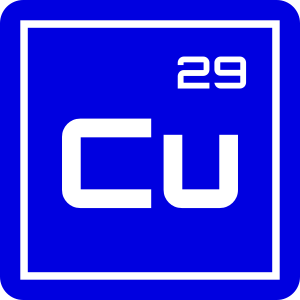
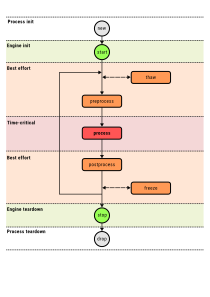
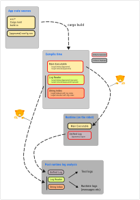
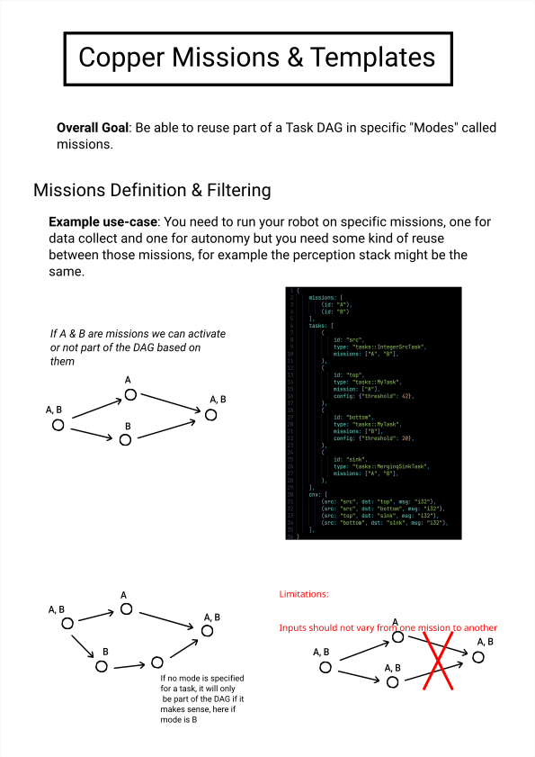

# Copper Documentation

Copper is a deterministic robotics runtime written in Rust. Think of it as a "game engine for robots": describe your system declaratively and Copper will create a custom scheduler and run it deterministically from cloud simulation down to embedded controllers.

**Why Copper**

- ⚡ Sub-microsecond latency with a zero-alloc, data-oriented runtime. Comparative benchmarks with ROS2 and others [here](Benchmarks)
- ⏱️ Deterministic replay for debugging and certification.
- 🧠 Interoperable with ROS 2 via bridges.
- 🪶 Runs anywhere from x86 servers to bare metal.

> Ready to get started? Check out the [README](https://github.com/copper-project/copper-rs#readme) or jump into [Build and Deploy a Copper Application](Build-and-Deploy-a-Copper-Application).

## Start Here

| Topic | What you'll get |
| --- | --- |
| 🧭 [Copper Application Overview](Copper-Application-Overview) | A minimal task graph and runtime walk through. |
| 🚀 [Build and Deploy a Copper Application](Build-and-Deploy-a-Copper-Application) | Project structure, build artifacts, and deployment flow. |
| 📋 [Project Templates](Project-Templates) | Scaffold a new Copper project quickly. |
| ⚙️ [Copper Configuration file Reference](Copper-RON-Configuration-Reference) | The RON schema for tasks, messages, and connections. |
| [Copper Runtime Overview](Copper-Runtime-Overview) | Core runtime concepts and SDK capabilities. |
| 🗺️ [Copper Configuration and Mission Visualization](Config-and-Missions-Visualization) | Render task graphs and mission definitions. |
| 🧭 [Copper Tasks lifecycle overview](Task-Lifecycle) | How tasks run, pause, and serialize state. |
| 🧩 [Modular Configuration](Modular-Configuration) | Split big configs into reusable chunks. |
| [Task Automation with just](Task-Automation-with-Just) | Repeatable task helpers across the repo. |
| 🌉 [Copper Bridge concept](CuBridge-Concept) | Link Copper to external systems and protocols. |
| 🧰 [Resources](Resources) | Wire hardware and shared services into tasks and bridges. |
| 🔧 [Baremetal Development](Baremetal-Development) | Running Copper as a bare-metal runtime. |
| 🖥️ [Supported Platforms](Supported-Platforms) | Desktop, mobile, and embedded targets. |
| 💡 [Contribution Ideas](Ideas) | Larger ideas we would love to collaborate on. |

## Visual Overview

| Task Lifecycle | Build and Deploy | Missions |
| :--: | :--: | :--: |
|  |  |  |

---

## What's New

- 📝 [Copper Release Notes](Copper-Release-Notes)
## Resources

- 🧱 [Copper Component Catalog](https://cdn.copper-robotics.com/catalog/index.html)
- [SDK Features](SDK-Features)
- [FAQ](FAQ)
- [Roadmap](Roadmap)
- 📚 [API Documentation on docs.rs](https://docs.rs/cu29)
- 🧪 [Bleeding edge API Documentation (master branch)](https://copper-project.github.io/copper-rs/)
- 📦 [Main crate on crates.io](https://crates.io/crates/cu29)
- 💻 [Source code on GitHub](https://github.com/copper-project/copper-rs)
- 🛠️ [Contributing guide](https://github.com/copper-project/copper-rs/blob/master/CONTRIBUTING.md)

---
