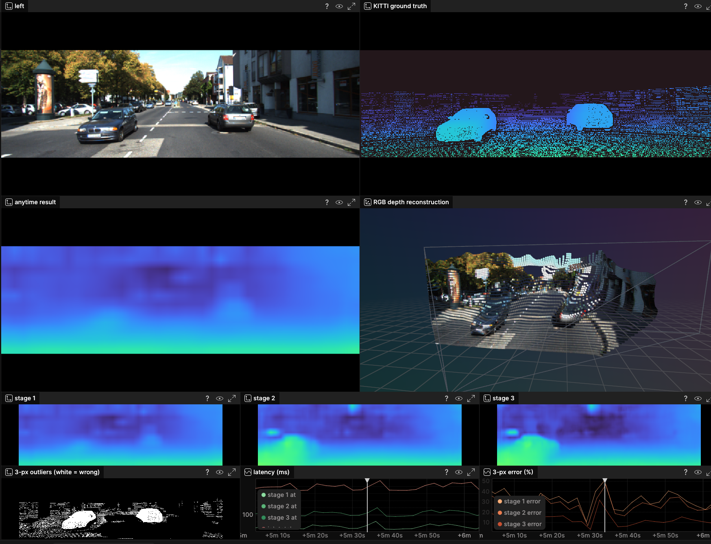
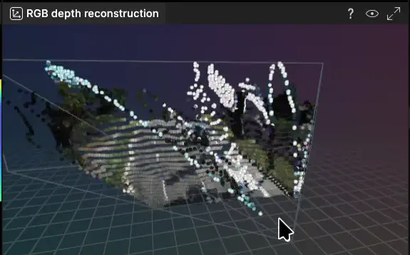

# AnyNet anytime stereo depth



This demo runs the first three stages of [AnyNet](https://github.com/mileyan/AnyNet)
as a Copper `CuAnytimeTask`. `anynet-fg` refines in the foreground and can be
recorded and resimulated; `anynet-bg` keeps the 5 Hz graph responsive while
Candle inference runs on a background worker.

The foreground configuration defines two compile-time Copper missions:

- `synthetic` is the zero-data default.
- `kitti` uses real KITTI stereo frames, disparity ground truth, and the scaled
  camera calibration.

Both mission graphs are compiled into the same binary from separate RON
includes. Selecting KITTI does not require editing the configuration or
recompiling a different topology.

Render the complete static graph, including both missions, from this directory:

```sh
just dag
```

## Quick start

Run the default synthetic mission:

```sh
just
```

Synthetic input demonstrates the stage-by-stage runtime behavior, but has no
KITTI labels. The ground-truth, 3-pixel outlier, and measured-error panes are
therefore empty.

Other useful entry points are:

```sh
just bg         # synthetic input, inference on a background worker
just smoketest  # task-graph smoke test with random weights
just cuda       # synthetic background demo with Candle/cudarc
```

## Run it on real KITTI data

[](doc/anynet-kitti-reconstruction.webm)

The animation is an RGB-colored reconstruction from the same real-data run as
the main screenshot. Click it for the original 60 FPS WebM.

Run:

```sh
just kitti
```

That one command:

1. Downloads the official KITTI 2015 scene-flow archive if it is missing
   (about 1.6 GiB, with interrupted-download resume).
2. Unpacks and validates the stereo images and `disp_occ_0` labels.
3. Prepares the mirrored AnyNet checkpoint if needed.
4. Selects and runs the `kitti` Copper mission.

To install the dataset without launching the viewer, use `just kitti-data`.
Data is kept outside the repository in the expected sister directory:

```text
copper/
├── copper-rs/
└── kitti/
    ├── data_scene_flow.zip
    ├── training/
    │   ├── image_2/
    │   ├── image_3/
    │   └── disp_occ_0/
    └── testing/
```

The archive can also be obtained from the
[KITTI stereo 2015 page](https://www.cvlibs.net/datasets/kitti/eval_scene_flow.php?benchmark=stereo)
and unpacked manually into that layout.

The source selects the 200 `_10` stereo benchmark frames. KITTI's `_11` files
are following temporal frames for scene flow and do not carry the disparity
labels used here.

### How the two missions are configured

`copperconfig.ron` declares the missions and includes both static graph
fragments:

```ron
missions: [(id: "synthetic"), (id: "kitti")],
includes: [
    (path: "config/synthetic.ron"),
    (path: "config/kitti.ron"),
],
```

`config/synthetic.ron` owns the generated stereo source and its default 721.5
pixel calibration. `config/kitti.ron` points at `../kitti/training` and uses
371.7 pixels on both AnyNet and the viewer: KITTI's native 721.5 pixel focal
length scaled from approximately 1242 pixels wide to the model's 640 pixels.
The 0.54 m stereo baseline is shared.

Copper generates one application builder per mission. The foreground CLI
selects `synthetic` when no argument is supplied; `just kitti` selects the
`kitti` builder. Only the selected mission's tasks are instantiated, so the
default remains usable when no KITTI directory exists.

## Reading the viewer

The large 2×2 comparison area contains:

- `left`: the current rectified image.
- `KITTI ground truth`: labeled disparity resampled into model-pixel units.
- `anytime result`: the result currently published by the refining task.
- `RGB depth reconstruction`: a metric point cloud colored from the matching
  left image, so cars and road features remain recognizable in 3D.

The smaller diagnostics area is intentionally about one quarter the size of
the primary views. It contains stage 1 through stage 3, a spatial outlier mask,
latency curves, and measured 3-pixel error curves.

All 2D disparity panes use Turbo with a shared, pinned 0–96 pixel range. This
is deliberate: a road scene distributes disparity across the colormap, whereas
linear metric depth compresses most of the scene into a few colors and hides
the changes made by refinement.

### Ground truth and the 3-pixel outlier mask

KITTI ground truth is semi-dense: unlabeled pixels are omitted. The outlier pane
evaluates only its labeled pixels:

- White means the prediction differs from ground truth by more than 3 native
  KITTI pixels **and** more than 5 percent.
- Black means it is within that benchmark tolerance.
- Unlabeled pixels are omitted.

A recognizable white car is not segmentation—it means the car's labeled
disparity pixels are mostly wrong. Reflective bodywork, occlusion, and sharp
foreground boundaries commonly make cars difficult.

### Why the 3D reconstruction is filtered

Directly back-projecting all 640×192 predictions creates an opaque fan in which
ordinary disparity noise becomes long depth spikes. The reconstruction pane is
a display-only diagnostic designed for a human instead:

- one point per 4×4 output block;
- RGB from the exact stereo frame that produced the depth, including for a
  lagging background result;
- a small sampled-grid median to suppress isolated spikes;
- a 35 m foreground cutoff; and
- fixed 2-point screen-space dots.

Inference, logged depth snapshots, and KITTI scoring still use the untouched
full-resolution prediction. Filtering changes only the Rerun point cloud.

## Watching anytime refinement happen

Refinement rewrites the published depth map in place. Both foreground missions
set `"stage_snapshots": true`, making the task keep a detached copy of each
stage and the elapsed time at which it landed. Production graphs should
normally leave this off because it adds one depth copy per quantum.

Every entity is stamped on two timelines:

- `copperlist` steps through finished graph iterations and is used for replay.
- `time` stamps each stage at its actual publication instant inside the job.

Select `time` in Rerun and press play. The anytime result, RGB reconstruction,
outlier mask, and error score update from coarse stage 1 through stages 2 and 3.
The foreground missions use `time_dilation: 20.0` because the real stage gaps
are too short to perceive at normal playback speed. Dilation steps are capped
at one second so idle time between jobs does not become a long freeze.

Background delivery can arrive after newer input frames. Leave dilation at 1.0
in background mode so timestamps retain their true order; the viewer matches a
result to its source image and ground truth by time of validity.

## Making the budget bite

With the default 800 ms budget, a modern desktop CPU normally reaches stage 3.
Read the actual stage times from `latency (ms)` and set `time_budget_ms` just
below the stage you want to prevent. Example measurements at 640×192 were:

| `time_budget_ms` | Typical published stage |
| ---: | :--- |
| 90 | stage 1 |
| 100 | stage 1, sometimes stage 2 |
| 130 | stage 2 |
| 800 | stage 3 |

These boundaries are machine-specific; the graph in your viewer is the source
of truth.

## Pretrained weights and normalization

The original AnyNet checkpoint link is dead. The `weights` recipe downloads a
compatible mirror and converts it to Safetensors. It requires `torch`,
`safetensors`, and `gdown` in the active Python environment:

```sh
just weights
```

The result is written to
`target/cu_anytime_anynet/anynet-kitti.safetensors`. The normal `just`, `fg`,
`kitti`, `bg`, and `cuda` recipes invoke this step automatically when needed.

The mirror checkpoint was trained on raw 0–255 pixels, not the `/255` ImageNet
normalization used by the original AnyNet dataloader. Its mission configs must
therefore retain:

```ron
"normalization": "raw",
```

A normalization mismatch is not rejected by the model; it simply produces
confidently wrong disparities and a 3-pixel error near 100 percent.

## Recording, replay, and platform notes

For a headless Rerun recording, add `"rrd": "anynet.rrd"` to the selected
mission's viewer node. The blueprint is stored in the recording. An installed
interactive Rerun viewer must match the workspace SDK version.

The foreground binary supports normal Copper unified logging and resimulation.
Mission logs are written under this example's `logs/` directory. Its 8 MiB
CopperList sections are sized for the 640×192 stereo pair, published depth, and
three visualization snapshots. Increasing resolution may require raising
`section_size_mib`, `slab_size_mib`, and the binary's matching slab constant.

The background config disables task logging because an active background
anytime job cannot be frozen safely for a keyframe. It still produces Rerun
output but not a replayable unified log. CUDA builds use Candle/cudarc; verify
Jetson/aarch64 behavior on the target. Floating-point replay may differ between
CPU and CUDA devices.

The architecture is ported from AnyNet (Wang et al., ICRA 2019) under its MIT
license. The optional SPN sharpening stage and its custom CUDA operator are not
included.
